# Generative AI

## **Table of Contents**

* [Introduction to Generative AI](#Introduction)

* [Applications of Generative AI](#Applications)

* [Introduction to Generative Models](#Generative_Models)

    - [Types of Generative Models](#Types)

## Introduction

Generative AI represents a groundbreaking advancement in artificial intelligence, characterized by its ability to create new and original content. Unlike traditional AI, which primarily analyzes and processes existing data, generative AI models are designed to produce new data that mimics the patterns and structures found in their training sets. This technology leverages sophisticated algorithms and neural network architectures, such as Generative Adversarial Networks (GANs) and Transformers, to generate text, images, audio, and even video.
 

## Applications

Generative AI has a wide array of applications across various industries, transforming how we create and interact with content. Here are some notable applications:

1. **Text Generation** 

    * **Content Creation:** Writing articles, stories, poetry, reports, news summaries, product descriptions, and social media content. 
    * **Customer Service:** AI-powered chatbots for real-time assistance. 
    * **Translation and Summarization:** Translating text between languages and summarizing long documents. 
     

2. **Image and Video Generation** 

    * **Art and Design:** Creating original artwork, design concepts, and fashion items. 
    * **Entertainment:** Generating characters, scenes, and special effects for movies and video games. 
    * **Advertising:** Creating personalized and visually appealing advertisements. 

     

3. **Audio Generation**

    * **Music Composition:** Composing original music and exploring different genres. 
    * **Voice Synthesis:** Generating realistic human speech for   voice-over work, virtual assistants, and accessibility technologies. 
     

4. **Healthcare**

    * **Medical Imaging:** Enhancing the quality of medical images and aiding in diagnosis. 
    * **Drug Discovery:** Generating molecular structures for potential new drugs. 
     

5. **Design and Manufacturing**

    * **Generative Design:** Creating optimized design solutions for engineering and architecture. 
    * **Product Design:** Prototyping new products and testing configurations and materials virtually. 
     

6. **Finance**

    * **Algorithmic Trading:** Generating trading strategies and optimizing portfolio management. 
    * **Fraud Detection:** Identifying patterns in financial transactions indicating fraudulent activity. 
     

7. **Education**

    * **Tutoring Systems:** Generating personalized lesson plans and feedback for students. 
    * **Content Creation:** Creating educational materials, including interactive simulations and quizzes. 

 

## Generative_Models

Generative models are a class of machine learning models designed to generate new data samples from the same distribution as the training data. They are widely used in various applications such as image synthesis, text generation, and more. Here’s a brief introduction to generative models:

## Types

1. **Generative Adversarial Networks (GANs):**

    * **Components:** Consist of two neural networks, a generator and a discriminator, which are trained simultaneously. 
    * **Function:** The generator creates fake data samples, and the discriminator evaluates their authenticity. The generator improves over time to produce more realistic data. 
     

2. **Variational Autoencoders (VAEs):**

    * **Components:** Encoders and decoders with a latent space representation. 
    * **Function:** Encoders map input data to a latent space, while decoders generate new data from this space. VAEs use a probabilistic approach to ensure the generated data is similar to the input data. 
     

3. **Autoregressive Models:**

    * **Examples:** PixelRNN, PixelCNN, GPT (Generative Pre-trained Transformer). 
    * **Function:** Generate data sequentially, where each data point is conditioned on the previous ones. For instance, in text generation, each word is predicted based on the preceding words. 
   

## Deep_Learning for Genrative_Models

Deep learning has revolutionized generative modeling by harnessing the power of neural networks to create complex and realistic data distributions. Variational Autoencoders (VAEs) and Generative Adversarial Networks (GANs) are two prominent examples. VAEs use an encoder-decoder architecture to learn latent representations of data, enabling generation of new samples. GANs, on the other hand, pit a generator against a discriminator in a game-theoretic framework where the generator learns to produce increasingly realistic samples by fooling the discriminator, which itself improves at distinguishing real from generated data. These models have found applications in diverse fields such as image and text generation, offering capabilities from generating lifelike images to creating natural language text. Despite their successes, challenges like mode collapse and ethical implications regarding generated content remain areas of active research and debate in the field of deep generative models.

Here's how deep learning fuels generative models, along with some cool examples: 

1. Unveiling the Secrets: Learning the Data's Language 
    *  Deep learning excels at analyzing vast amounts of data, like mountains of cat pictures. 
    *  Through complex neural networks, it uncovers the hidden patterns and relationships within the data. 
    *  This allows the model to understand the "language" of the data, like the typical shapes, colors, and textures of cats.

    Example: Imagine a deep learning model trained on countless images of different dog breeds. It learns the characteristics of each breed – floppy ears for Bassets, curly fur for Poodles, etc.

    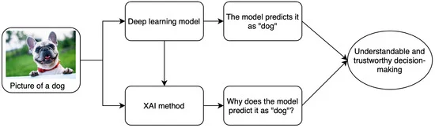

2. Generating New Worlds: Creating from the Learned Language

    * Once the model understands the data's language, it can use that knowledge to generate entirely new examples that adhere to those patterns. 
    *  It doesn't simply copy existing data; it creates variations based on what it has learned. 

    Example: The dog image model, having learned dog features, can now generate images of new, never-before-seen dog breeds! Maybe a fluffy Basset with Poodle curls?

    

## GANs

A generative adversarial network (GAN) has two parts:

1. The generator learns to generate plausible data. The generated instances become negative training examples for the discriminator. 
2. The discriminator learns to distinguish the generator's fake data from real data. The discriminator penalizes the generator for producing implausible results. 

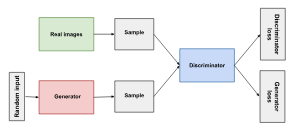
Both the generator and the discriminator are neural networks. The generator output is connected directly to the discriminator input. Through backpropagation, the discriminator's classification provides a signal that the generator uses to update its weights.

## VAEs

Imagine a data compression tool for creativity! VAEs compress data into a latent space, capturing its essence. The model can then decode this compressed version to generate new data samples that hold the same core characteristics.

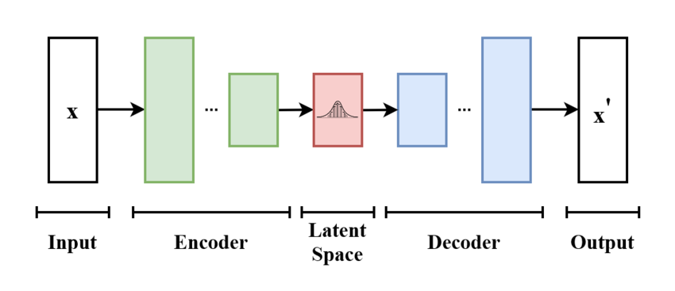
The basic scheme of a variational autoencoder. The model receives 
x as input. The encoder compresses it into the latent space. The decoder receives as input the information sampled from the latent space and produces x' as similar as possible to x.

## Autoregressive_models

Autoregressive models are think of them like storytellers. These models predict the next element in a sequence, like the next word in a sentence. By chaining these predictions together, they can generate entirely new sequences that follow the learned patterns.

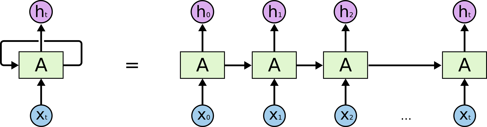

## Transformers

Building large language models using the transformer architecture dramatically improved the performance of natural language tasks over the earlier generation of RNNs, and led to an explosion in regenerative capability. The power of the transformer architecture lies in its ability to learn the relevance and context of all of the words in a sentence. Not just as you see here, to each word next to its neighbor, but to every other word in a sentence. To apply attention weights to those relationships so that the model learns the relevance of each word to each other words no matter where they are in the input. This gives the algorithm the ability to learn who has the book, who could have the book, and if it's even relevant to the wider context of the document. 

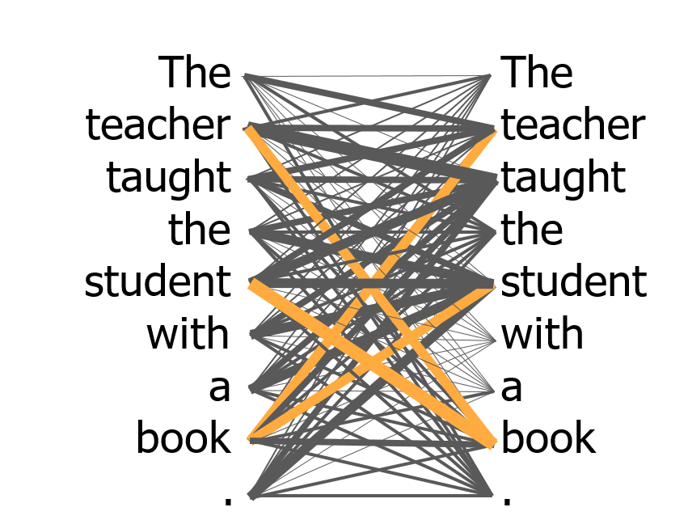 
This diagram is called an attention map and can be useful to illustrate the attention weights between each word and every other word. Here in this stylized example, you can see that the word book is strongly connected with or paying attention to the word teacher and the word student.This is called self-attention and the ability to learn a tension in this way across the whole input significantly approves the model's ability to encode language. 

## Transformer_Architecture

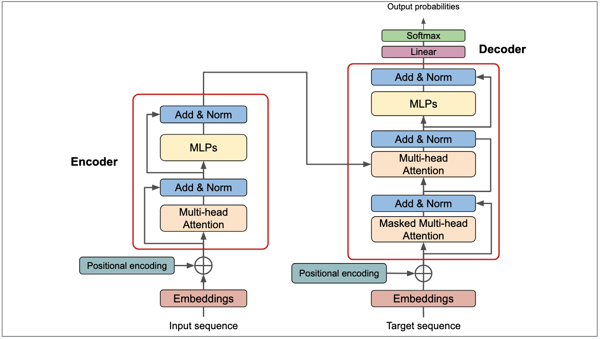
Transformer is a neural network architecture that can process sequential data such as texts, audios, videos, and images(as a sequence of image patches). Transformer does not use any recurrent or convolution layers. It’s fundamental layer is called Attention. It also contain other basic layers such as fully-connected layers, normalization layer,embedding layer, and positional encoding layer.Transformer was initially introduced for machine translation, a task that demands processing two sequences(both input and output are sequences). Thus, the transformer model had two parts: encoder for processing the input and decoder for generating the output. 

## Encoder 
1. Encoder is one of the main blocks of the transformer architecture that is right at the input of input sequence. Encoder transforms input sequence into compressed representation. In the orginal transformer architecture, the encoder was repeated 6 times(this depends on overall size of architecture, it can be changed). Each encoder block has 3 main layers which are multi-head attention(MHA), layer norm, and MLPs(or feedforward according to the paper).

2. Multi-head attention and MLPs are referred to as sub-layers in the transformer paper. Between sublayers, there are layer normalization and dropout and residual connections in between(refer to diagram).

3. The number of encoder layers was 6 as said previously. The more the number of encoder layers, the larger the model, and the more the model is likely to capture the global context of the input sequences hence resulting in better task generalization.

## Decoder
1. The decoder is pretty much the same as encoder except additional multi-head attention that operated over the output of the encoder. The goal of the decoder is to fuse encoder output with the target sequence and to make predictions(or to predict the next token).

2. The attention that takes the target sequence in decoder is masked to prevent the current token(being processed) from attending to subsquent tokens in the target sequence. If the decoder has access to a full target sequence, this would basically be cheating and can result in model that can not generalize beyond the training data.

3. Decoder is also typically repeated the same times as encoder. In the orginal transformer, the number of decoder blocks were also 6 blocks.

## Encoder_decoder

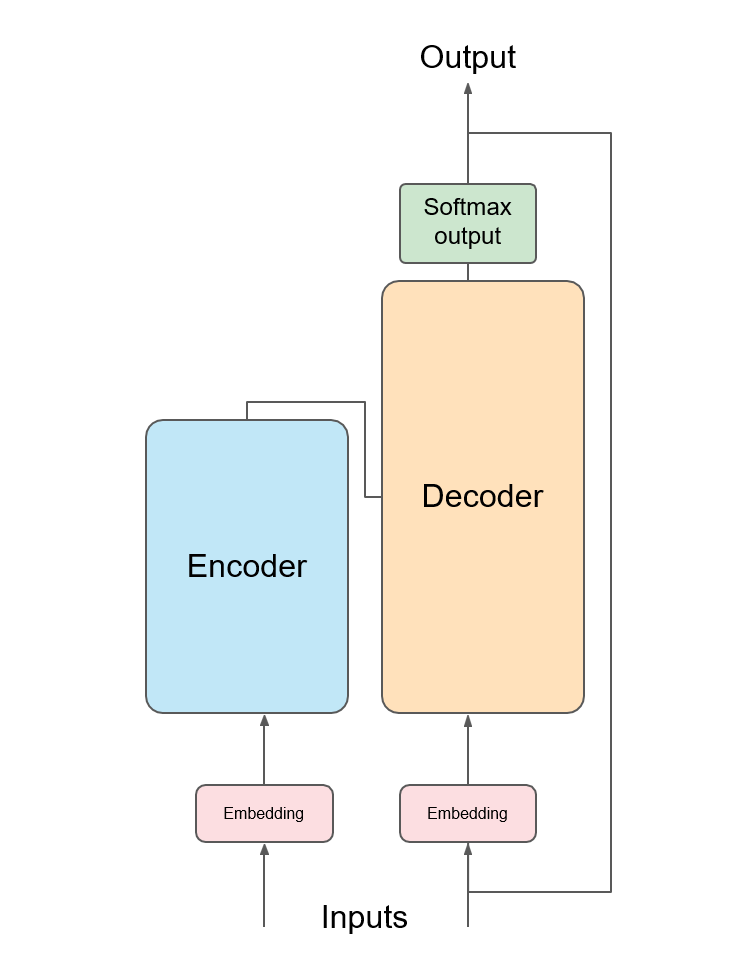

The transformer architecture is split into two distinct parts, the encoder and the decoder. These components work in conjunction with each other and they share a number of similarities. Also, note here, the diagram you see is derived from the original attention is all you need paper. Notice how the inputs to the model are at the bottom and the outputs are at the top.

## LLMs

Large Language Models (LLMs) represent a cutting-edge advancement in generative artificial intelligence, leveraging deep learning techniques to understand and generate human-like text. These models, such as GPT (Generative Pre-trained Transformer), are built on Transformer architectures that excel in capturing long-range dependencies in data. LLMs are trained on vast amounts of text data, enabling them to generate coherent and contextually relevant text in response to prompts or cues provided by users. Their ability to understand and produce language with fluency and coherence has enabled applications across various domains, including natural language understanding, dialogue systems, content generation, and more. However, alongside their remarkable capabilities, LLMs also raise ethical considerations related to biases in training data, potential misuse, and the societal impact of generated content. As research continues to advance, LLMs promise to further enhance our interactions with AI by pushing the boundaries of what machines can understand and express in natural language.

Imagine a computer program that has been trained on a massive amount of text data – like the entire internet! This data includes books, articles, code, and all sorts of online content. LLMs use this knowledge to understand the patterns and nuances of language.

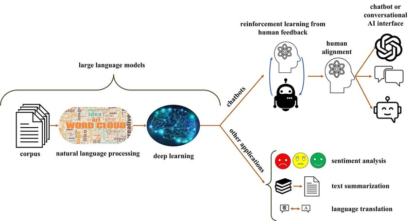

**How do LLMs Work?**

LLMs rely on a special type of deep learning architecture called transformers (we discussed these earlier!). Transformers allow LLMs to analyze large amounts of text data efficiently and understand the relationships between words, even if they are far apart in a sentence.

**What can LLMs do?**

LLMs have a wide range of capabilities, including:

1. **Text Generation:** LLMs can create different creative text formats, like poems, code, scripts, musical pieces, emails, and letters.

2. **Machine Translation:** LLMs can translate languages more accurately and naturally, considering context and sentence structure.
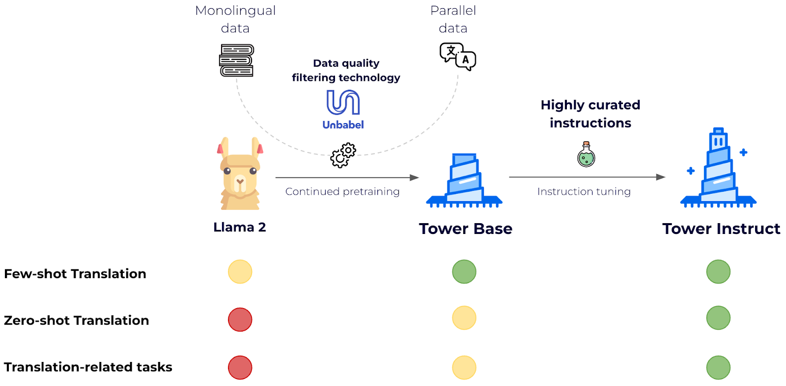

3. **Question Answering:** LLMs can answer your questions in an informative way, drawing on their vast knowledge base.
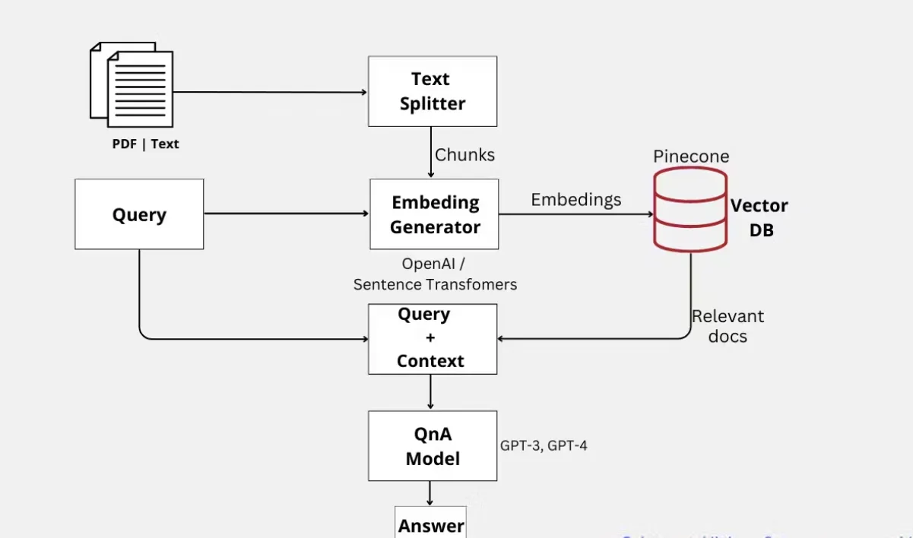

4. **Summarization:** LLMs can condense large pieces of text into shorter summaries, capturing the key points.

## Architecture_of-LLM

Large language models (LLMs) are impressive feats of engineering, capable of processing massive amounts of text data and generating human-quality responses. But how exactly do they achieve this? Let's delve into the typical architecture of LLMs, featuring a key component is transformers.

"Building Blocks of LLMs"

1. Input Embedding Layer: This layer transforms words or sub-words from text into numerical representations, allowing the model to understand the data.

2. Transformer Encoder: This is the heart of the LLM. It consists of multiple encoder layers stacked together. Each layer focuses on analyzing the relationships between words within a sentence.

    * Multi-Head Attention: This powerful mechanism allows the encoder to attend to different parts of the input sentence simultaneously, capturing long-range dependencies between words.

    * Positional Encoding: Since transformers don't inherently understand word order, this step injects information about the position of each word in the sentence.

    * Feed Forward Network: This layer adds non-linearity to the model, allowing it to learn complex patterns in the data.

3. Output Layer: Depending on the LLM's task (text generation, translation, etc.), this layer generates the final output, like translating a sentence or creating new text content.

**Here's a diagram illustrating the LLM architecture:**

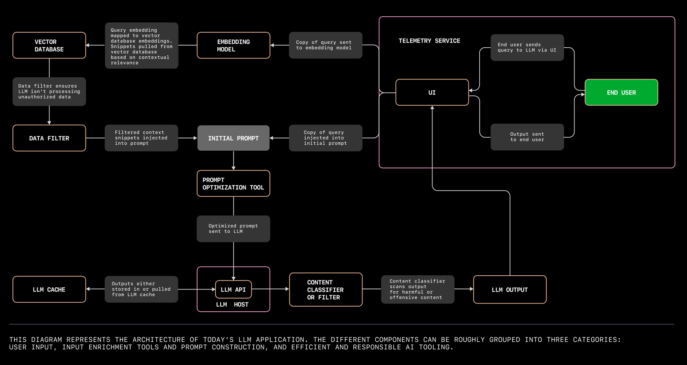

**Understanding the Transformer:**

1. The transformer is a neural network architecture specifically designed for natural language processing tasks. Unlike traditional models that process text sequentially (word by word), transformers can analyze all parts of a sentence simultaneously.

2. This parallel processing capability allows transformers to capture complex relationships between words, even if they are far apart in the sentence.

3. The multi-head attention mechanism within the transformer encoder is crucial for this. It enables the model to "attend" to different parts of the input sentence, focusing on the most relevant information for the task at hand.
 
**Benefits of Transformer-based Architecture:**

1. Efficient processing of large amounts of text data

2. Ability to capture long-range dependencies between words

3. Improved performance on various NLP tasks

## Text AI LLMs

## GPT-3

1. Developed by: OpenAI

2. Parameters: GPT-3 is known for its massive scale with 175 billion parameters, enabling it to handle a wide range of natural language processing tasks.

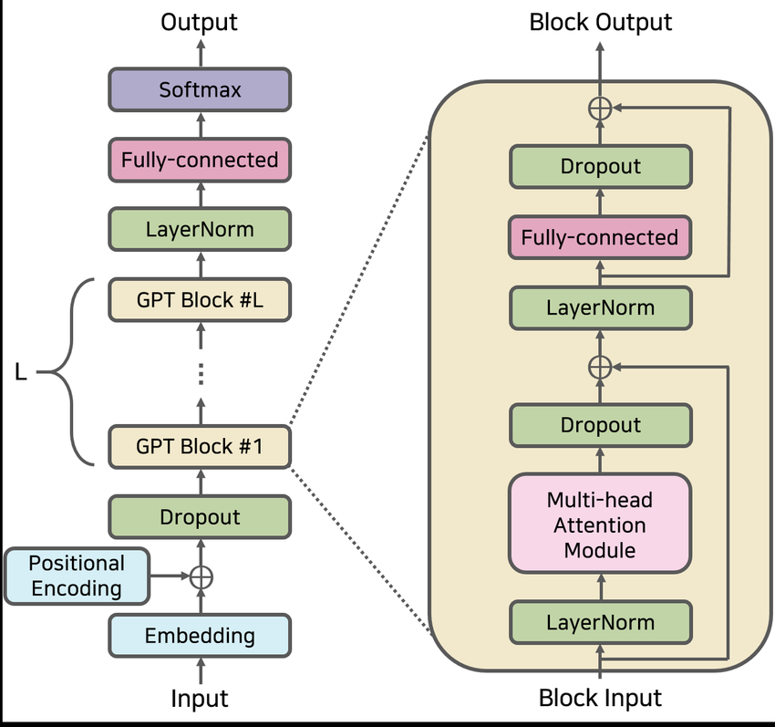

3. Capabilities: It excels in tasks such as text generation, translation, summarization, question answering, and more. GPT-3 operates based on autoregressive language modeling, predicting the next word in a sequence given the previous ones.

4. Applications: Used in chatbots, content generation, language translation services, and various other AI applications requiring natural language understanding and generation.

## GPT-4

1. Successor to GPT-3: GPT-4 continues the lineage of OpenAI's advancements in large language models. Specific details on its architecture and improvements over GPT-3 are typically revealed upon release or publication.

2. Expected Enhancements: Likely to build upon GPT-3's capabilities with improvements in performance, efficiency, and possibly new features or task-specific optimizations.

## LaMDA (Language Model for Dialogue Applications)

**Language Model for Dialogue Applications**

1. Developed by: Google

2. Focus: LaMDA is specifically tailored for dialogue applications, aiming to generate more natural and contextually appropriate responses in conversational AI systems.

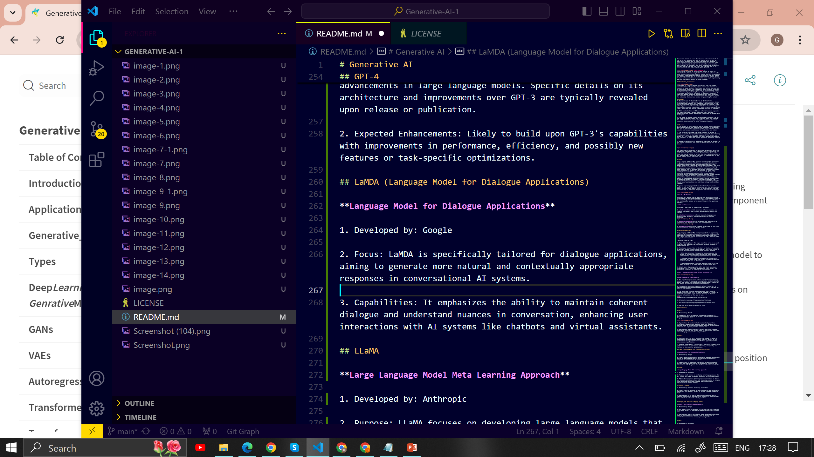
Diagram of lambda architecture. Source: http://lambda-architecture.net

3. Capabilities: It emphasizes the ability to maintain coherent dialogue and understand nuances in conversation, enhancing user interactions with AI systems like chatbots and virtual assistants.

## LLaMA

**Large Language Model Meta Learning Approach**

1. Developed by: Anthropic

2. Purpose: LLaMA focuses on developing large language models that are aligned with human values and prioritize safety in deployment.

3. Ethical Considerations: It integrates considerations of ethics and alignment with human values into its design, aiming to mitigate risks associated with large language models such as bias amplification or harmful outputs.

## Stanford_Alpaca:

1. Developed by: Stanford University researchers

2. Focus: Alpaca is designed to generate coherent and contextually appropriate text across a variety of natural language processing tasks.

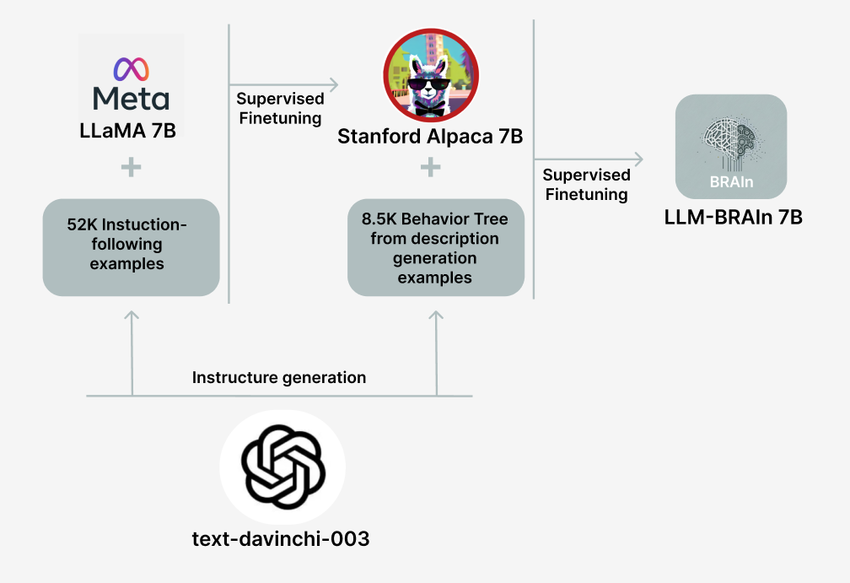

3. Applications: It is used in applications requiring natural language understanding and generation, potentially spanning tasks from chatbots to automated content generation.

## Google_FLAN (Few-shot LANguage model):

**Google_FLAN (Few-shot LANguage model)**

1. Developed by: Google

2. Key Feature: FLAN is optimized for few-shot learning, enabling it to adapt quickly to new tasks or domains with minimal training data.

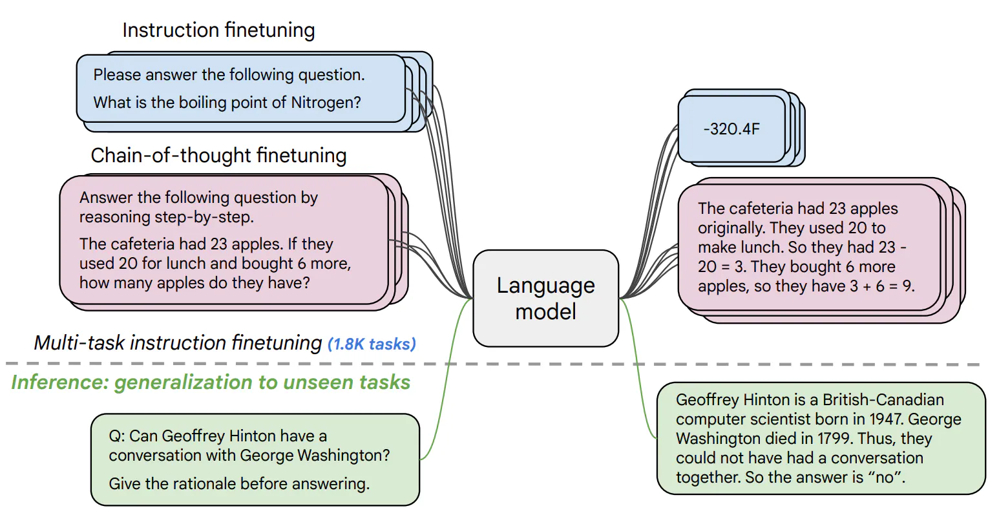

3. Applications: Useful in scenarios where rapid adaptation to new tasks or environments is required, such as personalized AI assistants or specialized language processing tasks.

## Poe:

1. Developed by: Anthropic

2. Focus: Poe emphasizes safety and ethical considerations in the development and deployment of large language models.

3. Safety Measures: It integrates mechanisms to mitigate risks associated with AI systems, ensuring alignment with human values and ethical standards.

## Falcon LLM:

1. Details: Information specific to Falcon LLM is not readily available in the current knowledge base. It likely represents another instance of a large language model designed to excel in natural language processing tasks.

## AI_Models 

The world of AI extends far beyond text, venturing into the creative domains of image, video, and audio. Here's a glimpse into some exciting AI models and services pushing the boundaries in these areas, along with visuals to help you understand.

## Image AI Models & Services 

1. Image Recognition and Classification:

    * Models: CNN-based models like ResNet, VGG, Inception, and EfficientNet are commonly used for image classification tasks.

    * Services: Google Vision API, Amazon Rekognition, and Microsoft Azure Computer Vision provide APIs for image recognition, object detection, and labeling.

**Single-label vs. multi-label classification**

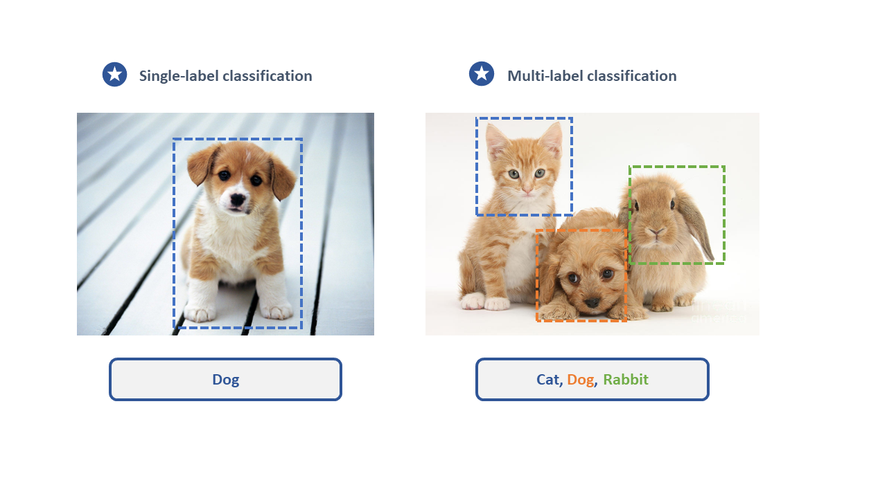 "Single-label image classification is a traditional image classification problem where each image is associated with only one label or class. For instance, an image of a cat can be labeled as “cat” and nothing else. The task of the classifier is to predict the label for a given image."

 "Multi-label image classification is an extension of the single-label image classification problem, where an image can have multiple labels or classes associated with it. For example, an image of a cat playing in a park can be labeled as “cat” and “park”. The task of the classifier, in this case, is to predict all the relevant labels or classes for a given image."

2. Object Detection:

    * Models: YOLO (You Only Look Once), Faster R-CNN, and Mask R-CNN are popular for real-time object detection and instance segmentation.

    * Services: TensorFlow Object Detection API, Detectron2, and OpenCV with pre-trained models offer frameworks for object detection tasks.

3. Image Generation:

    * Models: Generative Adversarial Networks (GANs) like StyleGAN, DALL-E (for text-to-image generation), and BigGAN.

    * Applications: Used in creative industries for generating realistic images, artistic styles, and even conditional image generation (e.g., generating images based on text descriptions).

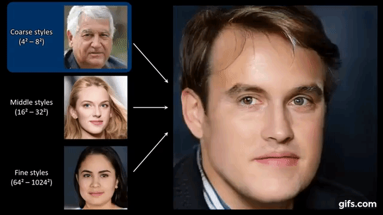 "A generative model, at its most basic, means that you have mapped the probability distribution of the data itself. In the case of images, this means that there is a chance for every possible combination of pixel values. This also implies that new data points can be generated by sampling from this distribution (i.e. choosing combinations with large probability). If you’re working in computer vision, this means your model can generate new images from scratch. Here’s an example of a generated face." 

## Video AI Models 

1. Video Generation:

    * Models: VideoGAN, MoCoGAN (Motion and Content GAN), and approaches combining GANs with RNNs or Transformers.

    * Applications: Creating synthetic video content, video editing automation, and enhancing video production workflows.

    !?[movie](https://x.com/i/status/1742366871146443239)"AI models can create entirely new videos from scratch or modify existing ones. Imagine creating a video explaining a scientific concept."

2. video Editing

    * Automated Editing: Video AI models automate tasks like scene segmentation, shot detection, and storyboard generation, streamlining the editing process.

    * Enhancement Tools: AI enhances videos by upscaling resolution, applying color grading, reducing noise, and enabling creative effects like style transfer and object replacement.

    * Workflow Optimization: AI improves workflow efficiency with automated metadata tagging, real-time processing for live events, and tools for adaptive editing and content personalization.

3. Video Summarization
    * Deep Learning Models: AI models like Convolutional Neural Networks (CNNs) and Recurrent Neural Networks (RNNs) are employed to understand spatial and temporal features in videos, often enhanced by attention mechanisms to focus on the most relevant segments for summarization.

    * Unsupervised and Reinforcement Learning: Techniques such as clustering and keyframe extraction, as well as reinforcement learning methods, are used to identify important parts of a video without relying on labeled data, ensuring efficient and high-quality summaries.

    * Hybrid Approaches and Applications: Combining different models and methods can enhance summarization effectiveness. These AI-powered summaries are widely used in content creation, surveillance, and educational tools to condense long videos into concise, informative highlights.

    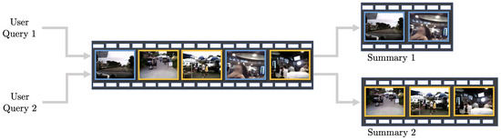 "The illustration of the query-conditioned video summarization task. Given a user query, query-conditioned video summarization aims to predict a summary that is relevant to the query in a concise manner. Summary 1 and Summary 2 are two summarization results for the same video but for different user queries."

## Audio AI Models 

Audio AI models are revolutionizing how we interact with and manipulate sound. Here's a glimpse into some exciting applications:

1. Music Generation:

    * Concept: Imagine composing a complete song or soundscape using AI! These models can generate music in various styles, from classical to electronic, or even create soundtracks based on specific moods or themes.

    * Example Audio: You can listen to music samples generated by Jukebox on the OpenAI website OpenAI 
    ?[audio](https://openai.com/index/jukebox/)

2. Speech Recognition:

    * Concept: This is a fundamental AI skill, converting spoken language into text. It allows for features like voice dictation, automated captioning for videos, or voice search functionalities.

    * Example Services: ?[Google Cloud Speech-to-Text](https://cloud.google.com/speech-to-text), ?[Amazon Transcribe](https://aws.amazon.com/transcribe/)

    * Example Application: Dictating a text message using voice commands on your smartphone leverages speech recognition.

3. Audio Classification:

    * Concept: AI can analyze and identify different sounds within an audio recording. Imagine automatically classifying animal calls in a forest recording or recognizing musical instruments playing in a song.

    * Example Services: 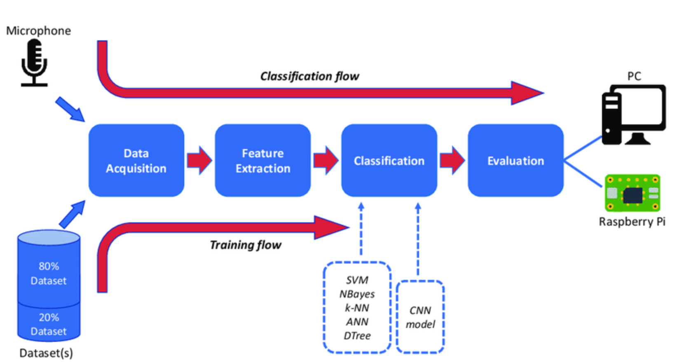

    * Example Application: Security systems can use audio classification to identify the sound of breaking glass or a smoke detector alarm.

## Prompt_Engineering 

Prompt engineering is the art of crafting clear and effective instructions for Large Language Models (LLMs) like GPT-3 or LaMDA. These instructions, called prompts, guide the AI towards the desired outcome, influencing the kind of text, code, or creative content it generates.

**Why is Prompt Engineering Important?**

Imagine giving vague instructions to a friend. The results might be unpredictable. Similarly, LLMs need precise prompts to understand your intent and deliver exceptional outputs. Prompt engineering helps you:

* Fine-tune outputs: Tailor the AI's response to a specific style, format, or topic.

* Reduce ambiguity: Clear prompts minimize the chance of nonsensical or irrelevant outputs.

* Unlock creativity: Crafting prompts with specific details or scenarios can inspire the AI to generate creative text formats like poems or scripts.

* Improve factual accuracy: By providing factual context within the prompt, you can guide the AI towards generating more accurate and reliable responses.
 

**Key Strategies for Effective Prompt Engineering**

* Clarity is King: Use concise and well-structured language. The AI should understand the prompt without any confusion.

* Provide Context: Give the AI background information relevant to the task. This helps it understand the situation and generate a more relevant response.

* Set the Tone: Indicate the desired style or formality of the output. Do you want a casual email, a persuasive argument, or a humorous story?

* Examples are Powerful: Provide examples of the kind of output you expect. This gives the AI a reference point and improves the accuracy of its response.

* Iteration is Key: Don't be afraid to experiment and refine your prompts. Test different approaches and see how the AI responds.

## Introduction-to-Chatgpt

ChatGPT is an advanced conversational AI developed by OpenAI, designed to understand and generate human-like text based on the input it receives. It is built on the GPT-4 architecture, an iteration of the Generative Pre-trained Transformer models, and is capable of engaging in a wide variety of conversational tasks. Here’s an introduction to ChatGPT, highlighting its functionality, underlying technology, applications, and considerations.
 

**Here's a glimpse into what ChatGPT can do**

* Answer your questions in an informative way: Stuck on a question? ChatGPT can access and process vast amounts of information to provide insightful answers.

* Engage in casual conversation: Feeling chatty? ChatGPT can hold engaging conversations on various topics, adapting its style and tone to match yours.

* Generate different creative text formats: Need a poem for a special occasion or a script for a short play? ChatGPT can generate creative text formats based on your prompts and instructions.

* Translate languages: Traveling the world or need to understand a foreign text? ChatGPT can translate languages, bridging communication gaps.
 

**Understanding How ChatGPT Works**

While the inner workings of complex AI models are often not public knowledge, here's a simplified conceptual diagram to illustrate the general idea:

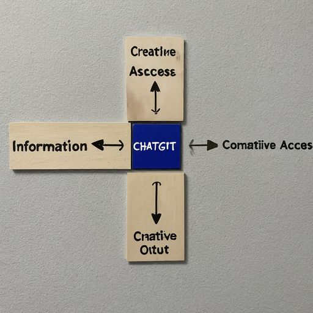

* User Input: This is what you provide, like questions, conversation prompts, or instructions for creative text generation.

* Information Access: ChatGPT can access and process massive amounts of information from various sources.

* Conversational Response: Based on your input and processed information, ChatGPT formulates informative or casual conversation responses.

* Creative Text Output: When prompted, ChatGPT can generate different creative text formats like poems, code, or scripts.

## Designing-a-prompt

**Designing a prompt - The process and workflow**

Imagine you're a movie director instructing your actors. The clearer your directions, the better the performance. Similarly, crafting effective prompts for AI models like ChatGPT or Bard (me!) is crucial for achieving the desired outcome. 
Here's a breakdown of the process with helpful visuals:

1.  **Define Your Goal:**

    *  What do you want the AI model to generate? Is it a poem, a news report, a code snippet, or something else entirely?

    * Having a clear goal will guide your prompt structure and content.

2. **Understand the AI Model's Capabilities:**

    *  Different AI models have varying strengths and weaknesses. Familiarize yourself with the model's capabilities to ensure your prompt aligns with what it can do.

    *  Knowing the model's limitations can help you adjust your expectations and avoid frustration.

3. **Gather Information and Context:**

    * What background information or context is relevant to your goal? Providing relevant details helps the AI understand the situation and generate a more accurate response. 

    *  This could include specific details, keywords, or references related to your desired output.

4. **Craft the Prompt:**

    *  Clarity is King: Use concise and well-structured language. The AI should understand the prompt without any confusion.

    *  Set the Tone: Indicate the desired style or formality of the output. Do you want a casual email, a persuasive argument, or a humorous story?

    *  Provide Instructions: Clearly state what you want the AI to do with the information you provided.

    * Examples are Powerful: Include examples of the kind of output you expect if possible. This gives the AI a reference point for generating the desired response.

**Here's an example to illustrate the process**

 **Goal:** Generate a short, funny poem about a cat who loves to play with yarn.

**Prompt:**
Write a humorous poem in the style of Shel Silverstein about a mischievous cat who becomes obsessed with a ball of yarn.

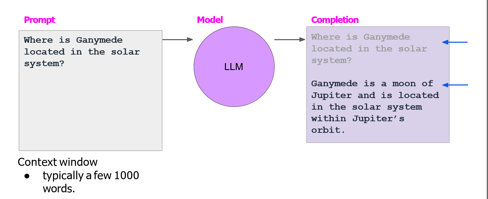 "The text that you feed into the model is called the prompt, the act of generating text is known as inference, and the output text is known as the completion. The full amount of text or the memory that is available to use for the prompt is called the context window. Although the example here shows the model performing well, you'll frequently encounter situations where the model doesn't produce the outcome that you want on the first try. You may have to revise the language in your prompt or the way that it's written several times to get the model to behave in the way that you want. This work to develop and improve the prompt is known as prompt engineering." 
 

5. **Refine and Iterate:**

Don't be afraid to experiment and refine your prompts. Test different approaches and see how the AI responds. The first attempt might not be perfect, so be prepared to adjust based on the results.

## Avoiding prompt injections using delimiters

Prompt injections are a form of attack where an adversary includes malicious instructions or text in a prompt to manipulate the AI model's response. To avoid prompt injections, using delimiters can help clearly define the boundaries of user input and system instructions.
 

**Steps to Avoid Prompt Injections Using Delimiters**

1. **Define Clear Boundaries:** Use delimiters to separate the system instructions from user input. This helps the model differentiate between what is intended as a command and what is user-provided data.

2. **Use Consistent and Recognizable Delimiters:** Choose delimiters that are unlikely to appear in normal user input. Common delimiters include quotation marks, triple quotes, brackets, or custom symbols.

3. **Sanitize User Input:** Clean the user input to remove any characters that might interfere with the delimiters.
 

**Example Workflow**

**Objective**

Create a prompt for a story generator that accepts user-defined characters and settings while preventing prompt injections.

**Initial Prompt Structure**
Design the prompt structure with clear delimiters for user input.

#
#
#
#
#

## Defining constraints

## Zero-shot Prompting

Zero-shot prompting refers to the technique of designing prompts in such a way that an AI model can perform a task without having been explicitly trained on specific examples of that task. Instead, the model relies on its general understanding and knowledge derived from its training data to generate appropriate responses. This is particularly useful when you need the model to handle tasks for which no specific training examples are available.

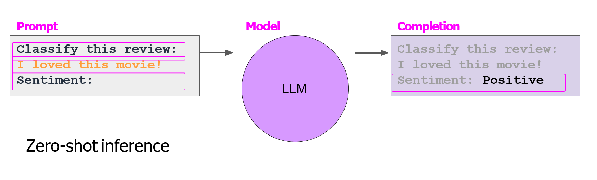 "With in-context learning, you can help LLMs learn more about the task being asked by including examples or additional data in the prompt. Here is a concrete example. Within the prompt shown here, you ask the model to classify the sentiment of a review. So whether the review of this movie is positive or negative, the prompt consists of the instruction, "Classify this review," followed by some context, which in this case is the review text itself, and an instruction to produce the sentiment at the end. This method, including your input data within the prompt, is called zero-shot inference. The largest of the LLMs are surprisingly good at this, grasping the task to be completed and returning a good answer. In this example, the model correctly identifies the sentiment as positive."

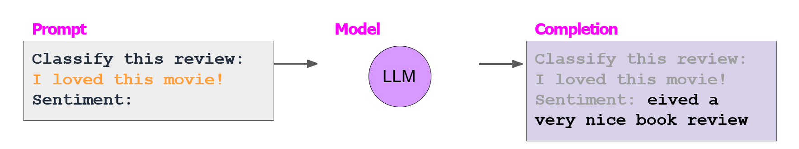 "Smaller models, on the other hand, can struggle with this. Here's an example of a completion generated by GPT-2, an earlier smaller version of the model that powers ChatGPT. As you can see, the model doesn't follow the instruction. While it does generate text with some relation to the prompt, the model can't figure out the details of the task and does not identify the sentiment."

## Few-shot Prompting

Few-shot prompting is a technique used with AI models like ChatGPT to perform tasks with minimal examples or shots of training data. Unlike zero-shot prompting, which requires the model to generalize from its training data without specific examples, few-shot prompting involves providing a small number of examples (shots) to guide the model in understanding and generating responses for a particular task or domain.

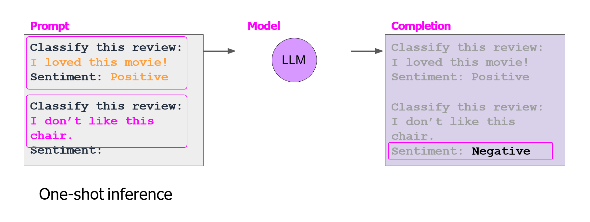 "Here you can see that the prompt text is longer and now starts with a completed example that demonstrates the tasks to be carried out to the model. After specifying that the model should classify the review, the prompt text includes a sample review. I loved this movie, followed by a completed sentiment analysis. In this case, the review is positive. Next, the prompt states the instruction again and includes the actual input review that we want the model to analyze. You pass this new longer prompt to the smaller model, which now has a better chance of understanding the task you're specifying and the format of the response that you want. The inclusion of a single example is known as one-shot inference, in contrast to the zero-shot prompt you supplied earlier."

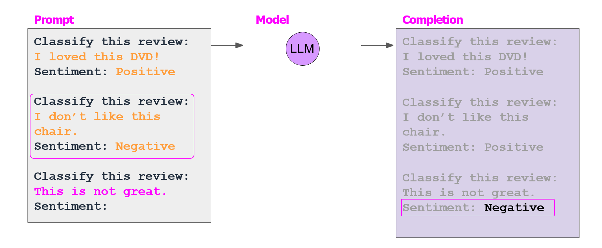 "Sometimes a single example won't be enough for the model to learn what you want it to do. So you can extend the idea of giving a single example to include multiple examples. This is known as few-shot inference. Here, you're working with an even smaller model that failed to carry out good sentiment analysis with one-shot inference. Instead, you're going to try few-shot inference by including a second example. This time, a negative review, including a mix of examples with different output classes can help the model to understand what it needs to do. You pass the new prompts to the model. And this time it understands the instruction and generates a completion that correctly identifies the sentiment of the review as negative."

## Persona Prompting

Persona prompting involves guiding an AI model like ChatGPT to generate responses that align with a specific persona or character profile. This technique is useful for creating personalized interactions or content that reflects distinct personalities, which can enhance engagement and relevance in various applications.

Persona prompting is a valuable technique for customizing interactions with AI models to reflect specific personalities or character profiles. By defining clear persona attributes and crafting appropriate prompts, you can guide the model to generate responses that align with the desired persona, enhancing engagement and relevance in various applications such as customer support, storytelling, education, and personal assistance. This approach leverages AI's ability to simulate human-like interactions tailored to specific user needs and preferences.

**Key Aspects of Persona Prompting**

* Persona Definition: Define the characteristics, traits, and behaviors of the persona you want the AI to embody.

* Contextual Guidance: Provide prompts that incorporate the persona's attributes to guide the model's responses.

* Consistency: Maintain consistency in the persona's voice and style throughout interactions or content generation.
 

**Steps to Implement Persona Prompting**

1. Define Persona Attributes: Identify key traits, preferences, language style, and behaviors that characterize the persona.

2. Craft Persona-based Prompts: Write prompts that integrate the persona's attributes to guide the model's responses.

3. Test and Refine: Evaluate the model's outputs to ensure they align with the persona and adjust prompts as needed for accuracy.

**Here's an Example**

* Task: Write a news report about a new scientific discovery.

* Prompt without Persona:  Scientists have made a breakthrough discovery in the field of renewable energy. Write a news report explaining the discovery and its potential impact.

* Prompt with Persona:  Sarah Jones, a veteran science journalist known for her skeptical approach, is investigating a recent breakthrough in renewable energy. Write a news report from Sarah's perspective, highlighting both the potential of the discovery and potential challenges that need further exploration.

In the second prompt, Sarah's skepticism influences the tone and content of the news report.

## Chain of Thought

Chain of Thought (CoT) prompting is a technique used to improve the reasoning and interpretability of AI models like ChatGPT by encouraging them to articulate their thought processes. This approach aims to make the model's decision-making process more transparent and to help it generate more accurate and logical responses by breaking down complex tasks into smaller, manageable steps.
 

**Key Aspects of Chain of Thought Prompting**

* Step-by-Step Reasoning: Encourages the model to think through problems in a structured, sequential manner.

* Transparency: Makes the model's thought process explicit, enhancing interpretability and trust.

* Improved Accuracy: Helps the model generate more accurate and logical responses by focusing on each step of the reasoning process.

 " Chain of Thought prompting is a powerful technique for enhancing the reasoning capabilities and transparency of AI models. By encouraging step-by-step reasoning, this approach helps models generate more accurate and logical responses, making them more reliable and interpretable. This technique is particularly useful for tasks that require complex problem-solving, logical analysis, and detailed explanations."

## Adversial

Adversarial techniques in generative AI, particularly within the framework of Generative Adversarial Networks (GANs), are a cornerstone of modern generative modeling. Here’s an overview of how adversarial concepts apply to generative AI:

**Generative Adversarial Networks (GANs)**

GANs consist of two neural networks, the generator and the discriminator, which are trained simultaneously through adversarial 
processes:

* **Generator:** The generator network creates synthetic data that resembles real data.

* **Discriminator:** The discriminator network evaluates the data, distinguishing between real data and the synthetic data produced by the generator.

The training process is a game where the generator aims to fool the discriminator with increasingly realistic data, while the discriminator strives to become better at identifying fake data.
 

**Training Process**

* **Adversarial Training:** The generator and discriminator are pitted against each other. The generator tries to produce data that the discriminator cannot distinguish from real data, while the discriminator tries to improve its accuracy in identifying real vs. fake data.
 

* **Loss Functions:** The loss functions for both networks are designed to optimize their respective goals. The generator's loss is minimized when it successfully fools the discriminator, while the discriminator's loss is minimized when it correctly identifies real and fake data.
 

**Applications of GANs**

* Image Generation: GANs can create high-resolution, realistic images from noise.

    * Examples: DeepArt, StyleGAN (generating faces), and text-to-image models.
     

* Data Augmentation: GANs can generate additional training data for machine learning models, especially useful in fields with limited data.

    * Examples: Medical imaging, where GANs generate additional examples of rare conditions.
     

* Video Generation: GANs can generate videos from a few frames or create entirely synthetic videos.

    * Examples: Deepfake technology for creating realistic but fake videos.
     

* Text Generation: GANs can generate human-like text, poetry, or code.

    * Examples: Text-to-text generation models, conversational agents.
     

* Audio Generation: GANs can produce realistic synthetic audio, including speech and music.

    * Examples: Text-to-speech models, music composition.
     

**Adversarial Techniques in GANs**

* Conditional GANs (cGANs): These models condition the generation process on additional information, such as class labels, to produce more controlled and relevant outputs.

    * Example: Generating images of specific classes (e.g., dogs, cars).
     

* CycleGANs: These models learn to translate between two different domains without requiring paired training examples.

    * Example: Translating images of horses to zebras and vice versa.
     

* StyleGAN: A variant of GANs designed for high-resolution image generation with control over various aspects of the image style.

    * Example: Generating faces with specific attributes (age, gender, expression).

## Chatbot architecture

Designing a chatbot involves creating an architecture that ensures  effective interaction, accurate responses, and a seamless user  experience. The architecture typically includes several key  components, each serving a specific purpose. Here’s an overview of the main components and the workflow of a typical chatbot     architecture:
            
**Key Components**

1. User Interface (UI): The front-end interface through which users interact with the chatbot. This can be a web application, mobile app, messaging platform (e.g., WhatsApp, Facebook Messenger), or a voice assistant.
 

2. Natural Language Processing (NLP):

    * Natural Language Understanding (NLU): Converts user input into structured data. It includes tasks like intent recognition and entity extraction.

    * Natural Language Generation (NLG): Converts structured data back into human language to generate responses.
 

3. Core Logic: The brain of the chatbot that determines how to handle different user inputs. It includes:

    * Intent Handling: Mapping user intents to appropriate actions.

    * Dialogue Management: Managing the flow of the conversation.

    * Business Logic: Implementing specific business rules and processes.
 

4. Backend Systems and Databases: Store and retrieve information needed by the chatbot. 

    * User Data: Storing user profiles, preferences, and interaction history.

    * External APIs: Integrating with external services to provide information or perform actions (e.g., booking systems, weather services).
 

5. Response Generation: Creating responses based on the output from the core logic. 

    * Static Responses: Predefined responses for common queries.

    * Dynamic Responses: Generated based on the context and data retrieved from backend systems.
 

6. Monitoring and Analytics: Tools to monitor chatbot performance, user interactions, and gather insights for continuous improvement.
 

**Architecture of Chatbot**

An architecture of Chatbot requires a candidate response generator and response selector to give the response to the user’s queries through text, images, and voice. The architecture of the Chatbot is shown in the below figure.

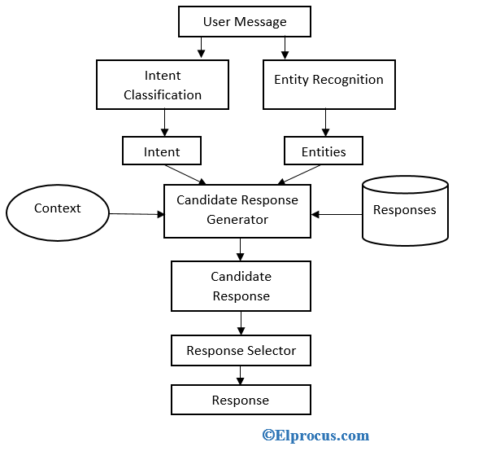

In the above figure, user messages are given to an intent classification and entity recognition.

* Intent: An intent in the above figure is defined as a user’s intention, example the intent of the word “Good Bye” is to end the conversation similarly, the intent of the word “What are some good Chinese restaurants”  the intent would be to find a restaurant.

* Entity: An entity in the Chatbot is used to modifies an intent and there are three types of entities they are system entity, developer entity and session entity.

* Candidate Response Generator: The candidate response generator in the Chatbot do the calculations using different algorithms to process the user request. Then the result of these calculations is the candidate’s response.

* Response Selector: The response selector in the Chatbot used to select the word or text according to the user queries to give a response to the users which should work better.
 

**The applications of Chatterbot**

* Chatbot’s for entertainment: Jokebot, Quotebot, Dinner ideas bot, Ruuh, Zo, Genius, etc.

* Chatbot’s for health: Webot, Meditatebot, Health tap, etc.

* Chatbot’s for news and weather: CNN, Poncho, etc.

The Chabot improves customer services, because of this improvement the benefits of the Chatbot are increasing day by day. In today’s world messaging has become one of the popular means of communication, whether it is a text message or through messaging apps. The Chabot’s are used in different fields for different purposes, because of these different types of businesses are being developed Chabot’s.