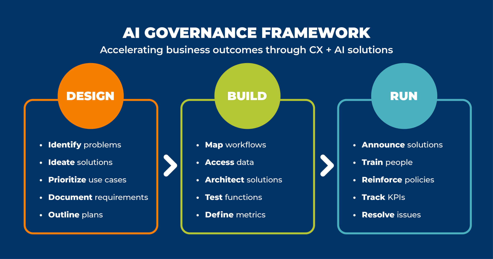

# GENERATIVE AI

## **Table of Contents**

* [Introduction to Generative AI](#Introduction)

* [Applications of Generative AI](#Applications)

* [Introduction to Generative Models](#Generative_Models)

    - [Types of Generative Models](#Types)

* [Deep Learning for Generative Models](#Deep_Learning)

    - [Generative Adversial Network(GAN)](#GANs)

    - [variational AutoEncoder(VAEs)](#VAEs)

    - [Autoregressive Models](#Autoregressive_Models)

* [Transformers](#Transformers)

    - [Architecture of Transformer](#Transformer_Architecture)

    - [Encoder](#Encoder)

    - [Decoder](#Decoder)

    - [Encoder Decoder](#Encoder_Decoder)

* [Introduction to Large Language Models](#LLMs)

* [Architecture of Large Language Models](#Architecture_of-LLMs)

* [Text AI LLMs](#Text_AI-LLMs) 

    - [GPT-3](#GPT-3)

    - [GPT-4](#GPT-4)

    - [LaMDA](#LaMDA)

    - [LLaMA](#LLaMA)

    - [Stanford Alpaca](#Stanford_Alpaca)

    - [Google FLAN](#Google_FLAN)

    - [Poe](#Poe)

    - [Falcon LLM](#Falcon_LLM)

* [AI Models & Services](AI_Models-Services)

    - [Image AI Models](#Image-AI_Models)

    - [Video AI Models](#Video-AI_Models)

    - [Audio AI Models](#Audio-AI_Models) 

* [Introduction to Prompt Engineering](Prompt_Engineering)

* [Introduction to Chatgpt](#ChatGPT)

* [Designing a prompt - The process and workflow](#Prompt_Designing)

* [Avoiding prompt injections using delimiters](#Prompt_Injections)

* [Defining Constraints](#Defining_constraints)

* [Zero-shot Prompting](#Zero-shot_Prompting)

* [Few-shot Prompting](#Few-shot_Prompting)

* [Persona Prompting](#Persona_Prompting)

* [Chain of Thought](#Chain_OfThought)

* [Adversial](#adversial)

* [Chatbot Architecture](#Chatbot_Architecture)

* [What is LangChain and when should you use it?](#Langchain)

* [The LangChain Ecosystem](#LangChain)

* [Supported LLMs](#Supported_LLMs)

* [Getting Started with Langchain on Google Colab](#LangChain_on-Google_Colab)

* [Prompt composition and templates](Prompt_Composition-Templates)

    - [Prompt Composition](#Prompt_Composition)

    - [Prompt Templates](#prompt_Templates)

* [Langchain Agents, Langchain Pipelines](#Agents_Piplines(Langchain))

    - [Langchain Agents](#Langchain_Agents)

    - [Langchain Pipelines](#Langchain_Pipelines)

* [Retrieval Augmented Generation(RAG)](#RAG)

* [Enterprise Data Search Using LLMs & Langchain](#Enterprise_Data-Search)

* [Case Study: Getting started with LangChain and OpenAI](#Case_Study)

* [Langchain Deep Dive](#Langchain-Deep_Dive)

* [Using multiple LLMs (Chains)](#Multiple_LLMs(Chains))

* [Working with Data loaders - Ingesting documents](Data_Loaders)

* [Working with text splitters - Chunking Data](#Text_Splitters)

* [Working with chains](#Working_with(Chains))

    - [Conversational Retrieval QA](#Conversational_Retrieval-QA)

    - [Retrieval-QA](#Retrieval-QA)

    - [Summarization](#Summarization)

    - [API](#API_Instructions)

* [Working with Memrory](#Working_with-Memory)

* [Working with Embedding](#Working_with-Embedding)

    - [Clustering](#Clustering)

    - [Text Classification](#Text_Classification)

* [Hugging Face](#Hugging_Face)

* [Model Library of Hugging Face](#Model_Library)

* [Identifying & choosing the Right LLM Models](#Identifying-choosing(LLMs))

* [Understanding the Model Metrics, Accuracy and other Benchmarks](#Evaluation_Metrics)

* [Hugging Face Datasets](#Hugging_Face-Datasets)

* [Code Documentations in Hugging face](#Code_Documentations)

* [Loading & Running a Huggingface Model in Google Colab](#Huggingface_Model)

* [Other Huggingface features](#Huggingface_features)

* [How to industrialize models and enable ModelOps](#Industrialize)

* [When and how to recalibrate,re-train,re-build models](#Models)

    - [Recalibrate](#Recalibrate)

    - [Re-train](#Re-Train)

    - [Re-building](#Re-Building)

* [When should I re-train the model](#Re-train(Model))

* [Model Retraining Options like PEFT, LORA](#Model_Retraining)

    - [PEFT](#PEFT)

    - [LORA](#LORA)

* [Perform Fine tuning of a LLM using PEFT](#Fine_tuning(PEFT))

* [Small Language Models](#small_LMs)

* [What next in the AI world](#AI_world)

* [Conclusion](#Conclusion)
<br>
<br>

## Introduction

Generative AI represents a groundbreaking advancement in artificial intelligence, characterized by its ability to create new and original content. Unlike traditional AI, which primarily analyzes and processes existing data, generative AI models are designed to produce new data that mimics the patterns and structures found in their training sets. This technology leverages sophisticated algorithms and neural network architectures, such as Generative Adversarial Networks (GANs) and Transformers, to generate text, images, audio, and even video.
<br>
<br>

## Applications

Generative AI has a wide array of applications across various industries, transforming how we create and interact with content. Here are some notable applications:

1. **Text Generation**<br>

    * **Content Creation:** Writing articles, stories, poetry, reports, news summaries, product descriptions, and social media content.<br>
    * **Customer Service:** AI-powered chatbots for real-time assistance.<br>
    * **Translation and Summarization:** Translating text between languages and summarizing long documents.<br>
    <br>

2. **Image and Video Generation**<br>

    * **Art and Design:** Creating original artwork, design concepts, and fashion items.<br>
    * **Entertainment:** Generating characters, scenes, and special effects for movies and video games.<br>
    * **Advertising:** Creating personalized and visually appealing advertisements.<br>

    <br>

3. **Audio Generation**

    * **Music Composition:** Composing original music and exploring different genres.<br>
    * **Voice Synthesis:** Generating realistic human speech for   voice-over work, virtual assistants, and accessibility technologies.<br>
    <br>

4. **Healthcare**

    * **Medical Imaging:** Enhancing the quality of medical images and aiding in diagnosis.<br>
    * **Drug Discovery:** Generating molecular structures for potential new drugs.<br>
    <br>

5. **Design and Manufacturing**

    * **Generative Design:** Creating optimized design solutions for engineering and architecture.<br>
    * **Product Design:** Prototyping new products and testing configurations and materials virtually.<br>
    <br>

6. **Finance**

    * **Algorithmic Trading:** Generating trading strategies and optimizing portfolio management.<br>
    * **Fraud Detection:** Identifying patterns in financial transactions indicating fraudulent activity.<br>
    <br>

7. **Education**

    * **Tutoring Systems:** Generating personalized lesson plans and feedback for students.<br>
    * **Content Creation:** Creating educational materials, including interactive simulations and quizzes.<br>
<br>

## Generative_Models

Generative models are a class of machine learning models designed to generate new data samples from the same distribution as the training data. They are widely used in various applications such as image synthesis, text generation, and more. Here’s a brief introduction to generative models:
<br>

## Types

1. **Generative Adversarial Networks (GANs):**

    * **Components:** Consist of two neural networks, a generator and a discriminator, which are trained simultaneously.

    * **Function:** The generator creates fake data samples, and the discriminator evaluates their authenticity. The generator improves over time to produce more realistic data.
    <br>

2. **Variational Autoencoders (VAEs):**

    * **Components:** Encoders and decoders with a latent space representation.

    * **Function:** Encoders map input data to a latent space, while decoders generate new data from this space. VAEs use a probabilistic approach to ensure the generated data is similar to the input data.
    <br>

3. **Autoregressive Models:**

    * **Examples:** PixelRNN, PixelCNN, GPT (Generative Pre-trained Transformer).

    * **Function:** Generate data sequentially, where each data point is conditioned on the previous ones. For instance, in text generation, each word is predicted based on the preceding words.
<br>
<br>   

## Deep_Learning

**Deep Learning for Genrative Models**

Deep learning has revolutionized generative modeling by harnessing the power of neural networks to create complex and realistic data distributions. Variational Autoencoders (VAEs) and Generative Adversarial Networks (GANs) are two prominent examples. VAEs use an encoder-decoder architecture to learn latent representations of data, enabling generation of new samples. GANs, on the other hand, pit a generator against a discriminator in a game-theoretic framework where the generator learns to produce increasingly realistic samples by fooling the discriminator, which itself improves at distinguishing real from generated data. These models have found applications in diverse fields such as image and text generation, offering capabilities from generating lifelike images to creating natural language text. Despite their successes, challenges like mode collapse and ethical implications regarding generated content remain areas of active research and debate in the field of deep generative models.

Here's how deep learning fuels generative models, along with some cool examples:

1. **Unveiling the Secrets:** Learning the Data's Language.

    *  Deep learning excels at analyzing vast amounts of data, like mountains of cat pictures.

    *  Through complex neural networks, it uncovers the hidden patterns and relationships within the data.

    *  This allows the model to understand the "language" of the data, like the typical shapes, colors, and textures of cats.

**Example:** Imagine a deep learning model trained on countless images of different dog breeds. It learns the characteristics of each breed – floppy ears for Bassets, curly fur for Poodles, etc.


<br>

2. **Generating New Worlds:** Creating from the Learned Language

    * Once the model understands the data's language, it can use that knowledge to generate entirely new examples that adhere to those patterns.

    *  It doesn't simply copy existing data; it creates variations based on what it has learned.

**Example:** The dog image model, having learned dog features, can now generate images of new, never-before-seen dog breeds! Maybe a fluffy Basset with Poodle curls?


<br>
<br>


## GANs

**Generative Adversarial Network**

A generative adversarial network (GAN) has two parts:

1. The generator learns to generate plausible data. The generated instances become negative training examples for the discriminator.

2. The discriminator learns to distinguish the generator's fake data from real data. The discriminator penalizes the generator for producing implausible results.


Both the generator and the discriminator are neural networks. The generator output is connected directly to the discriminator input. Through backpropagation, the discriminator's classification provides a signal that the generator uses to update its weights.
<br>
<br>

## VAEs

**Variational AutoEncoder**

Imagine a data compression tool for creativity! VAEs compress data into a latent space, capt/*uring its essence. The model can then decode this compressed version to generate new data samples that hold the same core characteristics.


The basic scheme of a variational autoencoder. The model receives x as input. The encoder compresses it into the latent space. The decoder receives as input the information sampled from the latent space and produces x' as similar as possible to x.
<br>
<br>

## Autoregressive_models

Autoregressive models are think of them like storytellers. These models predict the next element in a sequence, like the next word in a sentence. By chaining these predictions together, they can generate entirely new sequences that follow the learned patterns.


<br>
<br>

## Transformers

Building large language models using the transformer architecture dramatically improved the performance of natural language tasks over the earlier generation of RNNs, and led to an explosion in regenerative capability. The power of the transformer architecture lies in its ability to learn the relevance and context of all of the words in a sentence. Not just as you see here, to each word next to its neighbor, but to every other word in a sentence. To apply attention weights to those relationships so that the model learns the relevance of each word to each other words no matter where they are in the input. This gives the algorithm the ability to learn who has the book, who could have the book, and if it's even relevant to the wider context of the document. 

 
This diagram is called an attention map and can be useful to illustrate the attention weights between each word and every other word. Here in this stylized example, you can see that the word book is strongly connected with or paying attention to the word teacher and the word student.This is called self-attention and the ability to learn a tension in this way across the whole input significantly approves the model's ability to encode language. 
<br>
<br>

## Transformer_Architecture


Transformer is a neural network architecture that can process sequential data such as texts, audios, videos, and images(as a sequence of image patches). Transformer does not use any recurrent or convolution layers. It’s fundamental layer is called Attention. It also contain other basic layers such as fully-connected layers, normalization layer,embedding layer, and positional encoding layer.Transformer was initially introduced for machine translation, a task that demands processing two sequences(both input and output are sequences). Thus, the transformer model had two parts: encoder for processing the input and decoder for generating the output. 
<br>
<br>

## Encoder 
1. Encoder is one of the main blocks of the transformer architecture that is right at the input of input sequence. Encoder transforms input sequence into compressed representation. In the orginal transformer architecture, the encoder was repeated 6 times(this depends on overall size of architecture, it can be changed). Each encoder block has 3 main layers which are multi-head attention(MHA), layer norm, and MLPs(or feedforward according to the paper).

2. Multi-head attention and MLPs are referred to as sub-layers in the transformer paper. Between sublayers, there are layer normalization and dropout and residual connections in between(refer to diagram).

3. The number of encoder layers was 6 as said previously. The more the number of encoder layers, the larger the model, and the more the model is likely to capture the global context of the input sequences hence resulting in better task generalization.
<br>
<br>

## Decoder
1. The decoder is pretty much the same as encoder except additional multi-head attention that operated over the output of the encoder. The goal of the decoder is to fuse encoder output with the target sequence and to make predictions(or to predict the next token).

2. The attention that takes the target sequence in decoder is masked to prevent the current token(being processed) from attending to subsquent tokens in the target sequence. If the decoder has access to a full target sequence, this would basically be cheating and can result in model that can not generalize beyond the training data.

3. Decoder is also typically repeated the same times as encoder. In the orginal transformer, the number of decoder blocks were also 6 blocks.
<br>
<br>

## Encoder_decoder


The transformer architecture is split into two distinct parts, the encoder and the decoder. These components work in conjunction with each other and they share a number of similarities. Also, note here, the diagram you see is derived from the original attention is all you need paper. Notice how the inputs to the model are at the bottom and the outputs are at the top.


In essence, this process transforms words into numbers, where each number corresponds to a specific position in a dictionary containing all the potential words the model can handle. There are various tokenization methods available. For instance, some token IDs may represent two entire words.


Once your input is converted into numbers, it can be fed into the embedding layer. This layer is a trainable vector embedding space, a high-dimensional area where each token is represented by a vector and occupies a unique position within that space. Every token ID in the vocabulary is associated with a multi-dimensional vector. 


The idea is that these vectors learn to capture the meaning and context of individual tokens in the input sequence. Referring back to the example sequence, you can observe that each word has been assigned a token ID, and each token is translated into a vector. In the original transformer paper, the vector size was actually 512, which is too large to fit into this image.


When you integrate token vectors into the encoder or decoder base, you also incorporate positional encoding. The model processes all input tokens in parallel. By including positional encoding, you preserve the word order information, ensuring the positional relevance of words within the sentence is maintained. Once the input tokens and positional encodings are combined, the resulting vectors are passed to the self-attention layer.


In this stage, the model examines the relationships between tokens in your input sequence. As previously discussed, this enables the model to focus on different parts of the input sequence, effectively capturing the contextual dependencies between words. The self-attention weights, learned during training and stored in these layers, indicate the significance of each word in the input sequence relative to all other words.

However, this process occurs multiple times through the transformer's multi-headed self-attention mechanism. This means that several sets of self-attention weights, or heads, are learned in parallel, each independently from the others. The number of attention heads in the attention layer varies depending on the model, typically ranging from 12 to 100. The idea is that each self-attention head will learn to recognize different aspects of the language.


For instance, one head might identify relationships between the people entities in a sentence, while another head might focus on the activities described. Yet another head could concentrate on different properties, such as whether the words rhyme. It's important to understand that you don't predetermine which aspects of language each attention head will learn. The weights for each head start with random initialization, and with enough training data and time, each head will learn different language aspects. While some attention maps are straightforward to interpret, like the examples given here, others might be more complex.


After all the attention weights have been applied to your input data, the output is processed through a fully-connected feed-forward network. This layer's output is a vector of logits, with each value representing a proportional probability score for every token in the tokenizer dictionary. These logits can then be passed to a final softmax layer, where they are normalized into probability scores for each word. The output includes a probability for every word in the vocabulary, which means there will likely be thousands of scores. One token will have a higher score than the rest, indicating it is the most likely predicted token. However, as you'll learn later in the course, there are various methods to modify the final selection from this vector of probabilities.

<br>
<br>

## LLMs


Large Language Models (LLMs) represent a cutting-edge advancement in generative artificial intelligence, leveraging deep learning techniques to understand and generate human-like text. These models, such as GPT (Generative Pre-trained Transformer), are built on Transformer architectures that excel in capturing long-range dependencies in data. LLMs are trained on vast amounts of text data, enabling them to generate coherent and contextually relevant text in response to prompts or cues provided by users. Their ability to understand and produce language with fluency and coherence has enabled applications across various domains, including natural language understanding, dialogue systems, content generation, and more. However, alongside their remarkable capabilities, LLMs also raise ethical considerations related to biases in training data, potential misuse, and the societal impact of generated content. As research continues to advance, LLMs promise to further enhance our interactions with AI by pushing the boundaries of what machines can understand and express in natural language.

Imagine a computer program that has been trained on a massive amount of text data – like the entire internet! This data includes books, articles, code, and all sorts of online content. LLMs use this knowledge to understand the patterns and nuances of language.


**How do LLMs Work?**

LLMs rely on a special type of deep learning architecture called transformers (we discussed these earlier!). Transformers allow LLMs to analyze large amounts of text data efficiently and understand the relationships between words, even if they are far apart in a sentence.

**What can LLMs do?**

LLMs have a wide range of capabilities, including:

1. **Text Generation:** LLMs can create different creative text formats, like poems, code, scripts, musical pieces, emails, and letters.

2. **Machine Translation:** LLMs can translate languages more accurately and naturally, considering context and sentence structure.


3. **Question Answering:** LLMs can answer your questions in an informative way, drawing on their vast knowledge base.


4. **Summarization:** LLMs can condense large pieces of text into shorter summaries, capturing the key points.
<br>
<br>

## Architecture_of-LLMs

Large language models (LLMs) are impressive feats of engineering, capable of processing massive amounts of text data and generating human-quality responses. But how exactly do they achieve this? Let's delve into the typical architecture of LLMs, featuring a key component is transformers.

**Building Blocks of LLMs**

1. **Input Embedding Layer:** This layer transforms words or sub-words from text into numerical representations, allowing the model to understand the data.

2. **Transformer Encoder:** This is the heart of the LLM. It consists of multiple encoder layers stacked together. Each layer focuses on analyzing the relationships between words within a sentence.

    * **Multi-Head Attention:** This powerful mechanism allows the encoder to attend to different parts of the input sentence simultaneously, capturing long-range dependencies between words.

    * **Positional Encoding:** Since transformers don't inherently understand word order, this step injects information about the position of each word in the sentence.

    * **Feed Forward Network:** This layer adds non-linearity to the model, allowing it to learn complex patterns in the data.

3. **Output Layer:** Depending on the LLM's task (text generation, translation, etc.), this layer generates the final output, like translating a sentence or creating new text content.
<br>

**Here's a diagram illustrating the LLM architecture:**


**Understanding the Transformer:**

1. The transformer is a neural network architecture specifically designed for natural language processing tasks. Unlike traditional models that process text sequentially (word by word), transformers can analyze all parts of a sentence simultaneously.

2. This parallel processing capability allows transformers to capture complex relationships between words, even if they are far apart in the sentence.

3. The multi-head attention mechanism within the transformer encoder is crucial for this. It enables the model to "attend" to different parts of the input sentence, focusing on the most relevant information for the task at hand.
<br>

**Benefits of Transformer-based Architecture:**

1. Efficient processing of large amounts of text data

2. Ability to capture long-range dependencies between words

3. Improved performance on various NLP tasks
<br>
<br>

## Text_AI-LLMs

## GPT-3

1. **Developed by:** OpenAI

2. **Parameters:** GPT-3 is known for its massive scale with 175 billion parameters, enabling it to handle a wide range of natural language processing tasks.


3. **Capabilities:** It excels in tasks such as text generation, translation, summarization, question answering, and more. GPT-3 operates based on autoregressive language modeling, predicting the next word in a sequence given the previous ones.

4. **Applications:** Used in chatbots, content generation, language translation services, and various other AI applications requiring natural language understanding and generation.


## GPT-4

1. **Successor to GPT-3:** GPT-4 continues the lineage of OpenAI's advancements in large language models. Specific details on its architecture and improvements over GPT-3 are typically revealed upon release or publication.

2. **Expected Enhancements:** Likely to build upon GPT-3's capabilities with improvements in performance, efficiency, and possibly new features or task-specific optimizations.


## LaMDA

**Language Model for Dialogue Applications**

1. **Developed by:** Google

2. **Focus:** LaMDA is specifically tailored for dialogue applications, aiming to generate more natural and contextually appropriate responses in conversational AI systems.

3. **Capabilities:** It emphasizes the ability to maintain coherent dialogue and understand nuances in conversation, enhancing user interactions with AI systems like chatbots and virtual assistants.


## LLaMA

**Large Language Model Meta Learning Approach**

1. **Developed by:** Anthropic

2. **Purpose:** LLaMA focuses on developing large language models that are aligned with human values and prioritize safety in deployment.

3. **Ethical Considerations:** It integrates considerations of ethics and alignment with human values into its design, aiming to mitigate risks associated with large language models such as bias amplification or harmful outputs.


## Stanford_Alpaca

1. **Developed by:** Stanford University researchers

2. **Focus:** Alpaca is designed to generate coherent and contextually appropriate text across a variety of natural language processing tasks.


3. **Applications:** It is used in applications requiring natural language understanding and generation, potentially spanning tasks from chatbots to automated content generation.


## Google_FLAN

**Google_FLAN (Few-shot LANguage model)**

1. **Developed by:** Google

2. **Key Feature:** FLAN is optimized for few-shot learning, enabling it to adapt quickly to new tasks or domains with minimal training data.


3. **Applications:** Useful in scenarios where rapid adaptation to new tasks or environments is required, such as personalized AI assistants or specialized language processing tasks.


## Poe

1. **Developed by:** Anthropic

2. **Focus:** Poe emphasizes safety and ethical considerations in the development and deployment of large language models.

3. **Safety Measures:** It integrates mechanisms to mitigate risks associated with AI systems, ensuring alignment with human values and ethical standards.


## Falcon LLM

1. **Details:** Information specific to Falcon LLM is not readily available in the current knowledge base. It likely represents another instance of a large language model designed to excel in natural language processing tasks.
<br>
<br>

## AI_Models-Services

The world of AI extends far beyond text, venturing into the creative domains of image, video, and audio. Here's a glimpse into some exciting AI models and services pushing the boundaries in these areas, along with visuals to help you understand.

## Image-AI_Models

1. **Image Recognition and Classification**

    * **Models:** CNN-based models like ResNet, VGG, Inception, and EfficientNet are commonly used for image classification tasks.

    * **Services:** Google Vision API, Amazon Rekognition, and Microsoft Azure Computer Vision provide APIs for image recognition, object detection, and labeling.


**Single-label vs. multi-label classification**

 "Single-label image classification is a traditional image classification problem where each image is associated with only one label or class. For instance, an image of a cat can be labeled as “cat” and nothing else. The task of the classifier is to predict the label for a given image.

Multi-label image classification is an extension of the single-label image classification problem, where an image can have multiple labels or classes associated with it. For example, an image of a cat playing in a park can be labeled as “cat” and “park”. The task of the classifier, in this case, is to predict all the relevant labels or classes for a given image."


2. **Object Detection**

    * **Models:** YOLO (You Only Look Once), Faster R-CNN, and Mask R-CNN are popular for real-time object detection and instance segmentation.

    * **Services:** TensorFlow Object Detection API, Detectron2, and OpenCV with pre-trained models offer frameworks for object detection tasks.


3. **Image Generation**

    * **Models:** Generative Adversarial Networks (GANs) like StyleGAN, DALL-E (for text-to-image generation), and BigGAN.

    * **Applications:** Used in creative industries for generating realistic images, artistic styles, and even conditional image generation (e.g., generating images based on text descriptions).


 A generative model, at its most basic, means that you have mapped the probability distribution of the data itself. In the case of images, this means that there is a chance for every possible combination of pixel values. This also implies that new data points can be generated by sampling from this distribution (i.e. choosing combinations with large probability). If you’re working in computer vision, this means your model can generate new images from scratch. Here’s an example of a generated face. 
<br>
<br>

## Video-AI_Models 

1. **Video Generation**

    * **Models:** VideoGAN, MoCoGAN (Motion and Content GAN), and approaches combining GANs with RNNs or Transformers.

    * **Applications:** Creating synthetic video content, video editing automation, and enhancing video production workflows.

    !?[movie](https://x.com/i/status/1742366871146443239) AI models can create entirely new videos from scratch or modify existing ones. Imagine creating a video explaining a scientific concept.

2. **video Editing**

    * **Automated Editing:** Video AI models automate tasks like scene segmentation, shot detection, and storyboard generation, streamlining the editing process.

    * **Enhancement Tools:** AI enhances videos by upscaling resolution, applying color grading, reducing noise, and enabling creative effects like style transfer and object replacement.

    * **Workflow Optimization:** AI improves workflow efficiency with automated metadata tagging, real-time processing for live events, and tools for adaptive editing and content personalization.


3. **Video Summarization**

    * **Deep Learning Models:** AI models like Convolutional Neural Networks (CNNs) and Recurrent Neural Networks (RNNs) are employed to understand spatial and temporal features in videos, often enhanced by attention mechanisms to focus on the most relevant segments for summarization.

    * **Unsupervised and Reinforcement Learning:** Techniques such as clustering and keyframe extraction, as well as reinforcement learning methods, are used to identify important parts of a video without relying on labeled data, ensuring efficient and high-quality summaries.

    * **Hybrid Approaches and Applications:** Combining different models and methods can enhance summarization effectiveness. These AI-powered summaries are widely used in content creation, surveillance, and educational tools to condense long videos into concise, informative highlights.

     The illustration of the query-conditioned video summarization task. Given a user query, query-conditioned video summarization aims to predict a summary that is relevant to the query in a concise manner. Summary 1 and Summary 2 are two summarization results for the same video but for different user queries.
<br>
<br>

## Audio-AI_Models 

Audio AI models are revolutionizing how we interact with and manipulate sound. Here's a glimpse into some exciting applications:

1. **Music Generation**

    * **Concept:** Imagine composing a complete song or soundscape using AI! These models can generate music in various styles, from classical to electronic, or even create soundtracks based on specific moods or themes.

    * **Example Audio:** You can listen to music samples generated by Jukebox on the OpenAI website OpenAI 
    ?[audio](https://openai.com/index/jukebox/)


2. **Speech Recognition**

    * **Concept:** This is a fundamental AI skill, converting spoken language into text. It allows for features like voice dictation, automated captioning for videos, or voice search functionalities.

    * **Example Services:** ?[Google Cloud Speech-to-Text](https://cloud.google.com/speech-to-text), ?[Amazon Transcribe](https://aws.amazon.com/transcribe/)

    * **Example Application:** Dictating a text message using voice commands on your smartphone leverages speech recognition.


3. **Audio Classification**

    * **Concept:** AI can analyze and identify different sounds within an audio recording. Imagine automatically classifying animal calls in a forest recording or recognizing musical instruments playing in a song.

    * **Example Services:** 

    * **Example Application:** Security systems can use audio classification to identify the sound of breaking glass or a smoke detector alarm.
<br>
<br>

## Prompt_Engineering 

Prompt engineering is the art of crafting clear and effective instructions for Large Language Models (LLMs) like GPT-3 or LaMDA. These instructions, called prompts, guide the AI towards the desired outcome, influencing the kind of text, code, or creative content it generates.

**Why is Prompt Engineering Important?**

Imagine giving vague instructions to a friend. The results might be unpredictable. Similarly, LLMs need precise prompts to understand your intent and deliver exceptional outputs. Prompt engineering helps you:

* Fine-tune outputs: Tailor the AI's response to a specific style, format, or topic.

* Reduce ambiguity: Clear prompts minimize the chance of nonsensical or irrelevant outputs.

* Unlock creativity: Crafting prompts with specific details or scenarios can inspire the AI to generate creative text formats like poems or scripts.

* Improve factual accuracy: By providing factual context within the prompt, you can guide the AI towards generating more accurate and reliable responses.
<br>

**Key Strategies for Effective Prompt Engineering**

* **Clarity is King:** Use concise and well-structured language. The AI should understand the prompt without any confusion.

* **Provide Context:** Give the AI background information relevant to the task. This helps it understand the situation and generate a more relevant response.

* **Set the Tone:** Indicate the desired style or formality of the output. Do you want a casual email, a persuasive argument, or a humorous story?

* **Examples are Powerful:** Provide examples of the kind of output you expect. This gives the AI a reference point and improves the accuracy of its response.

* **Iteration is Key:** Don't be afraid to experiment and refine your prompts. Test different approaches and see how the AI responds.
<br>
<br>

## Introduction-to-Chatgpt

ChatGPT is an advanced conversational AI developed by OpenAI, designed to understand and generate human-like text based on the input it receives. It is built on the GPT-4 architecture, an iteration of the Generative Pre-trained Transformer models, and is capable of engaging in a wide variety of conversational tasks. Here’s an introduction to ChatGPT, highlighting its functionality, underlying technology, applications, and considerations.
<br>

**Here's a glimpse into what ChatGPT can do**

* Answer your questions in an informative way: Stuck on a question? ChatGPT can access and process vast amounts of information to provide insightful answers.

* Engage in casual conversation: Feeling chatty? ChatGPT can hold engaging conversations on various topics, adapting its style and tone to match yours.

* Generate different creative text formats: Need a poem for a special occasion or a script for a short play? ChatGPT can generate creative text formats based on your prompts and instructions.

* Translate languages: Traveling the world or need to understand a foreign text? ChatGPT can translate languages, bridging communication gaps.
<br>

**Understanding How ChatGPT Works**

While the inner workings of complex AI models are often not public knowledge, here's a simplified conceptual diagram to illustrate the general idea:


* **User Input:** This is what you provide, like questions, conversation prompts, or instructions for creative text generation.

* **Information Access:** ChatGPT can access and process massive amounts of information from various sources.

* **Conversational Response:** Based on your input and processed information, ChatGPT formulates informative or casual conversation responses.

* **Creative Text Output:** When prompted, ChatGPT can generate different creative text formats like poems, code, or scripts.
<br>
<br>

## Designing-a-prompt

**Designing a prompt - The process and workflow**

Imagine you're a movie director instructing your actors. The clearer your directions, the better the performance. Similarly, crafting effective prompts for AI models like ChatGPT is crucial for achieving the desired outcome. 
Here's a breakdown of the process with helpful visuals:

1.  **Define Your Goal**

    *  What do you want the AI model to generate? Is it a poem, a news report, a code snippet, or something else entirely?

    * Having a clear goal will guide your prompt structure and content.
    <br>

2. **Understand the AI Model's Capabilities**

    *   Different AI models have varying strengths and weaknesses. Familiarize yourself with the model's capabilities to ensure your prompt aligns with what it can do.

    *  Knowing the model's limitations can help you adjust your expectations and avoid frustration.

3. **Gather Information and Context**

    *   What background information or context is relevant to your goal? Providing relevant details helps the AI understand the situation and generate a more accurate response. 

    *  This could include specific details, keywords, or references related to your desired output.

4. **Craft the Prompt**

    *  **Clarity is King:** Use concise and well-structured language. The AI should understand the prompt without any confusion.

    *  **Set the Tone:** Indicate the desired style or formality of the output. Do you want a casual email, a persuasive argument, or a humorous story?

    *  **Provide Instructions:** Clearly state what you want the AI to do with the information you provided.

    * **Examples are Powerful:** Include examples of the kind of output you expect if possible. This gives the AI a reference point for generating the desired response.

**Here's an example to illustrate the process**

**Goal:** Generate a short, funny poem about a cat who loves to play with yarn.

**Prompt:**
Write a humorous poem in the style of Shel Silverstein about a mischievous cat who becomes obsessed with a ball of yarn.

 The text that you feed into the model is called the prompt, the act of generating text is known as inference, and the output text is known as the completion. The full amount of text or the memory that is available to use for the prompt is called the context window. Although the example here shows the model performing well, you'll frequently encounter situations where the model doesn't produce the outcome that you want on the first try. You may have to revise the language in your prompt or the way that it's written several times to get the model to behave in the way that you want. This work to develop and improve the prompt is known as prompt engineering.
<br>

5. **Refine and Iterate**

Don't be afraid to experiment and refine your prompts. Test different approaches and see how the AI responds. The first attempt might not be perfect, so be prepared to adjust based on the results.
<br>
<br>

## Prompt_injection

**Avoiding prompt injections using delimiters**

Avoiding prompt injections in large language models (LLMs) is crucial for maintaining the security and integrity of the interaction. Prompt injection attacks occur when an attacker manipulates the input prompts to influence the behavior of the model in an unintended way. Using delimiters effectively can help mitigate such risks. Here are some strategies to avoid prompt injections using delimiters:

1. **Clear Delimiters for User Input and System Instructions**

Use clear and distinct delimiters to separate user input from system instructions. This helps the model distinguish between what is user-provided content and what are system directives.

**Example**

```plaintext
<USER_INPUT>
This is a user input.
</USER_INPUT>

<SYSTEM_INSTRUCTION>
Summarize the user input.
</SYSTEM_INSTRUCTION>
```
<br>

2. **Sanitizing User Inputs**

Sanitize user inputs by escaping special characters or by using specific tokens to indicate the start and end of user content. This prevents the user from including text that could be interpreted as instructions to the model.

**Example**

```plaintext
<USER_INPUT>
BEGIN_USER_TEXT
This is a user input.
END_USER_TEXT
</USER_INPUT>

<SYSTEM_INSTRUCTION>
Summarize the text enclosed between BEGIN_USER_TEXT and END_USER_TEXT.
</SYSTEM_INSTRUCTION>
```
<br>

3. **Explicit Instruction Parsing**

Explicitly parse and validate instructions and user inputs. Define a strict schema for inputs and validate against this schema before processing.

**Example**

```python
import re

def validate_input(user_input):
    # Define a regex pattern for allowed input
    pattern = r'^[a-zA-Z0-9\s.,?!]*$'
    if re.match(pattern, user_input):
        return user_input
    else:
        raise ValueError("Invalid characters in user input")

try:
    user_input = validate_input("This is a user input.")
    system_instruction = "Summarize the following user input:"
    prompt = f"<USER_INPUT>{user_input}</USER_INPUT><SYSTEM_INSTRUCTION>{system_instruction}</SYSTEM_INSTRUCTION>"
except ValueError as e:
    print(e)
```
<br>

4. **Encapsulation**

Encapsulate user inputs and instructions in well-defined data structures, such as JSON objects, to ensure clarity and avoid ambiguity.

**Example**

```json
{
  "user_input": "This is a user input.",
  "system_instruction": "Summarize the user input."
}
```
<br>

5. **Limiting Instruction Scope**

Limit the scope of what the model can interpret as an instruction by using delimiters to encapsulate the commands and responses strictly.

**Example**

```plaintext
---USER INPUT START---
This is a user input.
---USER INPUT END---

---SYSTEM INSTRUCTION START---
Summarize the user input.
---SYSTEM INSTRUCTION END---
```
<br>

6. **Contextual Awareness**

Train the model to be aware of the context, using delimiters to mark different segments of the conversation or task, ensuring that it can distinguish between user input and system commands.

**Example**

```plaintext
[USER]
This is a user input.
[/USER]

[SYSTEM]
Summarize the user input.
[/SYSTEM]
```
<br>

7. **Using Strong Contextual Prompts**

Use strong contextual prompts to reinforce the boundaries of user inputs and instructions. This helps the model to better understand and separate the context.

**Example**

```plaintext

User: "This is a user input."

Assistant: "I will summarize the user's input."

Summary:
```
<br>
<br>

## Defining_constraints

Defining constraints in the context of machine learning and natural language processing (NLP) involves setting boundaries or limitations on the model or system to ensure it performs optimally within certain parameters. Constraints can be related to various aspects, including the data, model architecture, computational resources, and deployment environment. Here are some key areas where constraints can be defined:

**1. Data Constraints**

- **Quality of Data**: Ensure that the data used for training and testing is of high quality, properly labeled, and representative of the real-world scenarios where the model will be deployed.

- **Data Privacy**: Implement measures to protect sensitive information in the dataset, ensuring compliance with data protection regulations such as GDPR or CCPA.

- **Imbalanced Data**: Address class imbalances in the dataset to avoid biased predictions, potentially using techniques like resampling, SMOTE, or adjusting class weights.
<br>

**2. Model Constraints**

- **Model Size**: Define limits on the model size to ensure it fits within the available memory and storage constraints, especially important for deployment on edge devices or mobile platforms.

- **Complexity**: Limit the complexity of the model to avoid overfitting and ensure it generalizes well to new, unseen data.

- **Interpretability**: Choose models that are interpretable and explainable, particularly in applications where understanding the model's decision-making process is crucial.
<br>

**3. Computational Constraints**

- **Training Time**: Set limits on the amount of time allocated for training the model, which may involve choosing more efficient algorithms or utilizing hardware accelerators like GPUs or TPUs.

- **Inference Speed**: Ensure the model can make predictions within an acceptable time frame, critical for real-time applications.

- **Resource Usage**: Monitor and limit the use of computational resources (CPU, GPU, memory) to ensure the system remains responsive and cost-effective.
<br>

4. **Deployment Constraints**

- **Environment**: Consider the deployment environment (cloud, on-premise, edge devices) and ensure the model is compatible with the target infrastructure.

- **Scalability**: Design the system to handle varying loads, ensuring it can scale up or down based on demand.

- **Robustness**: Ensure the model can handle unexpected inputs and edge cases gracefully, maintaining stability and reliability.
<br>

5. **Ethical and Regulatory Constraints**

- **Bias and Fairness**: Implement measures to detect and mitigate bias in the model to ensure fair treatment of all user groups.

- **Compliance**: Ensure the model complies with relevant regulations and standards in the industry, such as healthcare, finance, or automotive standards.

- **Transparency**: Maintain transparency in the model's development and deployment processes, including clear documentation and disclosure of potential risks.
<br>

6. **Performance Metrics Constraints**

- **Accuracy**: Define acceptable levels of accuracy or other performance metrics like precision, recall, F1 score, etc., based on the specific application requirements.

- **Error Rates**: Set thresholds for acceptable error rates and implement strategies for monitoring and addressing errors during operation.
<br>

**Examples**

* **NLP Model for Customer Support**: Constraints might include ensuring the model can handle a predefined number of queries per second, maintaining response times under a certain threshold, and adhering to privacy regulations.

* **Image Recognition Model on Mobile Devices**: Constraints could involve limiting the model size to fit within the device's memory, optimizing for low power consumption, and ensuring real-time processing capabilities.
<br>
<br>

## Zero-shot_Prompting

Zero-shot prompting refers to the technique of designing prompts in such a way that an AI model can perform a task without having been explicitly trained on specific examples of that task. Instead, the model relies on its general understanding and knowledge derived from its training data to generate appropriate responses. This is particularly useful when you need the model to handle tasks for which no specific training examples are available.

 With in-context learning, you can help LLMs learn more about the task being asked by including examples or additional data in the prompt. Here is a concrete example. Within the prompt shown here, you ask the model to classify the sentiment of a review. So whether the review of this movie is positive or negative, the prompt consists of the instruction, "Classify this review," followed by some context, which in this case is the review text itself, and an instruction to produce the sentiment at the end. This method, including your input data within the prompt, is called zero-shot inference. The largest of the LLMs are surprisingly good at this, grasping the task to be completed and returning a good answer. In this example, the model correctly identifies the sentiment as positive.

 Smaller models, on the other hand, can struggle with this. Here's an example of a completion generated by GPT-2, an earlier smaller version of the model that powers ChatGPT. As you can see, the model doesn't follow the instruction. While it does generate text with some relation to the prompt, the model can't figure out the details of the task and does not identify the sentiment.
<br>
<br>

## Few-shot_Prompting

Few-shot prompting is a technique used with AI models like ChatGPT to perform tasks with minimal examples or shots of training data. Unlike zero-shot prompting, which requires the model to generalize from its training data without specific examples, few-shot prompting involves providing a small number of examples (shots) to guide the model in understanding and generating responses for a particular task or domain.

 Here you can see that the prompt text is longer and now starts with a completed example that demonstrates the tasks to be carried out to the model. After specifying that the model should classify the review, the prompt text includes a sample review. I loved this movie, followed by a completed sentiment analysis. In this case, the review is positive. Next, the prompt states the instruction again and includes the actual input review that we want the model to analyze. You pass this new longer prompt to the smaller model, which now has a better chance of understanding the task you're specifying and the format of the response that you want. The inclusion of a single example is known as one-shot inference, in contrast to the zero-shot prompt you supplied earlier.

 "Sometimes a single example won't be enough for the model to learn what you want it to do. So you can extend the idea of giving a single example to include multiple examples. This is known as few-shot inference. Here, you're working with an even smaller model that failed to carry out good sentiment analysis with one-shot inference. Instead, you're going to try few-shot inference by including a second example. This time, a negative review, including a mix of examples with different output classes can help the model to understand what it needs to do. You pass the new prompts to the model. And this time it understands the instruction and generates a completion that correctly identifies the sentiment of the review as negative.
<br>
<br>

## Persona_Prompting

Persona prompting involves guiding an AI model like ChatGPT to generate responses that align with a specific persona or character profile. This technique is useful for creating personalized interactions or content that reflects distinct personalities, which can enhance engagement and relevance in various applications.

Persona prompting is a valuable technique for customizing interactions with AI models to reflect specific personalities or character profiles. By defining clear persona attributes and crafting appropriate prompts, you can guide the model to generate responses that align with the desired persona, enhancing engagement and relevance in various applications such as customer support, storytelling, education, and personal assistance. This approach leverages AI's ability to simulate human-like interactions tailored to specific user needs and preferences.
<br>

**Key Aspects of Persona Prompting**

* **Persona Definition:** Define the characteristics, traits, and behaviors of the persona you want the AI to embody.

* **Contextual Guidance:** Provide prompts that incorporate the persona's attributes to guide the model's responses.

* **Consistency:** Maintain consistency in the persona's voice and style throughout interactions or content generation.
<br>

**Steps to Implement Persona Prompting**

1. **Define Persona Attributes:** Identify key traits, preferences, language style, and behaviors that characterize the persona.

2. **Craft Persona-based Prompts:** Write prompts that integrate the persona's attributes to guide the model's responses.

3. **Test and Refine:** Evaluate the model's outputs to ensure they align with the persona and adjust prompts as needed for accuracy.

**Here's an Example**

* **Task:** Write a news report about a new scientific discovery.

* *8Prompt without Persona:** Scientists have made a breakthrough discovery in the field of renewable energy. Write a news report explaining the discovery and its potential impact.

* **Prompt with Persona:** Sarah Jones, a veteran science journalist known for her skeptical approach, is investigating a recent breakthrough in renewable energy. Write a news report from Sarah's perspective, highlighting both the potential of the discovery and potential challenges that need further exploration.

In the second prompt, Sarah's skepticism influences the tone and content of the news report.
<br>
<br>

## Chain_ofThought

Chain of Thought (CoT) prompting is a technique used to improve the reasoning and interpretability of AI models like ChatGPT by encouraging them to articulate their thought processes. This approach aims to make the model's decision-making process more transparent and to help it generate more accurate and logical responses by breaking down complex tasks into smaller, manageable steps.
<br>

**Key Aspects of Chain of Thought Prompting**

* Step-by-Step Reasoning: Encourages the model to think through problems in a structured, sequential manner.

* Transparency: Makes the model's thought process explicit, enhancing interpretability and trust.

* Improved Accuracy: Helps the model generate more accurate and logical responses by focusing on each step of the reasoning process.

 Chain of Thought prompting is a powerful technique for enhancing the reasoning capabilities and transparency of AI models. By encouraging step-by-step reasoning, this approach helps models generate more accurate and logical responses, making them more reliable and interpretable. This technique is particularly useful for tasks that require complex problem-solving, logical analysis, and detailed explanations.
<br>
<br>

## Adversial

Adversarial techniques in generative AI, particularly within the framework of Generative Adversarial Networks (GANs), are a cornerstone of modern generative modeling. Here’s an overview of how adversarial concepts apply to generative AI:

**Generative Adversarial Networks (GANs)**

GANs consist of two neural networks, the generator and the discriminator, which are trained simultaneously through adversarial 
processes:

* **Generator:** The generator network creates synthetic data that resembles real data.

* **Discriminator:** The discriminator network evaluates the data, distinguishing between real data and the synthetic data produced by the generator.

The training process is a game where the generator aims to fool the discriminator with increasingly realistic data, while the discriminator strives to become better at identifying fake data.
<br>

**Training Process**

* **Adversarial Training:** The generator and discriminator are pitted against each other. The generator tries to produce data that the discriminator cannot distinguish from real data, while the discriminator tries to improve its accuracy in identifying real vs. fake data.
<br>

* **Loss Functions:** The loss functions for both networks are designed to optimize their respective goals. The generator's loss is minimized when it successfully fools the discriminator, while the discriminator's loss is minimized when it correctly identifies real and fake data.
<br>

**Applications of GANs**

* **Image Generation:** GANs can create high-resolution, realistic images from noise.

    * **Examples:** DeepArt, StyleGAN (generating faces), and text-to-image models.
    <br>

* **Data Augmentation:** GANs can generate additional training data for machine learning models, especially useful in fields with limited data.

    * **Examples:** Medical imaging, where GANs generate additional examples of rare conditions.
    <br>

* **Video Generation:** GANs can generate videos from a few frames or create entirely synthetic videos.

    * **Examples:** Deepfake technology for creating realistic but fake videos.
    <br>

* **Text Generation:** GANs can generate human-like text, poetry, or code.

    * **Examples:** Text-to-text generation models, conversational agents.
    <br>

* **Audio Generation:** GANs can produce realistic synthetic audio, including speech and music.

    * **Examples:** Text-to-speech models, music composition.
    <br>

**Adversarial Techniques in GANs**

* **Conditional GANs (cGANs):** These models condition the generation process on additional information, such as class labels, to produce more controlled and relevant outputs.

    * **Example:** Generating images of specific classes (e.g., dogs, cars).
    <br>

* **CycleGANs:** These models learn to translate between two different domains without requiring paired training examples.

    * **Example:** Translating images of horses to zebras and vice versa.
    <br>

* **StyleGAN:** A variant of GANs designed for high-resolution image generation with control over various aspects of the image style.

    * **Example:** Generating faces with specific attributes (age, gender, expression).
<br>
<br>


## Chatbot_Architecture

Designing a chatbot involves creating an architecture that ensures  effective interaction, accurate responses, and a seamless user  experience. The architecture typically includes several key components, each serving a specific purpose. 
Here’s an overview of the main components and the workflow of a typical chatbot architecture:
<br>

**Key Components**

1. **User Interface (UI):** The front-end interface through which users interact with the chatbot. This can be a web application, mobile app, messaging platform (e.g., WhatsApp, Facebook Messenger), or a voice assistant.
<br>

2. **Natural Language Processing (NLP)**

    * **Natural Language Understanding (NLU):** Converts user input into structured data. It includes tasks like intent recognition and entity extraction.

    * **Natural Language Generation (NLG):** Converts structured data back into human language to generate responses.
<br>

3. **Core Logic:** The brain of the chatbot that determines how to handle different user inputs. It includes:

    * **Intent Handling:** Mapping user intents to appropriate actions.

    * **Dialogue Management:** Managing the flow of the conversation.

    * **Business Logic:** Implementing specific business rules and processes.
<br>

4. **Backend Systems and Databases:** Store and retrieve information needed by the chatbot. 

    * **User Data:** Storing user profiles, preferences, and interaction history.

    * **External APIs:** Integrating with external services to provide information or perform actions (e.g., booking systems, weather services).
<br>

5. **Response Generation:** Creating responses based on the output from the core logic. 

    * **Static Responses:** Predefined responses for common queries.

    * **Dynamic Responses:** Generated based on the context and data retrieved from backend systems.
<br>

6. **Monitoring and Analytics:** Tools to monitor chatbot performance, user interactions, and gather insights for continuous improvement.
<br>

**Architecture of Chatbot**

An architecture of Chatbot requires a candidate response generator and response selector to give the response to the user’s queries through text, images, and voice. The architecture of the Chatbot is shown in the below figure.


In the above figure, user messages are given to an intent classification and entity recognition.

* Intent: An intent in the above figure is defined as a user’s intention, example the intent of the word “Good Bye” is to end the conversation similarly, the intent of the word “What are some good Chinese restaurants”  the intent would be to find a restaurant.

* Entity: An entity in the Chatbot is used to modifies an intent and there are three types of entities they are system entity, developer entity and session entity.

* Candidate Response Generator: The candidate response generator in the Chatbot do the calculations using different algorithms to process the user request. Then the result of these calculations is the candidate’s response.

* Response Selector: The response selector in the Chatbot used to select the word or text according to the user queries to give a response to the users which should work better.
<br>

**The applications of Chatterbot**

* Chatbot’s for entertainment: Jokebot, Quotebot, Dinner ideas bot, Ruuh, Zo, Genius, etc.

* Chatbot’s for health: Webot, Meditatebot, Health tap, etc.

* Chatbot’s for news and weather: CNN, Poncho, etc.

The Chabot improves customer services, because of this improvement the benefits of the Chatbot are increasing day by day. In today’s world messaging has become one of the popular means of communication, whether it is a text message or through messaging apps. The Chabot’s are used in different fields for different purposes, because of these different types of businesses are being developed Chabot’s.
<br>
<br>


## Langchain 

**What is LangChain?**

LangChain is an open source framework for building applications based on large language models (LLMs). LLMs are large deep-learning models pre-trained on large amounts of data that can generate responses to user queries—for example, answering questions or creating images from text-based prompts. LangChain provides tools and abstractions to improve the customization, accuracy, and relevancy of the information the models generate. For example, developers can use LangChain components to build new prompt chains or customize existing templates. LangChain also includes components that allow LLMs to access new data sets without retraining.
<br>

**Why is LangChain important?**

LLMs excel at responding to prompts in a general context, but struggle in a specific domain they were never trained on. Prompts are queries people use to seek responses from an LLM. For example, an LLM can provide an answer to how much a computer costs by providing an estimate. However, it can't list the price of a specific computer model that your company sells. 

To do that, machine learning engineers must integrate the LLM with the organization’s internal data sources and apply prompt engineering—a practice where a data scientist refines inputs to a generative model with a specific structure and context. 

LangChain streamlines intermediate steps to develop such data-responsive applications, making prompt engineering more efficient. It is designed to develop diverse applications powered by language models more effortlessly, including chatbots, question-answering, content generation, summarizers, and more.
<br>

**When to Use LangChain**

* **Building Chatbots:** If you're developing a chatbot or conversational agent, LangChain can simplify handling dialogue management, response generation, and context maintenance.

* **Natural Language Processing (NLP) Applications:** For tasks such as text classification, sentiment analysis, or summarization, LangChain provides the necessary tools and integrations.

* **Automation:** Automating tasks that involve natural language understanding, such as customer service automation or personal assistant applications.

* **Prototyping and Experimentation:** If you're experimenting with new ideas or prototypes involving language models, LangChain can speed up the development process.

* **Integration with Other Systems:** When you need to integrate language models with existing systems or workflows, LangChain offers connectors and integration points to make this easier.

By using LangChain, developers can focus more on the application logic and user experience rather than dealing with the complexities of integrating and managing language models.
<br>

**How does LangChain work?**

With LangChain, developers can adapt a language model flexibly to specific business contexts by designating steps required to produce the desired outcome. 
<br>

**Chains**

Chains are the fundamental principle that holds various AI components in LangChain to provide context-aware responses. A chain is a series of automated actions from the user's query to the model's output. For example, developers can use a chain for:

* Connecting to different data sources.
* Generating unique content.
* Translating multiple languages.
* Answering user queries. 
<br>

**Links**

Chains are made of links. Each action that developers string together to form a chained sequence is called a link. With links, developers can divide complex tasks into multiple, smaller tasks. Examples of links include:

* Formatting user input. 
* Sending a query to an LLM. 
* Retrieving data from cloud storage.
* Translating from one language to another.

In the LangChain framework, a link accepts input from the user and passes it to the LangChain libraries for processing. LangChain also allows link reordering to create different AI workflows. 
<br>

**Overview**

To use LangChain, developers install the framework in Python with the following command:

'''python
!pip install langchain
'''

Developers then use the chain building blocks or LangChain Expression Language (LCEL) to compose chains with simple programming commands. The chain() function passes a link's arguments to the libraries. The execute() command retrieves the results. Developers can pass the current link result to the following link or return it as the final output. 

Below is an example of a chatbot chain function that returns product details in multiple languages.

'''python
chain([

retrieve_data_from_product_database()

send_data_to_language_model()

   format_output_in_a_list()

  translate_output_in_target_language()

])
'''


**Here are some potential applications of LangChain**

* **Chatbots:** Develop chatbots that can engage in natural language conversations and provide informative responses.

* **Data Analysis:** Use LangChain to analyze large amounts of text data and extract key insights.

* **Content Creation:** Generate creative text formats like poems, scripts, or marketing copy using LLMs and LangChain's guidance.

LangChain is a valuable tool for developers who want to harness the power of LLMs to create innovative and intelligent applications.  If you're interested in exploring the world of LLM development, LangChain is definitely worth considering.
<br>
<br>

## LangChain_Ecosystem


The LangChain ecosystem is composed of various components and tools designed to work together seamlessly to facilitate the development of applications that utilize language models. 

Here's an overview of the key components in the LangChain ecosystem:

**Core Components**

1. **LangChain Core:** The foundational library that provides the core abstractions and utilities for building language model applications. This includes modules for handling input/output, managing context, and integrating with different language models.

2. **Modules:** LangChain offers a variety of pre-built modules for common tasks, such as:

    * **Language Model Modules:** Interfaces and connectors for popular language models like GPT-3, GPT-4, and other transformers.

    * **NLP Modules:** Tools for tasks like tokenization, entity recognition, sentiment analysis, and more.

    * **Utility Modules:** Helpers for tasks like logging, configuration management, and debugging.
    <br>

**Development Tools**

1. **LangChain CLI:** A command-line interface that helps with project initialization, management, and deployment. It simplifies tasks such as creating new projects, running local servers, and deploying applications to the cloud.

2. **LangChain Studio:** An integrated development environment (IDE) tailored for developing language model applications. It offers features like code editing, real-time collaboration, debugging, and visualization tools.
<br>

**Integration and Deployment**

1. **APIs and Connectors:** LangChain provides a set of APIs and connectors to integrate with other systems and services. This includes RESTful APIs, webhooks, and SDKs for different programming languages.

2. **Deployment Options:** LangChain supports various deployment environments, including local servers, cloud platforms (AWS, Azure, GCP), and containerized environments (Docker, Kubernetes). It also offers templates and scripts to simplify deployment.
<br>


It visually depicts the various components and their interactions. Here’s a breakdown of the key elements:

* **Large Language Models (LLMs):** These are powerful AI models trained on massive amounts of text data. They can generate text, translate languages, write different kinds of creative content, and answer your questions in an informative way.  The diagram shows LLMs at the top because they are the core component that LangChain applications interact with.
<br>

* **Prompt Engineering & Prompt Chaining:** Prompt engineering refers to the art of crafting the right instructions or questions (prompts) to get the desired results from an LLM. Prompt chaining is the technique of combining multiple prompts together to achieve a complex task. The diagram shows these two concepts near the top because they are essential for guiding the LLM and shaping its outputs.
<br>

* **LangChain Framework:** This is the foundation of the LangChain ecosystem. It provides the core libraries and functionalities for building LLM applications.  The framework is depicted in the center of the image, highlighting its central role.
<br>

* **Tools:** LangChain offers various tools to aid in development, such as debugging, monitoring, and memory management. These tools are represented on the left side of the diagram.
<br>

* **Data Connections:** LangChain allows you to incorporate external data sources like databases or documents into the LLM's workflow. This is illustrated by an arrow pointing from a box labeled "Data"  to the LangChain Framework.
<br>

* **Flowise:** This component is mentioned in the bottom left corner of the image, but its functionality is not explicitly explained in the official LangChain documentation. It likely refers to a specific tool or library within the LangChain ecosystem.
<br>

* **Autonomous Agents:** LangChain can be used to build stateful, multi-actor applications with LLMs, meaning these applications can learn and adapt over time.  This is represented by the concept of "Autonomous Agents"  in the bottom right corner of the image.
<br>

* LangSmith and LangGraph are also mentioned in the image but not depicted visually. We discussed these earlier:

    * LangSmith is a developer platform that provides functionalities like debugging, testing, evaluating, and monitoring your LLM applications.

    * LangGraph is the core framework for building stateful, controllable agents using LLMs.
<br>
<br>

## Supported_LLMs

LangChain supports a variety of large language models (LLMs) to cater to different use cases and requirements.Here's an overview of some of the supported LLMs:

**OpenAI_Models**

1. **GPT-3**: Known for its powerful text generation capabilities, GPT-3 can be used for tasks like content creation, summarization, translation, and conversational AI.

2. **GPT-4**: The latest in the GPT series, offering improved performance, understanding, and generation capabilities compared to its predecessors.
<br>

**Google_Models**

1. **BERT**: Primarily used for tasks that require understanding the context of words in a sentence, such as question answering and text classification.

2. **T5 (Text-to-Text Transfer Transformer)**: Converts all NLP tasks into a text-to-text format, making it highly versatile for tasks like translation, summarization, and more.
<br>

**Microsoft Models**

1. **Turing-NLG**: Known for its large-scale language generation capabilities, suitable for generating human-like text and conversational agents.

2. **DialoGPT**: Fine-tuned for generating conversational responses, making it ideal for building chatbots and interactive applications.
<br>

**Open-Source Models**

1. **GPT-Neo**: An open-source alternative to GPT-3, providing powerful language generation capabilities for those who prefer open-source solutions.

2. **GPT-J**: Another open-source language model known for its balanced performance in various NLP tasks.
<br>

**Hugging Face Models**

1. **Transformers**: LangChain supports integration with the Hugging Face Transformers library, giving access to a wide range of pre-trained models for various NLP tasks.
<br>

**Specialized Models**

1. **BioBERT**: A variant of BERT fine-tuned for biomedical text mining tasks.

2. **SciBERT**: Designed for scientific text, useful in academic and research contexts.
<br>

**Multilingual Models**

1. **mBERT (Multilingual BERT)**: Supports multiple languages, making it suitable for multilingual NLP tasks.

2. **XLM-R (Cross-lingual Language Model - RoBERTa)**: Provides strong cross-lingual understanding and generation capabilities.
<br>
<br>

## LangChain_on-Google_Colab

**Getting Started with LangChain on Google Colab**

Getting started with LangChain on Google Colab is a straightforward process. Below are the steps to set up and run a basic LangChain application on Google Colab.

**Step 1: Open Google Colab**

1. Go to [Google Colab](https://colab.research.google.com/) and create a new notebook.
<br>

**Step 2: Install LangChain**

First, you need to install LangChain and any other necessary dependencies. You can do this using pip. Run the following command in a code cell:

```python
!pip install langchain
```
<br>

**Step 3: Import LangChain and Set Up Your Environment**

After installing LangChain, you can import it and set up your environment. Here's a basic example:

```python
from langchain import LangChain

# Initialize the LangChain instance
lc = LangChain()
```
<br>

**Step 4: Choose and Configure a Language Model**

LangChain supports various language models. For this example, let's use OpenAI's GPT-3. You'll need an API key from OpenAI to use GPT-3. If you don't have one, sign up at [OpenAI](https://beta.openai.com/signup/).

```python
from langchain.models import OpenAI

# Set your OpenAI API key
openai_api_key = 'your-openai-api-key'

# Initialize the OpenAI model
gpt3 = OpenAI(api_key=openai_api_key)
```
<br>

**Step 5: Define Your Task**

Let's create a simple task where the model generates a response to a given prompt.

```python
# Define a prompt
prompt = "Explain the benefits of using LangChain."

# Generate a response using GPT-3
response = gpt3.generate(prompt)
print(response)
```
<br>

**Step 6: Run Your Notebook**

Execute the cells in your Colab notebook. If everything is set up correctly, you should see the response generated by GPT-3 based on your prompt.
<br>

**Complete Example Code**

Here's the complete code for reference:

```python
!pip install langchain

from langchain import LangChain
from langchain.models import OpenAI

# Set your OpenAI API key
openai_api_key = 'your-openai-api-key'

# Initialize the LangChain instance
lc = LangChain()

# Initialize the OpenAI model
gpt3 = OpenAI(api_key=openai_api_key)

# Define a prompt
prompt = "Explain the benefits of using LangChain."

# Generate a response using GPT-3
response = gpt3.generate(prompt)
print(response)
```
<br>

**Additional Tips**

1. **Explore LangChain Modules**: LangChain offers various modules for different tasks. Explore the documentation to understand all available features.

2. **Handle API Limits**: Be mindful of API usage limits and costs associated with using models like GPT-3.

3. **Experiment with Other Models**: Try integrating other models supported by LangChain to see which best fits your needs.

By following these steps, you should be able to get started with LangChain on Google Colab and begin exploring the capabilities of language models in your applications.
<br>
<br>

## Prompt_Composition-Templates

Prompt composition and the use of templates are key aspects of working with language models effectively. They help structure the input given to the models, ensuring more consistent and contextually appropriate responses. LangChain provides tools to facilitate prompt composition and templating.

## Prompt_Composition

Prompt composition involves crafting the input text in a way that guides the language model to produce the desired output. 
Here are some tips for effective prompt composition:

1. **Clarity**: Make the prompt as clear and specific as possible.

2. **Context**: Provide enough context for the model to understand what you are asking.

3. **Instructions**: Include explicit instructions if needed, such as the format of the response or any specific details to include.

4. **Examples**: Sometimes, providing examples can help the model understand the expected output.
<br>
<br>

## Prompt_Templates

LangChain allows you to create reusable prompt templates. Templates can include placeholders that are filled with specific values when the prompt is generated. This makes it easy to create consistent and dynamic prompts.

**Example of Using Templates in LangChain**

Here's a basic example to demonstrate how you can create and use templates in LangChain:

**Step 1: Define a Template**

First, define a template with placeholders for dynamic content.

```python
from langchain.prompts import PromptTemplate

# Define a prompt template
template = PromptTemplate(
    template="Write a summary for the following text:\n\n{text}\n\nSummary:",
    input_variables=["text"]
)
```
<br>

**Step 2: Fill the Template**

Next, fill the template with specific values.

```python
# Example text to summarize
text_to_summarize = "LangChain is a framework for developing applications using language models. It provides tools and abstractions to integrate language models into various applications easily."

# Fill the template with the text
prompt = template.format(text=text_to_summarize)
print(prompt)
```
<br>

**Step 3: Generate the Response**

Use the filled template to generate a response from the language model.

```python
# Initialize the OpenAI model
from langchain.models import OpenAI
openai_api_key = 'your-openai-api-key'
gpt3 = OpenAI(api_key=openai_api_key)

# Generate a response using the filled prompt
response = gpt3.generate(prompt)
print(response)
```
<br>

**Complete Example Code**

Here's the complete code for reference:

```python
!pip install langchain

from langchain.prompts import PromptTemplate
from langchain.models import OpenAI

# Set your OpenAI API key
openai_api_key = 'your-openai-api-key'

# Define a prompt template
template = PromptTemplate(
    template="Write a summary for the following text:\n\n{text}\n\nSummary:",
    input_variables=["text"]
)

# Example text to summarize
text_to_summarize = "LangChain is a framework for developing applications using language models. It provides tools and abstractions to integrate language models into various applications easily."

# Fill the template with the text
prompt = template.format(text=text_to_summarize)
print(prompt)

# Initialize the OpenAI model
gpt3 = OpenAI(api_key=openai_api_key)

# Generate a response using the filled prompt
response = gpt3.generate(prompt)
print(response)
```
<br>

**Advanced Template Usage**

* For more advanced usage, LangChain templates can include multiple input variables, conditional logic, and more complex formatting. This allows you to create highly customized and context-aware prompts for different scenarios.

* By leveraging prompt templates, you can ensure consistency in your prompts, reduce the chances of errors, and make it easier to manage complex prompt structures.
<br>
<br>

## Agents-Pipelines(Langchain)

LangChain provides powerful abstractions called Agents and Pipelines to streamline complex workflows involving multiple steps and interactions with language models. Here's an overview of these concepts and how to use them effectively.
<br>

## LangChain_Agents

Agents in LangChain are designed to handle tasks that involve a series of interactions or decisions. They can execute sequences of actions, handle different types of inputs and outputs, and maintain context across multiple steps.

**Key Features of Agents**

1. **Multi-Step Workflows**: Agents can manage workflows that require multiple interactions with the model or other systems.

2. **Context Management**: They maintain context across different steps, allowing for more coherent and contextually appropriate responses.

3. **Action Execution**: Agents can execute actions based on the input they receive, such as calling external APIs, retrieving data, or performing computations.
<br>

**Working of the Agents**

 The functionality of these agents heavily relies on prompt engineering. Prompt recipes are carefully crafted sets of instructions that shape the agent’s behaviors, knowledge, goals, and persona and embed them in prompts. The agent’s interaction with the outer world is dictated by its user interface, which could vary from command-line, graphical, to conversational interfaces. In the case of fully autonomous agents, prompts are programmatically received from other systems or agents.

Another crucial aspect of their structure is the inclusion of memory, which can be categorized into short-term and long-term. While the former helps the agent be aware of recent actions and conversation histories, the latter works in conjunction with an external database to recall information from the past.
<br>

**Example of Using Agents**

Here’s a simple example of how to create and use an agent in LangChain:

```python
from langchain import LangChain, Agent
from langchain.models import OpenAI

# Initialize LangChain and the language model
lc = LangChain()
openai_api_key = 'your-openai-api-key'
gpt3 = OpenAI(api_key=openai_api_key)

# Define a simple agent
class SummaryAgent(Agent):
    def __init__(self, model):
        self.model = model

    def run(self, text):
        prompt = f"Summarize the following text:\n\n{text}\n\nSummary:"
        return self.model.generate(prompt)

# Create an instance of the agent
agent = SummaryAgent(gpt3)

# Use the agent to summarize text
text_to_summarize = "LangChain is a framework for developing applications using language models. It provides tools and abstractions to integrate language models into various applications easily."
summary = agent.run(text_to_summarize)
print(summary)
```
<br>


## LangChain_Pipelines

Pipelines in LangChain are used to define a series of processing steps that transform input data into desired output. Pipelines can chain together multiple models, pre-processing and post-processing steps, and other components to create complex workflows.

**Key Features of Pipelines**

1. **Sequential Processing**: Define a sequence of steps where the output of one step becomes the input to the next.

2. **Modular Design**: Pipelines can include different types of steps, such as model calls, data transformations, and external API calls.

3. **Reusability**: Pipelines can be reused and adapted for different tasks, promoting code reusability and consistency.
<br>

**Example of Using Pipelines**

Here’s an example of how to create and use a pipeline in LangChain:

```python
from langchain import Pipeline
from langchain.steps import Step
from langchain.models import OpenAI

# Initialize the language model
openai_api_key = 'your-openai-api-key'
gpt3 = OpenAI(api_key=openai_api_key)

# Define a pre-processing step
class PreprocessStep(Step):
    def run(self, input_data):
        # For example, clean the text or extract relevant parts
        return input_data.strip()

# Define a model step
class ModelStep(Step):
    def __init__(self, model):
        self.model = model

    def run(self, input_data):
        prompt = f"Summarize the following text:\n\n{input_data}\n\nSummary:"
        return self.model.generate(prompt)

# Define a post-processing step
class PostprocessStep(Step):
    def run(self, input_data):
        # For example, format the output or extract key points
        return input_data

# Create a pipeline with the defined steps
pipeline = Pipeline(steps=[
    PreprocessStep(),
    ModelStep(gpt3),
    PostprocessStep()
])

# Use the pipeline to process text
text_to_summarize = "LangChain is a framework for developing applications using language models. It provides tools and abstractions to integrate language models into various applications easily."
summary = pipeline.run(text_to_summarize)
print(summary)
```
<br>
<br>

## RAG

**Retrieval Augmented Generation**

Retrieval Augmented Generation (RAG) is a framework that combines the strengths of retrieval-based models and generative models to produce more accurate and contextually relevant responses. The idea is to first retrieve relevant documents or pieces of information from a large corpus and then use this information to generate a response. This approach can significantly enhance the performance of generative models, especially in tasks requiring detailed and factual information.
<br>

**Key Components of RAG**

* **Retriever:** A model or method to search and retrieve relevant documents or passages from a large corpus.

* **Generator:** A generative model (such as GPT-3) that uses the retrieved information to generate a response.
<br>

**How RAG Works**


* **Query:** The input query or prompt is processed.

* **Retrieve:** The retriever searches a corpus to find relevant documents or passages based on the query.

* **Generate:** The retrieved documents are passed to the generator, which uses them to generate a more accurate and informed response.

**Example:** 
<br>
<br>

## Enterprise_Data_Serach

**Enterprise Data Search Using LLMs & Langchain**

Implementing an enterprise data search using Large Language Models (LLMs) and LangChain can greatly enhance the ability to retrieve and generate insights from vast and diverse datasets. Below is a step-by-step guide to building an enterprise data search system using LLMs and LangChain.

**Step 1: Setting Up Your Environment**

First, ensure you have LangChain and any other necessary dependencies installed. If you are using Google Colab or any other Jupyter environment, you can use the following command:

```bash
!pip install langchain
```
<br>

**Step 2: Load and Preprocess Your Data**

Assume you have enterprise data stored in various formats (e.g., CSV files, databases, documents). First, load and preprocess this data.

```python
import pandas as pd

# Example: Load data from a CSV file
data = pd.read_csv('enterprise_data.csv')

# Preprocess data if needed
# For simplicity, we will assume the data is a DataFrame with a 'content' column
documents = data['content'].tolist()
```
<br>

**Step 3: Set Up the Retriever**

A retriever is used to search and retrieve relevant documents from your dataset. LangChain supports various retrieval methods. For this example, we will use a simple keyword-based retrieval.

```python
from langchain.retrievers import SimpleRetriever

class EnterpriseRetriever(SimpleRetriever):
    def __init__(self, corpus):
        self.corpus = corpus

    def retrieve(self, query, top_k=5):
        # Simple keyword matching retrieval
        results = sorted(self.corpus, key=lambda x: query in x, reverse=True)
        return results[:top_k]

# Initialize the retriever with the enterprise documents
retriever = EnterpriseRetriever(documents)
```
<br>

**Step 4: Set Up the Generative Model**

We will use OpenAI's GPT-3 for the generative part of our pipeline.

```python
from langchain.models import OpenAI

# Initialize the OpenAI model
openai_api_key = 'your-openai-api-key'
gpt3 = OpenAI(api_key=openai_api_key)
```
<br>

**Step 5: Implement the RAG Pipeline**

Combine the retriever and the generative model to create a Retrieval-Augmented Generation (RAG) pipeline.

```python
class EnterpriseRAGPipeline:
    def __init__(self, retriever, generator):
        self.retriever = retriever
        self.generator = generator

    def run(self, query):
        # Retrieve relevant documents
        retrieved_docs = self.retriever.retrieve(query)
        # Combine retrieved documents
        context = "\n".join(retrieved_docs)
        # Generate a response using the context
        prompt = f"Context:\n{context}\n\nQuestion: {query}\nAnswer:"
        return self.generator.generate(prompt)

# Initialize the RAG pipeline
rag_pipeline = EnterpriseRAGPipeline(retriever, gpt3)

# Example query
query = "What are the main findings in the latest financial report?"
response = rag_pipeline.run(query)
print(response)
```
<br>

**Step 6: Integrate with a User Interface**

To make the search system accessible to enterprise users, you can integrate it with a web interface. For simplicity, here’s how you might set up a basic Flask web app:

```python
from flask import Flask, request, jsonify

app = Flask(__name__)

@app.route('/search', methods=['POST'])
def search():
    query = request.json.get('query')
    response = rag_pipeline.run(query)
    return jsonify({'response': response})

if __name__ == '__main__':
    app.run(debug=True)
```
<br>

**Step 7: Deploy and Scale**

For production use, consider deploying the Flask app to a cloud platform (such as AWS, Google Cloud, or Azure) and scaling it as needed. Use appropriate security measures to protect sensitive data and ensure compliance with enterprise policies.

**Complete Example Code**

Here’s a summary of the complete code:

```python
!pip install langchain flask

import pandas as pd
from langchain.models import OpenAI
from langchain.retrievers import SimpleRetriever
from flask import Flask, request, jsonify

# Load and preprocess data
data = pd.read_csv('enterprise_data.csv')
documents = data['content'].tolist()

# Set up the retriever
class EnterpriseRetriever(SimpleRetriever):
    def __init__(self, corpus):
        self.corpus = corpus

    def retrieve(self, query, top_k=5):
        results = sorted(self.corpus, key=lambda x: query in x, reverse=True)
        return results[:top_k]

retriever = EnterpriseRetriever(documents)

# Set up the generative model
openai_api_key = 'your-openai-api-key'
gpt3 = OpenAI(api_key=openai_api_key)

# Implement the RAG pipeline
class EnterpriseRAGPipeline:
    def __init__(self, retriever, generator):
        self.retriever = retriever
        self.generator = generator

    def run(self, query):
        retrieved_docs = self.retriever.retrieve(query)
        context = "\n".join(retrieved_docs)
        prompt = f"Context:\n{context}\n\nQuestion: {query}\nAnswer:"
        return self.generator.generate(prompt)

rag_pipeline = EnterpriseRAGPipeline(retriever, gpt3)

# Set up Flask app
app = Flask(__name__)

@app.route('/search', methods=['POST'])
def search():
    query = request.json.get('query')
    response = rag_pipeline.run(query)
    return jsonify({'response': response})

if __name__ == '__main__':
    app.run(debug=True)
```
<br>

**Considerations for Enterprise Use**

1. **Security**: Ensure that your application complies with enterprise security standards.

2. **Scalability**: Design your system to handle high loads and scale as needed.

3. **Compliance**: Ensure compliance with relevant regulations, such as GDPR for data privacy.

4. **Performance**: Optimize the retrieval and generation processes for performance, especially with large datasets.

By following these steps, you can build a powerful enterprise data search system using LangChain and LLMs, providing users with the ability to retrieve and generate insights from large and diverse datasets efficiently.
<br>
<br>

## Case_Study

**Case Study: Building a Simple Q&A Bot with LangChain and OpenAI**

**Step 1: Set Up Your Environment**

1. **Install Dependencies**: First, you'll need to install LangChain and OpenAI's Python client library. If you're using Google Colab, Jupyter Notebook, or any other Python environment, you can install these packages using pip.

```bash
!pip install langchain openai
```

2. **Obtain API Keys**: Sign up for an API key from OpenAI [here](https://beta.openai.com/signup/). Keep your API key safe, as you'll need it to access OpenAI's models.
<br>

**Step 2: Initialize LangChain and OpenAI**

1. **Import Libraries**: Start by importing the necessary libraries.

```python
from langchain import LangChain
from langchain.models import OpenAI
```

2. **Set Up OpenAI Model**: Initialize the OpenAI model with your API key.

```python
# Replace 'your-openai-api-key' with your actual OpenAI API key
openai_api_key = 'your-openai-api-key'
gpt3 = OpenAI(api_key=openai_api_key)
```
<br>

**Step 3: Define a Simple Prompt Template**

We'll create a prompt template that formats the input question for the model. This helps in structuring the query and ensures consistency.

```python
from langchain.prompts import PromptTemplate

# Define a prompt template for a Q&A task
template = PromptTemplate(
    template="Question: {question}\nAnswer:",
    input_variables=["question"]
)
```
<br>

**Step 4: Create a Function to Generate Answers**

We will define a function that takes a question, formats it using the prompt template, and then generates an answer using the OpenAI model.

```python
def generate_answer(question):
    # Format the prompt using the template
    prompt = template.format(question=question)
    # Generate a response using the OpenAI model
    response = gpt3.generate(prompt)
    return response
```
<br>

**Step 5: Implement a Simple Interface**

For demonstration purposes, we'll create a simple text-based interface that allows the user to input questions and get answers.

```python
def main():
    print("Welcome to the LangChain Q&A Bot!")
    print("Type 'exit' to end the session.")
    
    while True:
        question = input("You: ")
        if question.lower() == 'exit':
            break
        answer = generate_answer(question)
        print(f"Bot: {answer}")

if __name__ == "__main__":
    main()
```
<br>

**Step 6: Run the Application**

Execute the script to start the Q&A bot. You can ask any question, and the bot will generate an answer using OpenAI's GPT-3 model.
<br>

**Complete Example Code**

```python
# Install dependencies
!pip install langchain openai

# Import necessary libraries
from langchain import LangChain
from langchain.models import OpenAI
from langchain.prompts import PromptTemplate

# Set up OpenAI model
openai_api_key = 'your-openai-api-key'
gpt3 = OpenAI(api_key=openai_api_key)

# Define a prompt template for a Q&A task
template = PromptTemplate(
    template="Question: {question}\nAnswer:",
    input_variables=["question"]
)

# Function to generate answers
def generate_answer(question):
    # Format the prompt using the template
    prompt = template.format(question=question)
    # Generate a response using the OpenAI model
    response = gpt3.generate(prompt)
    return response

# Simple text-based interface
def main():
    print("Welcome to the LangChain Q&A Bot!")
    print("Type 'exit' to end the session.")
    
    while True:
        question = input("You: ")
        if question.lower() == 'exit':
            break
        answer = generate_answer(question)
        print(f"Bot: {answer}")

if __name__ == "__main__":
    main()
```
<br>

**Considerations and Next Steps**

1. **Error Handling**: Implement error handling to manage API errors and invalid inputs gracefully.

2. **Advanced Features**: Extend the bot with more advanced features like context-aware responses, memory, or integration with other data sources.

3. **UI Enhancements**: Consider creating a web-based or mobile interface to make the bot more user-friendly.

4. **Fine-Tuning**: Fine-tune the model on specific datasets to improve performance for specialized tasks.

By following these steps, you can create a simple yet powerful Q&A bot using LangChain and OpenAI. This serves as a foundation that you can build upon to create more sophisticated applications.
<br>
<br>

## Langchain-Deep_Dive

Let's take a deep dive into LangChain, covering its key components, features, and how to use it effectively in building language model applications.

**Overview of LangChain**

LangChain is a powerful framework designed for building applications that leverage language models. It provides a suite of tools and abstractions to simplify the integration of language models into various applications, such as chatbots, Q&A systems, and more complex workflows involving multiple steps and interactions.
<br>

**Key Components of LangChain**

1. **Models**: Interface to various language models, including OpenAI's GPT-3.

2. **Prompts**: Templates and utilities for creating and managing prompts.

3. **Agents**: Components that handle multi-step workflows, maintaining context and executing actions.

4. **Pipelines**: Sequential processing steps that transform input data into desired output.

5. **Retrievers**: Mechanisms for retrieving relevant documents or data from large corpora.

6. **Memory**: Utilities for maintaining state or context across interactions.
<br>

**Detailed Breakdown of Each Component**

**1. Models**

LangChain provides easy access to various language models, abstracting the complexities of different APIs.

**Example: Initializing an OpenAI Model**

```python
from langchain.models import OpenAI

openai_api_key = 'your-openai-api-key'
gpt3 = OpenAI(api_key=openai_api_key)
```
<br>

**2. Prompts**

Prompts are templates used to structure the input for language models, ensuring consistency and clarity.

**Example: Creating a Prompt Template**

```python
from langchain.prompts import PromptTemplate

template = PromptTemplate(
    template="Question: {question}\nAnswer:",
    input_variables=["question"]
)

# Using the template
prompt = template.format(question="What is LangChain?")
print(prompt)
```
<br>

**3. Agents**

Agents are used for handling multi-step workflows, where each step can involve different actions and interactions with the model.

**Example: Defining and Using an Agent**

```python
from langchain import Agent

class SimpleQAAgent(Agent):
    def __init__(self, model):
        self.model = model

    def run(self, question):
        prompt = f"Question: {question}\nAnswer:"
        return self.model.generate(prompt)

# Initialize the agent
agent = SimpleQAAgent(gpt3)

# Use the agent
response = agent.run("What is LangChain?")
print(response)
```
<br>

**4. Pipelines**

Pipelines allow for defining a sequence of processing steps, making it easy to build complex workflows.

**Example: Creating a Simple Pipeline**

```python
from langchain import Pipeline
from langchain.steps import Step

class PreprocessStep(Step):
    def run(self, input_data):
        return input_data.strip()

class ModelStep(Step):
    def __init__(self, model):
        self.model = model

    def run(self, input_data):
        prompt = f"Summarize the following text:\n\n{input_data}\n\nSummary:"
        return self.model.generate(prompt)

# Define the pipeline
pipeline = Pipeline(steps=[
    PreprocessStep(),
    ModelStep(gpt3)
])

# Use the pipeline
text = "LangChain is a framework for developing applications using language models."
summary = pipeline.run(text)
print(summary)
```
<br>

**5. Retrievers**

Retrievers are used to search and retrieve relevant documents or pieces of information from a large corpus.

**Example: Implementing a Simple Retriever**

```python
from langchain.retrievers import SimpleRetriever

class KeywordRetriever(SimpleRetriever):
    def __init__(self, corpus):
        self.corpus = corpus

    def retrieve(self, query, top_k=3):
        results = sorted(self.corpus, key=lambda x: query in x, reverse=True)
        return results[:top_k]

# Example corpus
corpus = [
    "LangChain is a framework for developing applications using language models.",
    "It provides tools and abstractions to integrate language models into various applications.",
    "LangChain supports agents, pipelines, and retrieval-augmented generation.",
    "OpenAI's GPT-3 is one of the models supported by LangChain."
]

# Initialize the retriever
retriever = KeywordRetriever(corpus)

# Use the retriever
results = retriever.retrieve("LangChain")
print(results)
```
<br>

**6. Memory**

Memory components are used to maintain state or context across multiple interactions.

**Example: Implementing a Simple Memory Component**

```python
from langchain.memory import Memory

class SimpleMemory(Memory):
    def __init__(self):
        self.context = []

    def update(self, new_info):
        self.context.append(new_info)

    def get_context(self):
        return " ".join(self.context)

# Initialize memory
memory = SimpleMemory()

# Update and retrieve context
memory.update("LangChain is a framework for language models.")
print(memory.get_context())
memory.update("It supports agents and pipelines.")
print(memory.get_context())
```

By following this deep dive, you now have a comprehensive understanding of LangChain's components and how to use them to build powerful applications. You can extend this foundation to create more sophisticated systems tailored to specific use cases, such as enterprise data search, context-aware chatbots, and more. LangChain's modular design and rich feature set make it an excellent choice for integrating language models into a wide range of applications.
<br>
<br>

## Multiple-LLMs(chains)

**Using Multiple LLMs (Chains)**

Using multiple LLMs (Large Language Models) in a chain can provide greater flexibility and more powerful capabilities by leveraging the strengths of different models for specific tasks. LangChain makes it easy to combine multiple LLMs into a cohesive pipeline.

Here, we'll explore how to set up and use multiple LLMs in a chain using LangChain. We'll create a pipeline that processes inputs through different models for different stages of the workflow.

**Step-by-Step Guide to Using Multiple LLMs in a Chain**

**Step 1: Install Dependencies**

Ensure you have LangChain and any necessary dependencies installed.

```bash
!pip install langchain openai
```
<br>

**Step 2: Set Up Your Environment**

Import the required libraries and set up your API keys for the different LLMs you'll be using.

```python
from langchain import LangChain, Agent, Pipeline, Step
from langchain.models import OpenAI
from langchain.prompts import PromptTemplate
from langchain.retrievers import SimpleRetriever
from langchain.memory import Memory

# Set up OpenAI models
openai_api_key = 'your-openai-api-key'
gpt3 = OpenAI(api_key=openai_api_key)

# You can also add other models here if needed
gpt4 = OpenAI(api_key=openai_api_key, model="gpt-4")  # Assuming gpt-4 is available

# Define other models (mock example)
class CustomModel:
    def generate(self, prompt):
        # Implement your custom model's generation logic
        return "Custom model response to: " + prompt

custom_model = CustomModel()
```
<br>

**Step 3: Define Prompt Templates**

Create prompt templates for different stages of your workflow.

```python
# Define prompt templates for different tasks
qa_template = PromptTemplate(
    template="Context: {context}\nQuestion: {question}\nAnswer:",
    input_variables=["context", "question"]
)

summarize_template = PromptTemplate(
    template="Summarize the following text:\n\n{text}\n\nSummary:",
    input_variables=["text"]
)

analysis_template = PromptTemplate(
    template="Analyze the following data:\n\n{data}\n\nAnalysis:",
    input_variables=["data"]
)
```
<br>

**Step 4: Implement Multiple Steps Using Different Models**

Define steps in your pipeline where different models are used for different tasks.

```python
class SummarizeStep(Step):
    def __init__(self, model, template):
        self.model = model
        self.template = template

    def run(self, input_data):
        prompt = self.template.format(text=input_data)
        return self.model.generate(prompt)

class AnalyzeStep(Step):
    def __init__(self, model, template):
        self.model = model
        self.template = template

    def run(self, input_data):
        prompt = self.template.format(data=input_data)
        return self.model.generate(prompt)

class QAStep(Step):
    def __init__(self, model, template):
        self.model = model
        self.template = template

    def run(self, context, question):
        prompt = self.template.format(context=context, question=question)
        return self.model.generate(prompt)
```

**Step 5: Combine Steps into a Pipeline**

Create a pipeline that processes inputs through the defined steps.

```python
# Initialize memory to maintain context
memory = Memory()

# Define the pipeline with multiple steps
pipeline = Pipeline(steps=[
    SummarizeStep(gpt3, summarize_template),
    AnalyzeStep(custom_model, analysis_template),
    QAStep(gpt4, qa_template)
])
```
<br>

**Step 6: Create a Function to Execute the Pipeline**

Define a function to execute the pipeline and process user input.

```python
def run_pipeline(input_data, question):
    # Step 1: Summarize the input data
    summary = pipeline.steps[0].run(input_data)
    print("Summary:", summary)
    
    # Step 2: Analyze the summary
    analysis = pipeline.steps[1].run(summary)
    print("Analysis:", analysis)
    
    # Step 3: Answer the question based on the analysis
    context = summary + " " + analysis
    answer = pipeline.steps[2].run(context, question)
    return answer
```
<br>

**Step 7: Create a User Interface**

Create a simple text-based interface to interact with the pipeline.

```python
def main():
    print("Welcome to the Multi-LLM Pipeline!")
    print("Type 'exit' to end the session.")
    
    while True:
        input_data = input("Enter data to process: ")
        if input_data.lower() == 'exit':
            break
        question = input("Enter your question: ")
        if question.lower() == 'exit':
            break
        answer = run_pipeline(input_data, question)
        print(f"Bot: {answer}")

if __name__ == "__main__":
    main()
```
<br>

**Considerations for Using Multiple LLMs**

1. **Model Selection**: Choose models based on their strengths and the specific requirements of each step in the pipeline.

2. **Efficiency**: Ensure that the pipeline is efficient and does not introduce unnecessary latency.

3. **Error Handling**: Implement error handling to manage potential issues with different models and steps.

4. **Scalability**: Design the system to scale effectively, considering the computational resources required by each model.
<br>
<br>

## Data_Loaders

**Working with Data loaders - Ingesting documents**

Let's dive into working with data loaders for ingesting documents using LangChain. This process is crucial for building applications that require processing and analyzing large volumes of text data, such as information retrieval systems, text summarization tools, and more.

LangChain provides utilities for ingesting and processing documents through data loaders. These components help streamline the process of loading text data from various sources, such as local files, databases, and web scraping, and then using this data in your language model applications.
<br>

**Steps**

**Step 1: Install Dependencies**

Ensure you have LangChain and any necessary dependencies installed.

```bash
!pip install langchain openai
```
<br>

**Step 2: Import Required Libraries**

Import the necessary libraries and components from LangChain.

```python
from langchain import LangChain, DataLoader
from langchain.models import OpenAI
from langchain.prompts import PromptTemplate
```
<br>

**Step 3: Define Data Loaders**

LangChain supports various data loaders for different data sources. Here, we'll cover examples of loading data from local files and web scraping.

**Example: Loading Data from Local Files**

You can create a custom data loader for reading text files from a local directory.

```python
import os

class LocalFileLoader(DataLoader):
    def __init__(self, directory_path):
        self.directory_path = directory_path

    def load(self):
        documents = []
        for filename in os.listdir(self.directory_path):
            if filename.endswith(".txt"):
                with open(os.path.join(self.directory_path, filename), 'r') as file:
                    documents.append(file.read())
        return documents

# Initialize the local file loader
directory_path = 'path_to_your_local_directory'
local_file_loader = LocalFileLoader(directory_path)
documents = local_file_loader.load()
print(f"Loaded {len(documents)} documents from local files.")
```

**Example: Loading Data from Web Scraping**

You can also create a custom data loader for scraping data from web pages.

```python
import requests
from bs4 import BeautifulSoup

class WebScraperLoader(DataLoader):
    def __init__(self, urls):
        self.urls = urls

    def load(self):
        documents = []
        for url in self.urls:
            response = requests.get(url)
            soup = BeautifulSoup(response.content, 'html.parser')
            text = soup.get_text()
            documents.append(text)
        return documents

# Initialize the web scraper loader
urls = ['https://example.com/page1', 'https://example.com/page2']
web_scraper_loader = WebScraperLoader(urls)
documents = web_scraper_loader.load()
print(f"Loaded {len(documents)} documents from web pages.")
```
<br>

**Step 4: Process Loaded Documents**

Once the documents are loaded, you can process them using the models and prompts in LangChain. For example, you can summarize each document using a language model.

```python
# Set up OpenAI model
openai_api_key = 'your-openai-api-key'
gpt3 = OpenAI(api_key=openai_api_key)

# Define a summarization prompt template
summarize_template = PromptTemplate(
    template="Summarize the following text:\n\n{text}\n\nSummary:",
    input_variables=["text"]
)

# Function to summarize documents
def summarize_documents(documents, model, template):
    summaries = []
    for doc in documents:
        prompt = template.format(text=doc)
        summary = model.generate(prompt)
        summaries.append(summary)
    return summaries

# Summarize the loaded documents
summaries = summarize_documents(documents, gpt3, summarize_template)
for i, summary in enumerate(summaries):
    print(f"Summary {i+1}:\n{summary}\n")
```
<br>

**Step 5: Integrate with Your Application**

Now that you have loaded and processed the documents, you can integrate this data into your application. For example, you can use the summaries in a search engine or a Q&A system.

```python
# Example integration: Simple Q&A system using summarized documents
class QASystem:
    def __init__(self, model, summaries):
        self.model = model
        self.summaries = summaries

    def answer_question(self, question):
        combined_summaries = " ".join(self.summaries)
        prompt = f"Context: {combined_summaries}\nQuestion: {question}\nAnswer:"
        answer = self.model.generate(prompt)
        return answer

# Initialize the Q&A system
qa_system = QASystem(gpt3, summaries)

# Ask a question
question = "What is the main topic discussed in the documents?"
answer = qa_system.answer_question(question)
print(f"Answer: {answer}")
```
<br>

By following these steps, you can effectively use LangChain to ingest and process documents from various sources. This allows you to build powerful applications that leverage large volumes of text data, such as document summarization tools, Q&A systems, and more. The flexibility of LangChain's data loaders makes it easy to integrate different data sources and streamline the processing pipeline.
<br>
<br>

## Text_Splitters

**Working with text splitters - Chunking Data**

Working with text splitters and chunking data is an essential step when dealing with large documents or datasets. Text splitting allows you to break down large texts into manageable chunks, making it easier for language models to process and analyze the data. LangChain provides utilities for text splitting, which can be very useful in building efficient data pipelines.
<br>

**Why Use Text Splitters?**

1. **Model Constraints**: Many language models have token limits, so splitting long texts ensures that the input stays within these limits.

2. **Efficiency**: Smaller chunks are processed faster and can be parallelized.

3. **Context Preservation**: Splitting text into logical chunks helps maintain context, which is crucial for accurate analysis.
<br>

**Steps**

**Step 1: Install Dependencies**

Ensure you have LangChain installed.

```bash
!pip install langchain
```
<br>

**Step 2: Import Required Libraries**

Import the necessary components from LangChain.

```python
from langchain.text_splitter import RecursiveCharacterTextSplitter, NLTKTextSplitter
```
<br>

**Step 3: Define Text Splitters**

LangChain supports different types of text splitters. Here, we'll cover examples using `RecursiveCharacterTextSplitter` and `NLTKTextSplitter`.

**Example: Recursive Character Text Splitter**

This splitter recursively splits text by characters, ensuring the chunks are within a specified length.

```python
# Define a recursive character text splitter
recursive_splitter = RecursiveCharacterTextSplitter(
    chunk_size=500,
    chunk_overlap=50
)

# Example text
text = """
Lorem ipsum dolor sit amet, consectetur adipiscing elit. Integer nec odio. Praesent libero. Sed cursus ante dapibus diam. 
Sed nisi. Nulla quis sem at nibh elementum imperdiet. Duis sagittis ipsum. Praesent mauris. 
Fusce nec tellus sed augue semper porta. Mauris massa. Vestibulum lacinia arcu eget nulla. 
Class aptent taciti sociosqu ad litora torquent per conubia nostra, per inceptos himenaeos. 
Curabitur sodales ligula in libero. Sed dignissim lacinia nunc. Curabitur tortor. Pellentesque nibh. 
Aenean quam. In scelerisque sem at dolor. Maecenas mattis. Sed convallis tristique sem. 
Proin ut ligula vel nunc egestas porttitor. Morbi lectus risus, iaculis vel, suscipit quis, luctus non, massa. 
Fusce ac turpis quis ligula lacinia aliquet. Mauris ipsum. Nulla metus metus, ullamcorper vel, tincidunt sed, euismod in, nibh. 
Quisque volutpat condimentum velit. Class aptent taciti sociosqu ad litora torquent per conubia nostra, per inceptos himenaeos. 
Nam nec ante. Sed lacinia, urna non tincidunt mattis, tortor neque adipiscing diam, a cursus ipsum ante quis turpis. 
Nulla facilisi. Ut fringilla. Suspendisse potenti. Nunc feugiat mi a tellus consequat imperdiet. 
Vestibulum sapien. Proin quam. Etiam ultrices. Suspendisse in justo eu magna luctus suscipit. 
Sed lectus. Integer euismod lacus luctus magna. Quisque cursus, metus vitae pharetra auctor, sem massa mattis sem, 
at interdum magna augue eget diam. Vestibulum ante ipsum primis in faucibus orci luctus et ultrices posuere cubilia Curae; 
Morbi lacinia molestie dui. Praesent blandit dolor. Sed non quam. In vel mi sit amet augue congue elementum. Morbi in ipsum sit amet pede facilisis laoreet. 
Donec lacus nunc, viverra nec.
"""

# Split the text
chunks = recursive_splitter.split(text)
print(f"Number of chunks: {len(chunks)}")
for i, chunk in enumerate(chunks):
    print(f"Chunk {i+1}:\n{chunk}\n")
```

**Example: NLTK Text Splitter**

This splitter uses the NLTK library to split text based on sentences.

```python
# Make sure to install NLTK first
!pip install nltk

# Import NLTK and download necessary data
import nltk
nltk.download('punkt')

# Define an NLTK text splitter
nltk_splitter = NLTKTextSplitter(
    chunk_size=5,  # Number of sentences per chunk
)

# Split the text
chunks = nltk_splitter.split(text)
print(f"Number of chunks: {len(chunks)}")
for i, chunk in enumerate(chunks):
    print(f"Chunk {i+1}:\n{chunk}\n")
```
<br>

**Step 4: Process and Analyze Chunks**

Once you have split the text into chunks, you can process and analyze each chunk individually. For example, you can use a language model to summarize each chunk or perform other NLP tasks.

```python
from langchain.models import OpenAI
from langchain.prompts import PromptTemplate

# Set up OpenAI model
openai_api_key = 'your-openai-api-key'
gpt3 = OpenAI(api_key=openai_api_key)

# Define a summarization prompt template
summarize_template = PromptTemplate(
    template="Summarize the following text:\n\n{text}\n\nSummary:",
    input_variables=["text"]
)

# Function to summarize chunks
def summarize_chunks(chunks, model, template):
    summaries = []
    for chunk in chunks:
        prompt = template.format(text=chunk)
        summary = model.generate(prompt)
        summaries.append(summary)
    return summaries

# Summarize the text chunks
summaries = summarize_chunks(chunks, gpt3, summarize_template)
for i, summary in enumerate(summaries):
    print(f"Summary {i+1}:\n{summary}\n")
```
<br>

By using text splitters in LangChain, you can effectively manage large text data by breaking it down into smaller, manageable chunks. This allows for more efficient processing and analysis, making it easier to work within the constraints of language models and ensuring better context preservation.
<br>

**Use Cases for Text Chunking**

Text chunking can be used by several different applications:

* **Text Summarization:** By breaking down large bodies of text into manageable chunks, we can summarize each section individually, leading to a more accurate overall summary.

* **Sentiment Analysis:** Analyzing the sentiment of shorter, coherent chunks can often yield more precise results than analyzing an entire document.

* **Information Extraction:** Chunking helps in locating specific entities or phrases within text, enhancing the process of information retrieval.

* **Text Classification:** Breaking down text into chunks allows classifiers to focus on smaller, contextually meaningful units rather than entire documents, which can improve performance.

**Machine Translation:** Translation systems often operate on chunks of text rather than on individual words or whole documents. Chunking can aid in maintaining the coherence of the translated text.
<br>
<br>

## Working_with-Chains

Working with chains in LangChain allows you to create powerful and flexible workflows by chaining together various components, such as language models, text splitters, and data loaders. This approach can be used for a variety of tasks, including conversational retrieval QA, retrieval QA, summarization, and API interactions. 

LangChain's chain architecture enables you to connect multiple components in a sequence to achieve complex tasks. For example, you can create a chain that loads data, processes it, and then uses a language model to generate responses or summaries.
<br>

**Example Use Cases**

1. **Conversational Retrieval QA**: Engage in a conversational question-answering process using retrieved documents.

2. **Retrieval QA**: Retrieve relevant documents and answer questions based on the retrieved content.

3. **Summarization**: Summarize documents or text data using language models.

4. **API Interactions**: Chain together API calls with language models to perform complex tasks.
<br>
<br>

## Conversational_Retrieval-QA

Engage in a conversational QA process where the system retrieves relevant documents based on the conversation history and answers questions.

```python
# Define the conversational retrieval QA chain
conversational_qa_chain = ConversationalRetrievalQA(
    retriever=vector_store.as_retriever(),
    model=gpt3
)

# Example conversation
conversation_history = [
    {"role": "user", "content": "Tell me about the document contents."},
    {"role": "assistant", "content": "Sure, what specific information are you looking for?"}
]

# User asks a question
user_question = "What is the main topic of the documents?"

# Get the response
response = conversational_qa_chain.run(conversation_history, user_question)
print(response)
```
<br>
<br>

## Retrieval-QA

Retrieve relevant documents based on a query and generate answers using the language model.

```python
# Define the retrieval QA chain
retrieval_qa_chain = RetrievalQA(
    retriever=vector_store.as_retriever(),
    model=gpt3
)

# User query
query = "Summarize the main points of the documents."

# Get the response
response = retrieval_qa_chain.run(query)
print(response)
```
<br>
<br>

## Summarization

Summarize the content of documents using a language model.

```python
# Define the summarization chain
summarization_chain = Summarization(
    model=gpt3,
    prompt_template=PromptTemplate(
        template="Summarize the following text:\n\n{text}\n\nSummary:",
        input_variables=["text"]
    )
)

# Summarize each chunk
summaries = [summarization_chain.run(chunk) for chunk in chunks]
for i, summary in enumerate(summaries):
    print(f"Summary {i+1}:\n{summary}\n")
```
<br>
<br>

## API_Interactions

Chain together API calls with language model interactions to perform complex tasks.

```python
# Define the API chain
api_chain = APIChain(
    api_endpoint="https://api.example.com/data",
    request_template=PromptTemplate(
        template="Fetch data from the following endpoint: {endpoint}",
        input_variables=["endpoint"]
    ),
    response_processor=lambda response: response.json()
)

# Example API interaction
api_response = api_chain.run()
print(api_response)
```
<br>
<br>

## Working_with-Memory

**Working with Memory**

Working with memory in LangChain involves managing state across multiple interactions, which is especially useful in tasks like conversational AI where context from previous interactions needs to be retained. LangChain provides memory modules to help you store and retrieve context efficiently.

**Why Use Memory?**

* **Context Preservation:** Keep track of conversation history or previous interactions to maintain context.

* **State Management:** Store intermediate results or states across different stages of processing.

* **Personalization:** Retain user preferences and information to provide personalized responses.

Working with memory in LangChain involves managing state across multiple interactions, which is especially useful in tasks like conversational AI where context from previous interactions needs to be retained. LangChain provides memory modules to help you store and retrieve context efficiently. Let's go through how to use memory in LangChain step by step.

**Why Use Memory?**

1. **Context Preservation**: Keep track of conversation history or previous interactions to maintain context.
2. **State Management**: Store intermediate results or states across different stages of processing.
3. **Personalization**: Retain user preferences and information to provide personalized responses.
<br>

**Using Memory in a Conversational Chain**

**Step 1: Set Up Conversation Memory**

Initialize the conversation memory to store and retrieve conversation context.

```python
memory = ConversationBufferMemory()
```
<br>

**Step 2: Define Conversational Chain with Memory**

Create a conversational retrieval QA chain that uses the conversation memory.

```python
conversational_qa_chain = ConversationalRetrievalQA(
    retriever=vector_store.as_retriever(),
    model=gpt3,
    memory=memory
)
```
<br>

**Step 3: Conduct a Conversation**

Engage in a conversation where the system maintains context across multiple interactions.

```python
# Example conversation
conversation_history = [
    {"role": "user", "content": "Tell me about the document contents."},
    {"role": "assistant", "content": "Sure, what specific information are you looking for?"}
]

# User asks a question
user_question = "What is the main topic of the documents?"

# Get the response
response = conversational_qa_chain.run(conversation_history, user_question)
print(response)

# Ask another question to test memory
next_question = "Can you provide more details on that topic?"
response = conversational_qa_chain.run(conversation_history, next_question)
print(response)
```
<br>

**Advanced Memory Management**

You can customize the memory to suit your application's needs. For example, you can limit the size of the memory buffer or use different types of memory storage.

**Limiting Memory Buffer Size**

```python
memory = ConversationBufferMemory(max_memory_size=5)  # Store only the last 5 interactions
```
<br>

**Using Custom Memory Storage**

You can create custom memory storage by subclassing the `BaseMemory` class and implementing the required methods.

```python
from langchain.memory import BaseMemory

class CustomMemory(BaseMemory):
    def __init__(self):
        self.memory = []

    def load_memory(self):
        return self.memory

    def save_memory(self, interaction):
        self.memory.append(interaction)
        if len(self.memory) > 5:
            self.memory.pop(0)  # Keep only the last 5 interactions

custom_memory = CustomMemory()
```
<br>
<br>

## Working_with-embeddings

**Working with Embeddings**

Working with embeddings in LangChain allows you to represent text data in a dense vector format, which is useful for various NLP tasks such as document retrieval, clustering, and similarity search. Embeddings can capture the semantic meaning of text, making them powerful for many applications.
<br>

**Why Use Embeddings?**

* **Semantic Search:** Find documents or sentences with similar meanings.

* **Clustering:** Group similar texts together.

* **Dimensionality Reduction:** Represent large text data in a compact format.

* **Text Classification:** Use embeddings as features for machine learning models.


**Why Use Embeddings?**

1. **Semantic Search**: Find documents or sentences with similar meanings.

2. **Clustering**: Group similar texts together.

3. **Dimensionality Reduction**: Represent large text data in a compact format.

4. **Text Classification**: Use embeddings as features for machine learning models.
<br>

**Complete Example Code**

```python
# Install dependencies
!pip install langchain openai faiss-cpu

# Import necessary libraries
from langchain.embeddings import OpenAIEmbeddings
from langchain.vectorstores import FAISS
from langchain.text_splitter import RecursiveCharacterTextSplitter
from langchain.loaders import LocalFileLoader

# Load documents
directory_path = 'path_to_your_local_directory'
local_file_loader = LocalFileLoader(directory_path)
documents = local_file_loader.load()

# Split documents into chunks
splitter = RecursiveCharacterTextSplitter(chunk_size=500, chunk_overlap=50)
chunks = splitter.split_documents(documents)

# Set up the embedding model
openai_api_key = 'your-openai-api-key'
embeddings = OpenAIEmbeddings(api_key=openai_api_key)

# Generate embeddings for the document chunks
doc_embeddings = [embeddings.embed(chunk) for chunk in chunks]

# Initialize the vector store with FAISS
vector_store = FAISS.from_embeddings(doc_embeddings)

# Define a query
query = "What are the main points of the documents?"

# Generate the embedding for the query
query_embedding = embeddings.embed(query)

# Perform the search
search_results = vector_store.search(query_embedding, k=5)  # Retrieve top 5 results

# Display the search results
for i, result in enumerate(search_results):
    print(f"Result {i+1}:\n{result['text']}\n")
```
<br>


**Benefits of Embeddings in LLM Applications**

* **Semantic Search:** Embeddings enable efficient retrieval of documents or passages similar to a given query. This is crucial for tasks like question answering or document summarization.

* **Text Classification:** Embeddings can be used to represent documents or sentences as feature vectors for tasks like sentiment analysis or topic modeling.

* **Improved LLM Performance:** LLMs can leverage pre-trained embeddings to gain a deeper understanding of the context and relationships within textual data.
<br>

**How LangChain Supports Embedding Usage**

* **Text Embedding Models:** LangChain offers an Embeddings class that provides access to various pre-trained embedding models. You can choose the model that best suits the type of text data you're working with.

* **Embedding Document and Queries:** The Embeddings class allows you to generate embeddings for both documents and individual queries (user questions or search terms). This enables you to compare them in the vector space for tasks like semantic search.
<br>
<br>


## Clustering

You can use the document embeddings for clustering similar documents together. For example, using KMeans clustering:

```python
from sklearn.cluster import KMeans

# Perform KMeans clustering
num_clusters = 5
kmeans = KMeans(n_clusters=num_clusters)
kmeans.fit(doc_embeddings)

# Assign clusters to documents
clusters = kmeans.labels_

# Display clusters
for i in range(num_clusters):
    cluster_docs = [chunks[j] for j in range(len(chunks)) if clusters[j] == i]
    print(f"Cluster {i+1}:\n{cluster_docs}\n")
```
<br>
<br>

## Text Classification

Use embeddings as features for a machine learning model to classify text data:

```python
from sklearn.ensemble import RandomForestClassifier
from sklearn.model_selection import train_test_split
from sklearn.metrics import accuracy_score

# Prepare data (assuming labels are provided)
labels = [...]  # Replace with actual labels

# Split data into training and testing sets
X_train, X_test, y_train, y_test = train_test_split(doc_embeddings, labels, test_size=0.2, random_state=42)

# Train a RandomForest classifier
classifier = RandomForestClassifier()
classifier.fit(X_train, y_train)

# Predict on the test set
y_pred = classifier.predict(X_test)

# Evaluate the model
accuracy = accuracy_score(y_test, y_pred)
print(f"Accuracy: {accuracy:.2f}")
```
<br>
<br>

## Hugging_Face 

Hugging Face is both a company and a vibrant community focused on making artificial intelligence, especially Natural Language Processing (NLP), accessible to everyone. Here's a deeper dive into what they offer:

**Open-Source Resources:**

* **The Transformers Library:** This is Hugging Face's crown jewel. It's a popular open-source library that provides pre-trained models for various NLP tasks. These models can be used for tasks like question answering, text summarization, machine translation, and more. It's compatible with different programming frameworks like TensorFlow, PyTorch, and Jax, making it versatile.

* **The Hugging Face Hub:** This central online repository is a game-changer. It allows users to share and discover pre-trained models, datasets, and code for various machine learning tasks. This fosters collaboration and innovation as researchers and developers can easily find and reuse existing resources, accelerating their work. 

* **Additional Open-source Libraries:** Hugging Face goes beyond Transformers. They offer other open-source libraries that cater to specific needs in the machine learning workflow:

    * **Datasets:** This library simplifies data processing tasks, making it easier to prepare data for training models.

    * **Evaluate:** This library provides tools to evaluate the performance of your trained machine learning models.

    * **Gradio:** This library helps you create interactive demos for your machine learning models, making it easier to showcase and share your work. 
<br>

**Community Building:**

Hugging Face understands the power of collaboration. They've cultivated a large and active community of AI researchers, developers, and enthusiasts. Here are some ways they foster this community:

* **Forums and Discussions:** The Hugging Face website has forums and discussion boards where users can connect, share experiences, ask questions, and discuss various NLP topics. 

* **Tutorials and Documentation:** Extensive documentation and tutorials are available to help newcomers get started with the Transformers library, Hub, and other resources. Learning is made easier with clear and concise instructions.

* **Competitions and Events:** Hugging Face regularly hosts competitions and events that challenge participants to develop innovative solutions using NLP techniques. These events not only push the boundaries of NLP but also encourage friendly competition and collaboration within the community.
<br>

**Enterprise Products**

While Hugging Face is known for its open-source offerings, they also cater to businesses looking to leverage AI:

* **Model Deployment Tools:** Hugging Face offers tools to streamline the process of deploying trained models into production environments. This helps companies integrate AI solutions seamlessly into their workflows.

* **Customizable AI Solutions:** Not all companies have the same needs. Hugging Face provides services to tailor AI models and workflows to address specific business requirements.

* **Support and Training:**  Integrating AI solutions can be complex. Hugging Face offers support and training resources to help companies navigate the process and ensure their AI projects are successful. 

In essence, Hugging Face is a one-stop shop for everything NLP. Their open-source tools and resources democratize AI, making it accessible to a wider audience. The active community fosters collaboration and innovation, while the enterprise products help businesses leverage the power of AI for real-world applications. 
<br>
<br>

## Model_Library

**Model Library of Hugging Face**

Hugging Face hosts a comprehensive model library known as the Model Hub, which offers a vast array of pre-trained models for various natural language processing (NLP) tasks. Here are some key aspects of the Hugging Face Model Library:

1. **Diversity of Models**: The library includes a wide range of pre-trained models spanning different architectures such as transformers, BERT, GPT, RoBERTa, XLNet, T5, and more. These models are trained on large datasets and fine-tuned for specific NLP tasks like text classification, named entity recognition (NER), question answering, summarization, translation, sentiment analysis, and more.

2. **Accessibility**: Models hosted on Hugging Face's Model Hub are easily accessible through their website or directly via the `transformers` library in Python. This accessibility makes it convenient for developers and researchers to explore, download, and integrate these models into their projects.

3. **Model Cards**: Each model in the library is accompanied by a model card, which provides essential information such as the model architecture, input format, training data, performance benchmarks, and suggested use cases. Model cards help users understand the capabilities and limitations of each model before choosing one for their specific application.

4. **Fine-tuning and Customization**: Hugging Face supports fine-tuning of pre-trained models on custom datasets. This allows users to adapt models to their specific domain or task, leveraging the knowledge learned during pre-training.

5. **Community Contributions**: The Hugging Face community is actively involved in contributing new models, improving existing ones, and sharing resources such as scripts and tutorials. This collaborative environment fosters innovation and accelerates the development of state-of-the-art NLP solutions.

6. **Integration with `transformers` Library**: Models from the Model Hub can be seamlessly integrated into NLP pipelines using the `transformers` library. This library provides a unified API for loading models, performing inference, and fine-tuning, which simplifies the development process for NLP applications.

The Model Library of Hugging Face is a valuable resource for anyone working with natural language processing, offering a rich collection of pre-trained models and supporting tools to accelerate research, development, and deployment of NLP applications.
<br>
<br>

## Identifying-choosing(LLMs)

**Identifying & choosing the Right LLM Models**

Choosing the right Language Model (LM) from the Hugging Face Model Hub involves several considerations based on your specific needs and the nature of your task. Here’s a structured approach to help you identify and select the appropriate LM:

1. **Define Your Task Requirements**

- **Task Type**: Determine the specific NLP task you need the LM for (e.g., text classification, named entity recognition, question answering, language generation).
  
- **Input Data**: Consider the characteristics of your input data (e.g., text length, domain-specific vocabulary).

- **Performance Metrics**: Define the key metrics (e.g., accuracy, F1 score, BLEU score) that are crucial for evaluating the performance of your model.
<br>

2. **Explore Model Hub**

- **Browse Models**: Visit the Hugging Face Model Hub and explore models relevant to your task. Use filters to narrow down options based on architecture (e.g., BERT, GPT, RoBERTa), task type, language, and other criteria.

- **Model Cards**: Review the model cards associated with each model. Pay attention to details such as architecture, training data, performance benchmarks, and suggested use cases.
<br>

3. **Consider Model Architecture**

- **Transformer Variants**: Understand the differences between transformer architectures (e.g., BERT, GPT, RoBERTa). Each has its strengths depending on the task (BERT for fine-tuning, GPT for generation, RoBERTa for robustness).

- **Size and Complexity**: Larger models tend to capture more nuances but require more computational resources. Balance model size with your practical constraints.
<br>

4. **Evaluate Performance**

- **Benchmarking**: Look for performance benchmarks relevant to your task. Compare models based on their reported performance on standard datasets or benchmarks.

- **Fine-Tuning Feasibility**: Assess the ease and feasibility of fine-tuning the model on your specific dataset if needed. Some models may require less effort to adapt to new domains or tasks.
<br>

5. **Community Feedback and Support**

- **Community Engagement**: Check community forums, GitHub repositories, and user reviews to gauge practical experiences with different models.

- **Support and Updates**: Consider models that are actively maintained and updated by the community or Hugging Face.
<br>

6. **Practical Considerations**

- **Computational Resources**: Ensure your infrastructure can support the chosen model in terms of memory, GPU requirements, and inference speed.

- **Licensing and Usage**: Verify licensing terms if deploying models in commercial or production environments.
<br>

7. **Iterative Testing and Validation**

- **Iterative Testing**: Conduct iterative testing and validation using a subset of your data to refine your choice before full deployment.
<br>
<br>


## Evaluation_Matrics

**Understanding the Model Metrics, Accuracy and other Benchmarks**

Understanding model metrics like accuracy and other benchmarks is crucial in evaluating the performance of machine learning models. Here are some key concepts:

1. **Accuracy**: Accuracy is a basic metric that measures the percentage of correctly predicted instances out of the total instances. It's calculated as:

   \[
   \text{Accuracy} = \frac{\text{Number of correct predictions}}{\text{Total number of predictions}}
   \]
   While simple to understand, accuracy may not be the best metric for imbalanced datasets where one class dominates the others.
<br>

2. **Precision and Recall**:

   - **Precision**: Precision measures the accuracy of positive predictions. It is the ratio of correctly predicted positive observations to the total predicted positives.

     \[
     \text{Precision} = \frac{\text{True Positives}}{\text{True Positives + False Positives}}
     \]
   - **Recall**: Recall, or sensitivity, measures the ability of the model to correctly identify positive instances.
     \[
     \text{Recall} = \frac{\text{True Positives}}{\text{True Positives + False Negatives}}
     \]
   Precision and recall are especially useful when the cost of false positives and false negatives differs.
<br>

3. **F1 Score**: The F1 score is the harmonic mean of precision and recall, providing a balance between the two metrics. It is calculated as:

   \[
   F1 = 2 \cdot \frac{\text{Precision} \cdot \text{Recall}}{\text{Precision} + \text{Recall}}
   \]

<br>

4. **Confusion Matrix**: A confusion matrix provides a detailed breakdown of predictions by comparing predicted and actual classes. It helps visualize where the model is making errors.
<br>

5. **ROC Curve and AUC**: Receiver Operating Characteristic (ROC) curve plots the true positive rate against the false positive rate. Area Under the Curve (AUC) measures the entire two-dimensional area underneath the ROC curve, providing an aggregate measure of performance across all possible classification thresholds.
<br>

6. **Mean Squared Error (MSE)**: MSE is a metric used for regression tasks. It measures the average of the squares of the errors—that is, the average squared difference between the estimated values and the actual value.
<br>

7. **R-squared (R2)**: R-squared is a statistical measure that represents the proportion of the variance for a dependent variable that's explained by an independent variable or variables in a regression model. It ranges from 0 to 1, with 1 indicating a perfect fit.
<br>

These metrics collectively provide insights into different aspects of a model's performance, helping to understand its strengths and weaknesses in various contexts.
<br>
<br>


## Hugging_Face-Datasets

Hugging Face Datasets (formerly known as `datasets`) is a powerful library and repository for accessing and managing datasets in machine learning and natural language processing (NLP). Here are some key points about Hugging Face Datasets:

1. **Dataset Repository**: Hugging Face Datasets hosts a vast collection of datasets across various domains, including text, image, audio, and more. These datasets are curated from research, industry, and open data sources.

2. **Ease of Use**: It provides a unified API to easily access and manipulate datasets, making it straightforward to load, process, and analyze data for machine learning tasks.

3. **Data Processing**: The library includes functionalities for data preprocessing, including tokenization, batching, and handling different data formats (CSV, JSON, etc.), which are crucial for training machine learning models.

4. **Integration with Transformers**: Hugging Face Datasets integrates seamlessly with the Transformers library (also developed by Hugging Face), allowing direct use of datasets for training and evaluating state-of-the-art NLP models.

5. **Dataset Exploration**: Users can explore dataset metadata, statistics, and example data points through built-in functions, facilitating quick understanding and analysis of the data.

6. **Community Contributions**: The platform encourages community contributions by allowing users to upload and share datasets, fostering collaboration and access to diverse datasets.

7. **Version Control**: Datasets on Hugging Face can be versioned, allowing users to track changes and maintain reproducibility in experiments.

Hugging Face Datasets simplifies the process of dataset management and exploration, making it a valuable tool for researchers and developers in the machine learning and NLP communities.
<br>
<br>

## Code_Documentations

**Code Documentations in Hugging face**

Hugging Face provides comprehensive documentation to guide users on effectively utilizing their libraries, including documentation for code usage. Here's an overview of how code documentation is structured in Hugging Face:

1. **Documentation Hub**: The primary resource for Hugging Face documentation is their [official documentation hub](https://huggingface.co/docs), which covers various aspects of their libraries and tools.

2. **Library Documentation**: Each library, such as Transformers (for state-of-the-art NLP), Datasets (for dataset handling), and Tokenizers (for text tokenization), has its dedicated section with detailed documentation:

   - **Transformers**: Documentation includes how to use pre-trained models, fine-tuning, inference, and various utilities.

   - **Datasets**: Documentation covers dataset loading, preprocessing, accessing metadata, and integrating with machine learning pipelines.

   - **Tokenizers**: Documentation details tokenization methods, custom tokenization rules, and integration with other Hugging Face libraries.

3. **API References**: Detailed API references are provided for each library, listing classes, methods, parameters, and return types. These references help users understand the available functionalities and how to use them effectively.

4. **Tutorials and Examples**: Hugging Face documentation includes tutorials and examples that demonstrate common use cases, such as training a model, evaluating performance, and deploying models in production.

5. **Community Contributions**: The documentation often includes community-contributed examples, tips, and FAQs, enriching the learning experience and troubleshooting resources.

6. **Versioning and Updates**: Documentation also covers version-specific changes, ensuring users are informed about updates, new features, and deprecated functionalities across different releases.

7. **Support and Forums**: Users can seek further assistance and engage with the community through forums, where developers and researchers share insights, ask questions, and provide solutions related to Hugging Face libraries.

Hugging Face's documentation is structured to support both beginners and advanced users in effectively leveraging their libraries for machine learning and NLP tasks, fostering a supportive environment for learning and development.
<br>
<br>


## Huggingface_Model

**Loading & Running a Huggingface Model in Google Colab**

Loading and running a Hugging Face model in Google Colab involves several steps to ensure you have the necessary libraries installed and can effectively utilize the model. Here’s a step-by-step guide to get you started:

**Step 1: Set Up Your Environment**

1. **Open Google Colab**: Go to [Google Colab](https://colab.research.google.com/) and create a new notebook or open an existing one.

2. **Install Libraries**: First, install the Hugging Face Transformers library and any other dependencies you might need. Run the following commands in a code cell:

   ```python
   !pip install transformers
   ```

   This command installs the `transformers` library, which is essential for working with pre-trained models from Hugging Face.
<br>

**Step 2: Load and Run the Model**

3. **Import Necessary Libraries**: In your Colab notebook, import the required libraries:

   ```python
   from transformers import AutoTokenizer, AutoModelForSequenceClassification
   ```

   Here, `AutoTokenizer` is used to tokenize input text, and `AutoModelForSequenceClassification` is used to load a pre-trained model for sequence classification. You can adjust the import based on the task (e.g., `AutoModelForSequenceClassification` for classification tasks, `AutoModelForTokenClassification` for token classification tasks, etc.).

4. **Load Pre-trained Model**: Load a pre-trained model using its identifier (from the Hugging Face Model Hub) with the tokenizer and model class:

   ```python
   model_name = "distilbert-base-uncased"  # Example model identifier
   tokenizer = AutoTokenizer.from_pretrained(model_name)
   model = AutoModelForSequenceClassification.from_pretrained(model_name)
   ```

   Replace `"distilbert-base-uncased"` with the specific model you want to use. You can find model names on the [Hugging Face Model Hub](https://huggingface.co/models).

5. **Tokenize Input**: Tokenize a sample input text:

   ```python
   input_text = "This is a sample input sentence."
   inputs = tokenizer(input_text, return_tensors="pt")
   ```

   Adjust tokenization options (`return_tensors="pt"` for PyTorch tensors, `"tf"` for TensorFlow tensors, etc.) based on your framework and use case.

6. **Run Inference**: Perform inference using the loaded model:

   ```python
   outputs = model(**inputs)
   logits = outputs.logits
   ```

   `logits` will contain the output scores or predictions from the model.
<br>

**Step 3: Additional Steps**

7. **Fine-tuning**: If you plan to fine-tune a model on your own dataset, load the dataset, tokenize it appropriately, and follow fine-tuning procedures provided by Hugging Face.

8. **GPU Usage**: To utilize GPU acceleration in Colab, ensure your notebook runtime is set to GPU (`Runtime` -> `Change runtime type` -> `GPU`). This significantly speeds up model training and inference.

9. **Saving and Loading Models**: You can save and load models using `save_pretrained` and `from_pretrained` methods of the model and tokenizer objects.

By following these steps, you can effectively load and run Hugging Face models in Google Colab, leveraging its computing power and ease of use for machine learning tasks.
<br>
<br>

## Huggingface_features

In addition to the core functionalities of loading and using pre-trained models, Hugging Face offers several advanced features and tools that enhance the capabilities of machine learning and natural language processing (NLP) workflows. Here are some notable features:

1. **Custom Models and Pipelines**

   - **Custom Models**: Hugging Face allows you to create and train custom models using its Transformers library. You can define your architecture, integrate it with Hugging Face's ecosystem, and leverage their training pipelines.

   - **Pipelines**: Hugging Face provides high-level abstractions called pipelines for common NLP tasks such as text generation, named entity recognition (NER), translation, sentiment analysis, etc. These pipelines simplify the process of using pre-trained models for specific tasks.
<br>

2. **Model Hub and Sharing**

   - **Model Hub**: Hugging Face hosts a centralized Model Hub where you can discover, share, and download thousands of pre-trained models and datasets. Models range from basic architectures to state-of-the-art models like BERT, GPT, and more.

   - **Model Sharing**: Users can upload their trained models to the Model Hub, facilitating collaboration and knowledge sharing within the community.
<br>

3. **Tokenizers**:

   - **Custom Tokenizers**: Hugging Face's Tokenizers library provides various tokenization methods and allows you to create custom tokenizers tailored to specific datasets or languages. This flexibility is crucial for handling diverse text data.
<br>

4. **Integration with Other Libraries**

   - **Integration with PyTorch and TensorFlow**: Hugging Face Transformers library supports both PyTorch and TensorFlow, allowing users to seamlessly switch between these frameworks based on their preference or project requirements.
<br>

5. **Training and Fine-tuning**

   - **Training Interface**: Hugging Face provides a training interface with utilities for fine-tuning models on custom datasets. This includes tools for data preprocessing, batching, and training loop management.

   - **Trainer Class**: The `Trainer` class in Transformers simplifies the training process, providing functionalities for training, evaluation, and saving checkpoints.
<br>

6. **Model Interpretability**

   - **Integrated Tools**: Hugging Face includes tools for model interpretability, such as integrated methods for computing attention scores and visualizing attention weights in transformer models. These tools help understand how models make predictions.
<br>

7. **Extensions and Libraries**

   - **Extensions**: Beyond Transformers, Hugging Face offers additional libraries like Datasets (formerly `datasets`) for managing and accessing datasets efficiently, Tokenizers for handling text tokenization, and Accelerate for distributed training.
<br>

8. **Community and Support**

   - **Community Contributions**: Hugging Face has a vibrant community contributing to its libraries, sharing best practices, tutorials, and solutions to common issues.

   - **Support**: Users can seek help and participate in discussions through forums, GitHub repositories, and community events organized by Hugging Face.

These features collectively make Hugging Face a powerful platform for developing, deploying, and sharing NLP models and tools, catering to both beginners and advanced researchers in the field of machine learning and natural language processing.
<br>
<br>

## Indutrialize

**How to industrialize models and enable ModelOps**

Industrializing models and enabling ModelOps (Model Operations) involves creating a robust pipeline for deploying, managing, monitoring, and maintaining machine learning models in production environments. This ensures that models can be reliably used in real-world applications and remain effective over time. Here’s a step-by-step guide on how to industrialize models and enable ModelOps:

**Step-by-Step Guide to Industrializing Models and Enabling ModelOps**

1. **Model Development**

* **Data Preparation**: Ensure high-quality, clean, and relevant data is available for model training.

* **Model Training**: Use frameworks like TensorFlow, PyTorch, or scikit-learn for developing and training your model.

* **Model Validation**: Evaluate the model using appropriate metrics and validation techniques to ensure it meets the required performance.
<br>

2. **Model Versioning**

* **Version Control**: Use tools like Git for code versioning and DVC (Data Version Control) or MLflow for tracking datasets, model versions, and experiments.

* **Model Registry**: Implement a model registry to keep track of model versions, metadata, and deployment statuses. Tools like MLflow or Seldon can be used.
<br>

3. **Model Deployment**

* **Containerization**: Package your model and its dependencies into a container using Docker. This ensures consistency across environments.

* **Orchestration**: Use Kubernetes to manage containerized applications at scale, ensuring automated deployment, scaling, and management.

* **Deployment Pipelines**: Implement CI/CD pipelines using Jenkins, GitLab CI, or CircleCI to automate the deployment process.
<br>

4. **Monitoring and Logging**

* **Performance Monitoring**: Continuously monitor model performance using metrics like accuracy, precision, recall, etc. Tools like Prometheus and Grafana can be used.

* **Data Drift Detection**: Implement mechanisms to detect data drift, ensuring the model remains relevant as the data changes.

* **Logging**: Collect and analyze logs to track model 
predictions, errors, and operational metrics. Tools like ELK Stack (Elasticsearch, Logstash, Kibana) can be helpful.
<br>

5. **Model Maintenance and Retraining**

* **Automated Retraining**: Set up pipelines to retrain models automatically when new data is available or when performance drops below a threshold.

* **A/B Testing**: Use A/B testing to compare the performance of different model versions before fully deploying new models.

* **Feedback Loop**: Incorporate user feedback and new data into the training pipeline to continuously improve the model.
<br>

6. **Security and Compliance**

* **Access Control**: Implement role-based access control (RBAC) to secure model endpoints and data.

* **Auditing and Compliance**: Ensure compliance with regulations such as GDPR by implementing data governance and auditing mechanisms.


Industrializing models and enabling ModelOps involves a combination of tools and practices to ensure models are robust, scalable, and maintainable in production. By following this guide, you can create a reliable pipeline for deploying, monitoring, and maintaining machine learning models.
<br>
<br>

## Models

**When and how to recalibrate,re-train,re-build models**

Recalibrating, re-training, and re-building models are essential processes in model lifecycle management, ensuring that machine learning models remain accurate and effective over time. The need for these actions can arise due to various factors such as changes in data distribution, model performance degradation, or the availability of new data.
<br>
<br>

## Recalibration

**When:**

* **Data Drift:** The distribution of incoming data shifts over time, leading to performance degradation.

* **Concept Drift:** The underlying relationships between features and the target variable change, affecting model predictions.
<br>

**How:**
* **Monitoring:** Continuously monitor model performance metrics such as accuracy, precision, recall, and F1-score.

* **Comparison:** Compare model predictions with ground truth labels or expected outcomes.

* **Techniques:** Use techniques like recalibration methods (e.g., Platt scaling for probabilistic models) to adjust model outputs without re-training.
<br>
<br>

## Re-Training

**When:**

* **Model Performance Drops:** Significant decrease in model performance metrics beyond acceptable thresholds.

* **New Data Availability:** Access to a large amount of new labeled data that can improve model performance.

* **Model Architecture Change:** Updates or improvements in model architecture or algorithms.
<br>
<br>

**How:**

* **Data Preparation:** Collect and preprocess new data, ensuring it is clean, relevant, and representative of the current environment.

* **Model Selection:** Choose appropriate algorithms and models based on the updated data and business requirements.

* **Training Pipeline:** Develop or update pipelines for model training, validation, and evaluation.

* **Hyperparameter Tuning:** Optimize hyperparameters through techniques like grid search, random search, or Bayesian optimization.

* **Validation:** Validate the new model using cross-validation or hold-out validation techniques.
<br>
<br>

## Re-Building

**When:**

* **Significant Changes in Business Requirements:** Major shifts in business objectives, target audience, or operational environment that require a new model approach.

* **Technological Advancements:** Adoption of new technologies or frameworks that can significantly improve model performance or efficiency.

* **Regulatory or Compliance Changes:** Changes in regulations or compliance requirements that impact model use or data handling.
<br>
<br>

**How:**

* **Requirement Analysis:** Assess updated business needs, stakeholder requirements, and technical feasibility.

* **Architecture Design:** Design new model architectures, workflows, or pipelines to meet the revised requirements.

* **Development:** Implement the new model using modern software engineering practices, ensuring scalability, maintainability, and robustness.

* **Testing:** Conduct rigorous testing, including unit tests, integration tests, and performance tests, to validate the new model's functionality.

* **Deployment:** Deploy the rebuilt model using continuous integration and deployment (CI/CD) pipelines, ensuring seamless integration into production environments.
<br>
<br>

## Re-train(Model)

**When should I re-train the model**

You should consider re-training your machine learning model under several circumstances to ensure it remains effective and accurate. Here are some key situations when re-training may be necessary:

1. **Performance Degradation**

- **Data Drift:** When the distribution of incoming data changes significantly from the data used during initial training. This can lead to a decrease in model performance as the model may no longer generalize well to new data.
  
- **Concept Drift:** When the relationship between features and the target variable changes over time, affecting the relevance of the model's predictions.
<br>

2. **New Data Availability**

- **Large Amounts of New Labeled Data:** Access to new data that can improve the model's accuracy or generalize better to new scenarios. Incorporating this new data can lead to a more robust and up-to-date model.
<br>

3. **Model Limitations**

- **Model Architecture or Algorithm Improvements:** Advances in machine learning algorithms or improvements in model architectures that could significantly enhance performance or efficiency.
  
- **Feature Engineering:** When new insights or features are discovered that could improve the model's predictive power.
<br>

4. **Business or Operational Changes**

- **New Business Requirements:** Changes in business goals, target audience, or operational environment that require the model to adapt or perform differently.
  
- **Regulatory or Compliance Requirements:** Changes in regulations that impact how data is collected, processed, or used by the model.
<br>

**Example Scenarios**

* **E-commerce Recommendation System:** Re-train periodically to incorporate new user behavior and product preferences.
  
* **Financial Fraud Detection:** Re-train when there are changes in fraud patterns or transaction characteristics.
  
* **Healthcare Diagnosis:** Re-train when new medical research or diagnostic criteria are available.


Re-training the machine learning model is essential to maintain its effectiveness and relevance over time. By monitoring performance metrics, staying informed about changes in data and business requirements, and following best practices for model lifecycle management, you can ensure your models continue to deliver accurate and valuable insights in dynamic environments.
<br>
<br>

## Model_Retraining

**Model Retraining Options like PEFT, LORA**

When it comes to model retraining strategies, PEFT (Periodic Retraining) and LORA (Low-Rank Adaptation) are two specific approaches that address different aspects of maintaining model performance over time.
<br>
<br>

## PEFT

**Periodic Retraining (PEFT)**

PEFT, or Periodic Retraining, involves retraining machine learning models at regular intervals or when specific conditions are met. The goal is to incorporate new data and adapt to changing patterns or distributions in the data. Key aspects of PEFT include:

* **Scheduled Updates:** Models are retrained on a predefined schedule, such as daily, weekly, or monthly, depending on the application's requirements and the rate of data change.
  
* **Trigger-based Retraining:** Models may also be retrained based on triggers such as performance degradation beyond acceptable thresholds, significant changes in data distribution (data drift), or the availability of a sufficient amount of new labeled data.

* **Batch Retraining:** Typically involves retraining the entire model from scratch using the latest available data, ensuring the model remains up-to-date and maintains accuracy.

* **Example:** E-commerce recommendation systems retrained weekly to incorporate new user behavior.
  
* **PEFT** is suitable when:
  - Regular updates are feasible and necessary due to data drift or changing business requirements.

  - Batch retraining can be managed within acceptable timeframes and resource constraints.
<br>
<br>

## LORA

**Low-Rank Adaptation (LORA)**

LORA, or Low-Rank Adaptation, focuses on updating models efficiently by adapting the existing model parameters rather than retraining from scratch. This approach is particularly useful when dealing with large-scale models or scenarios where retraining is resource-intensive. Key aspects of LORA include:

* **Incremental Learning:** Models are updated incrementally using techniques that update only a subset of parameters or update weights gradually as new data arrives.

* **Regularization Techniques:** LORA often employs regularization methods to prevent overfitting and maintain model stability during incremental updates.

* **Online Learning:** Suitable for models that handle streaming data, allowing continuous adaptation to new observations without the need for batch retraining.

* **Example:** Real-time anomaly detection systems updated incrementally to adapt to evolving patterns in network traffic.

* **LORA** is suitable when:
  - Efficiency and scalability are critical, especially for large-scale models.

  - Incremental updates are preferred to avoid the computational cost of retraining from scratch.
<br>
<br>

## Fine_Tuning(PEFT)

**Perform Fine tuning of a LLM using PEFT**

Performing fine-tuning of a Large Language Model (LLM) using PEFT (Periodic Retraining) involves updating the model on a regular schedule to incorporate new data and adapt to evolving patterns.

 In the realm of code generation with Large Language Models (LLMs), optimizing performance while minimizing computational burden is paramount. Enter Parameter-Efficient Fine-Tuning (PEFT), a set of techniques designed to streamline the fine-tuning process and maximize model efficiency. Through rigorous experimentation and comparison with In-Context Learning (ICL), PEFT has emerged as a superior approach,demonstrating remarkable performance gains with significantly fewer parameters.

Performing fine-tuning of a Large Language Model (LLM) using PEFT (Periodic Retraining) involves updating the model on a regular schedule to incorporate new data and adapt to evolving patterns. Here’s a step-by-step guide on how to approach fine-tuning using PEFT:

**Step-by-Step Guide to Fine-Tuning a Large Language Model Using PEFT**

1. **Initial Model Training**

Before implementing PEFT, you typically start with the initial training of your LLM. This step involves training the model on a large corpus of data to learn the language patterns and generate high-quality text outputs. For instance, using OpenAI's GPT-3 model as an example:

```python
from transformers import GPT2LMHeadModel, GPT2Tokenizer

# Load pre-trained model and tokenizer
model_name = 'gpt2'
tokenizer = GPT2Tokenizer.from_pretrained(model_name)
model = GPT2LMHeadModel.from_pretrained(model_name)

# Example of text generation
input_text = "Once upon a time"
input_ids = tokenizer.encode(input_text, return_tensors='pt')

# Generate text
output = model.generate(input_ids, max_length=100, num_return_sequences=1, no_repeat_ngram_size=2)
generated_text = tokenizer.decode(output[0], skip_special_tokens=True)
print(generated_text)
```
<br>

2. **Setting Up PEFT for Fine-Tuning**

PEFT involves periodically retraining the LLM to ensure it remains effective over time. Here’s how you can set up PEFT for fine-tuning:

* **Data Collection and Preparation**

    * **Collect New Data:** Continuously collect new data relevant to your application. This could include recent text data, user interactions, or domain-specific documents.
  
    * **Data Cleaning and Preprocessing:** Clean and preprocess the new data to ensure it aligns with the format expected by the LLM.

* **PEFT Implementation**

    * **Define Retraining Schedule:** Decide on the frequency of fine-tuning sessions based on the rate of data change and the criticality of model accuracy in your application. For instance, weekly or monthly updates might be suitable depending on your use case.

    * **Update Training Pipeline:** Develop or update the training pipeline to incorporate the new data and fine-tune the LLM. This involves:
  
    * **Tokenization:** Tokenize the new data using the same tokenizer used during initial training.
  
    * **Training Setup:** Set up the training configuration including batch size, learning rate, and number of training epochs.
  
    * **Fine-tuning:** Fine-tune the LLM on the new data while retaining the weights learned during the initial training phase. This process updates the model to adapt to new patterns without starting from scratch.

* **Fine-Tuning Example**

Here’s an example using Hugging Face's Transformers library to fine-tune a pre-trained GPT-2 model on new data:

```python
from transformers import GPT2LMHeadModel, GPT2Tokenizer, TextDataset, DataCollatorForLanguageModeling, Trainer, TrainingArguments

# Load pre-trained model and tokenizer
model_name = 'gpt2'
tokenizer = GPT2Tokenizer.from_pretrained(model_name)
model = GPT2LMHeadModel.from_pretrained(model_name)

# Example fine-tuning setup
train_file = 'path_to_training_file.txt'
validation_file = 'path_to_validation_file.txt'

train_dataset = TextDataset(
    tokenizer=tokenizer,
    file_path=train_file,
    block_size=128
)

valid_dataset = TextDataset(
    tokenizer=tokenizer,
    file_path=validation_file,
    block_size=128
)

data_collator = DataCollatorForLanguageModeling(tokenizer=tokenizer, mlm=False)

training_args = TrainingArguments(
    output_dir='./results',
    overwrite_output_dir=True,
    num_train_epochs=3,
    per_device_train_batch_size=8,
    save_steps=10_000,
    logging_steps=2_000,
    logging_dir='./logs',
    evaluation_strategy="epoch",
    do_eval=True,
    logging_strategy="epoch",
    report_to="tensorboard"
)

trainer = Trainer(
    model=model,
    args=training_args,
    train_dataset=train_dataset,
    eval_dataset=valid_dataset,
    data_collator=data_collator,
    tokenizer=tokenizer
)

trainer.train()
```
<br>

3. **Monitoring and Evaluation**

* **Performance Metrics:** Monitor model performance metrics such as perplexity, accuracy, or BLEU score during and after each fine-tuning session.
  
* **Validation:** Evaluate the fine-tuned model on validation data to ensure it meets desired performance criteria before deployment.
<br>

4. **Deployment**

* **Deployment Pipeline:** Once fine-tuning is complete and the model meets performance criteria, deploy the updated LLM in your application environment.


By implementing PEFT for fine-tuning your Large Language Model, you can continuously adapt the model to new data and improve its performance over time, ensuring it remains effective in real-world applications.
<br>
<br>

## Small_LMs

**Small language Models**

Small language models refer to models that are less computationally intensive and have fewer parameters compared to large-scale language models like GPT-3 or BERT. These smaller models are often preferred in scenarios where computational resources are limited or where speed and efficiency are prioritized over absolute performance. 
Here are some key characteristics and use cases for small language models:

**Characteristics of Small Language Models**

1. **Fewer Parameters:** Small language models typically have fewer parameters, which reduces their computational and memory requirements. This makes them more feasible to deploy on devices with limited resources, such as mobile phones or edge devices.

2. **Faster Inference:** Due to their smaller size, these models often have faster inference times, making them suitable for applications that require real-time or near-real-time responses.

3. **Lower Accuracy:** Compared to large-scale models, small language models may sacrifice some accuracy in tasks like text generation, language understanding, or translation. However, they can still achieve acceptable performance for many applications.
<br>

**How do Small Language Models Work?**

Like LLMs, SLMs are trained on massive datasets of text and code. However, several techniques are employed to achieve their smaller size and efficiency:

* **Knowledge Distillation:** This involves transferring knowledge from a pre-trained LLM to a smaller model, capturing its core capabilities without the full complexity.

* **Pruning and Quantization:** These techniques remove unnecessary parts of the model and reduce the precision of its weights, respectively, further reducing its size and resource requirements.

* **Efficient Architectures:** Researchers are continually developing novel architectures specifically designed for SLMs, focusing on optimizing both performance and efficiency.
<br>

**Use Cases for Small Language Models**

1. **Embedded Systems and IoT Devices:** Deploying language models on devices with constrained resources, such as smart home devices or IoT sensors, benefits from smaller models that can operate efficiently.

2. **Mobile Applications:** Mobile apps often require lightweight models to provide functionalities like text prediction, voice assistants, or language translation without draining battery or consuming excessive data.

3. **Web Services and APIs:** Services that need to process large volumes of text data in real-time, such as sentiment analysis, chatbots, or content recommendation engines, can benefit from small models that offer quick responses.

4. **Educational Tools:** Small language models are useful for educational purposes, allowing students and educators to experiment with natural language processing tasks without needing extensive computational resources.
<br>

**Examples of Small Language Models**

1. **DistilBERT:** A smaller and faster version of BERT, DistilBERT retains much of BERT's performance while reducing the number of parameters.

2. **ALBERT (A Lite BERT):** Another variant of BERT that reduces model size and computational cost while maintaining competitive performance.

3. **MobileBERT:** Optimized for mobile devices, MobileBERT offers efficient inference and reduced memory footprint suitable for on-device applications.

4. **TinyBERT:** A smaller version of BERT achieved through knowledge distillation, balancing between model size and performance.
<br>

**Building and Deploying Small Language Models**

When building and deploying small language models, consider the following:

- **Model Architecture:** Choose architectures optimized for smaller size and faster inference, such as transformer variants designed for efficiency.
  
- **Training Data:** Adapt the training data to focus on specific tasks or domains to enhance performance within the constraints of the smaller model.

- **Fine-tuning and Optimization:** Fine-tune the model on relevant tasks and optimize hyperparameters to balance performance and resource efficiency.

- **Deployment Strategy:** Deploy small models using lightweight frameworks suitable for different deployment environments, including edge devices, mobile apps, or cloud-based services.
<br>
<br>

## AI_world

**What next in the AI world**

The future of AI promises several exciting advancements and trends that are likely to shape its trajectory in the coming years. Here are some key areas to watch out for in the AI world:

1. **AI Ethics and Responsible AI**


- **Ethical AI Development:** Increasing focus on developing AI systems that are fair, transparent, and accountable, addressing issues such as bias, privacy, and algorithmic transparency.
  
- **Regulatory Frameworks:** Emergence of regulatory frameworks and guidelines to govern AI development and deployment, ensuring ethical standards are upheld.
<br>

2. **AI in Healthcare**

 AI for healthcare offers the ability to process and analyze vast amounts of medical data far beyond human capacity. This capability was instrumental in diagnosing diseases, predicting outcomes, and recommending treatments. For instance, AI algorithms can analyze medical images, such as X-rays and MRIs, with greater accuracy and speed than human radiologists, often detecting diseases such as cancer at earlier stages.

Examples of artificial intelligence in healthcare are diverse and impactful. A significant development besides IBM’s Watson Health was Google's DeepMind Health project, which demonstrated the ability to diagnose eye diseases from retinal scans with a level of accuracy comparable to human experts. These pioneering projects showcased AI's potential to revolutionize diagnostics and personalized medicine.

- **Medical Diagnosis and Treatment:** Continued advancements in AI-driven diagnostic tools, personalized medicine, and drug discovery to enhance healthcare outcomes.
  
- **Health Monitoring:** Use of AI for real-time health monitoring through wearable devices and IoT, enabling proactive healthcare interventions.
<br>

3. **AI in Autonomous Systems**

 Current technologies in use for automated vehicles are in the very early stages of launch. Innovations using AI can:

* Enhance these systems further helping them differentiate road signs in variable weather conditions.

* Understand the actions of parked and moving vehicles to ensure appropriate action is taken.

* Deal with accidents and other road hazards in a safe manner.

In fact, expanding on the individual vehicular autonomous system, future transport systems could be fully automated, helping coordinate and dispatch vehicles across a whole city. Autonomous systems can, in fact, be used across a gamut of industries and verticals, and their only limitation is our own imagination. The use of AI and autonomous systems go far beyond what has already been explored. While vehicular autonomous systems can be significantly enhanced to provide even greater safety and security, this is not the only benefit of AI and autonomous systems.

- **Autonomous Vehicles:** Progress in autonomous driving technologies leveraging AI for enhanced safety, efficiency, and adoption in mainstream transportation.
  
- **Robotics:** Advancements in robotics and AI for automation across industries, including manufacturing, logistics, and home assistance.
<br>

4. **Natural Language Processing (NLP)**

 Artificial intelligence (AI) has a subfield called Natural Language Processing (NLP) that focuses on how computers and human language interact. It makes it possible for machines to effectively comprehend, translate, and create human language. The use of natural language processing (NLP) has revolutionized how we interact with technology by enabling robots to comprehend and respond to our instructions and inquiries.

An interdisciplinary field called "natural language processing" incorporates methods from computer science, linguistics, and artificial intelligence. It entails the creation of models and algorithms that can process and comprehend human language in all of its manifestations, including spoken language, written text, and even gestures. NLP covers a wide range of activities, including text summarization, sentiment analysis, language translation, and sentiment analysis.

- **Conversational AI:** Improvements in chatbots, virtual assistants, and customer service applications powered by NLP and dialogue systems.
  
- **Multilingual Understanding:** Enhanced capabilities in understanding and generating human language across multiple languages and dialects.
<br>

5. **AI and Climate Change**

- **Environmental Monitoring:** Use of AI for monitoring and predicting climate patterns, natural disasters, and environmental impacts.
  
- **Sustainable Solutions:** Application of AI in optimizing energy consumption, resource management, and sustainability efforts.
<br>

6. **AI in Finance and Business**

 Artificial intelligence (AI) in finance helps drive insights for data analytics, performance measurement, predictions and forecasting, real-time calculations, customer servicing, intelligent data retrieval, and more. It is a set of technologies that enables financial services organizations to better understand markets and customers, analyze and learn from digital journeys, and engage in a way that mimics human intelligence and interactions at scale.

 Artificial intelligence, or the development of computer systems and machine learning to mimic the problem-solving and decision-making capabilities of human intelligence, impacts an array of business processes. Organizations use artificial intelligence (AI) to strengthen data analysis and decision-making, improve customer experiences, generate content, optimize IT operations, sales, marketing and cybersecurity practices, and more. As AI technologies improve and evolve, new business applications emerge.

- **Predictive Analytics:** Use of AI for financial forecasting, risk management, fraud detection, and investment strategies.
  
- **Business Automation:** AI-driven solutions for process automation, customer insights, and operational efficiency across various industries.
<br>

7. **AI and Creativity**


- **Generative AI:** Advancements in AI-generated art, music, literature, and creative content creation, blurring the lines between human and machine creativity.
  
- **Collaborative Tools:** AI-enabled tools for enhancing creative workflows, design, and innovation processes.
<br>

8. **AI Hardware and Edge Computing**

 Edge AI is the combination of edge computing and edge intelligence to run machine learning tasks directly on end devices. It generally consists of an in-built microprocessor and sensors, while the data processing task is completed locally and stored at the edge node end. The implementation of machine learning models in edge AI will decrease the latency rate and improve the network bandwidth.

- **AI Accelerators:** Development of specialized hardware accelerators (e.g., GPUs, TPUs) and edge computing solutions to support AI inference and training tasks.
  
- **On-Device AI:** Integration of AI capabilities directly into devices and sensors, enabling real-time processing and improved user experiences.
<br>

9. **AI Governance and Collaboration**

 AI governance is the foundation of this business transformation, as it ensures that businesses deploy AI technologies responsibly and ethically. It involves developing a framework with principles, guidelines, technology controls, and regulations that address issues such as fairness, accountability, transparency, and privacy. By implementing AI governance, you can create a more trustworthy and inclusive CX environment, fostering customer loyalty and enhancing your brand reputation.

- **Global Collaboration:** International collaborations and partnerships to advance AI research, share best practices, and address global challenges.
  
- **AI Safety and Security:** Focus on cybersecurity, robustness, and resilience of AI systems against adversarial attacks and misuse.
<br>

10. **Human-AI Collaboration**

 In recent years, there has been a significant shift in the way humans and artificial intelligence (AI) interact and collaborate. Gone are the days when AI was viewed as a replacement for human intelligence. Instead, we are witnessing a new era where humans and AI are joining forces, leveraging each other's strengths to achieve remarkable outcomes. This rise of human-AI collaboration is transforming industries and opening up a world of possibilities that were once unimaginable.

One of the key advantages of human-AI collaboration is the ability to break down complex tasks into smaller, more manageable components. AI systems excel at processing large amounts of data and identifying patterns, while humans possess critical thinking and contextual understanding. By combining these capabilities, we can tackle intricate problems that were previously insurmountable.

Take the field of medicine, for example. AI algorithms can analyze vast amounts of medical data, helping doctors make more accurate diagnoses and treatment plans. However, it is the human doctors who possess the expertise to interpret these findings, consider the patient's unique circumstances, and make informed decisions. Together, human doctors and AI systems can provide patients with better healthcare outcomes.

- **Augmented Intelligence:** Emphasis on human-AI collaboration models where AI complements human decision-making and expertise across various domains.
  
- **AI Education and Literacy:** Efforts to enhance AI literacy, skills development, and ethical understanding among the general population.
<br>
<br>

## Conclusion

Here's a more detailed conclusion on the future of AI:

The future of AI holds immense promise and potential across a spectrum of applications and industries. Ethical considerations will play a pivotal role in shaping AI development, ensuring that technologies are not only advanced but also trustworthy, transparent, and equitable. Regulatory frameworks will likely evolve to manage the complexities and societal impacts of AI, balancing innovation with accountability.

In healthcare, AI stands to revolutionize diagnostics, personalized treatment plans, and drug discovery, potentially improving patient outcomes and reducing healthcare costs. Autonomous systems, including self-driving cars and robotics, are set to transform transportation, manufacturing, and everyday living by enhancing safety, efficiency, and productivity.

Advancements in natural language processing will continue to refine virtual assistants, customer service bots, and language translation tools, making interactions more intuitive and accessible globally. Furthermore, AI's role in addressing climate change through predictive modeling, resource management, and sustainable practices underscores its potential impact on environmental stewardship.

In finance and business, AI-driven analytics, automation, and decision support systems are expected to optimize operations, detect fraud, and unlock new insights for strategic decision-making. Creative industries are also benefiting from AI's generative capabilities, pushing the boundaries of art, design, and content creation.

Technological advancements in AI hardware, edge computing, and on-device AI are paving the way for faster, more efficient processing and real-time decision-making, democratizing access to AI capabilities across diverse platforms and devices.

As we navigate this transformative era of AI, fostering collaboration, investing in AI education and research, and prioritizing ethical AI governance will be crucial. By doing so, we can harness AI's full potential to drive inclusive growth, address global challenges, and create a future where AI enhances human capabilities and enriches lives worldwide.


